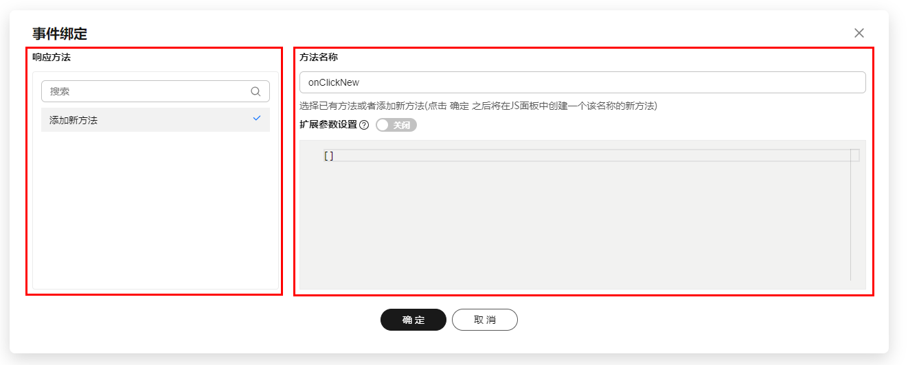

# 设置面板模块API	

## 变量绑定

变量绑定列表中的变量可能来自于其他元应用。

目前提供一种在元应用中注册变量绑定列表来源的方法：首先在元应用配置中添加 getSharedOptions 接口，这个接口也是用其他需要共享的配置

```js
export default {
 ...metaData,
 entry,
 apis: {
  getSharedOptions
 }
}
```

 

getSharedOptions 接口返回一个存储配置对象，这里约定了 variableConfiguratorList 字段为变量绑定列表。下面代码是各个元应用提供共享配置需要导出的函数

```javascript
export const getSharedOptions = () => ({
  variableConfiguratorList: [ /* 变量绑定列表 */ ]
})
```

在变量绑定组件中获取共享配置

```javascript
getSharedOptions('variableConfiguratorList')
```

variableConfiguratorList 数组项目的格式如下

```javascript
{
  id: string;
  content: string; // 列表项显示的文本
  getVariables: () => {
    bindPrefix: string;
    variables: any;
  }; // 获取变量绑定列表的方法
  getVariablesAsync: () => {
    bindPrefix: string;
    variables: any;
  }; // 获取变量绑定列表的异步方法。如果有同步方法，只会执行同步方法
  condition: () => boolean; // 控制是否显示的方法
  postConfirm: (context) => void, // 点击确定后执行的额外逻辑
  _order: number; // 用来排序的字段。因为组件导入过程中顺序不是确定的，所以需要增加一个字段用来确定顺序
}
```


## 事件绑定

事件元应用扩展，提供配置项和可替换的组件。元应用部分配置如下

```javascript
{
  options: {
    commonEvents // 默认绑定事件的列表
  },
  components: {
    BindEventsDialogSidebar,
    BindEventsDialogContent
  }
}
```

`commonEvents` 是默认绑定事件的列表，是对象类型。另外物料层级可以针对组件增加额外的事件

增加默认绑定事件示例：

```javascript
{
  options: {
    commonEvents: {
      ...commonEvents,
      // 增加 onKeyDown 到默认绑定事件列表
      onKeyDown: { /* 事件描述格式请参考原有的默认事件或者schema协议 */ }
    }
  }
}
```

替换事件绑定弹窗组件

- `BindEventsDialogSidebar` 为弹窗左侧 响应方法 组件；

- `BindEventsDialogContent` 为弹窗右侧 方法名称 组件

  

  

由于内部逻辑复杂，暂时无法提取细粒度更小的逻辑提供扩展或者替换。建议复制一份组件代码，在原有代码基础上修改后替换

例如给函数列表增加一些默认方法

```javascript
const defaultMethodList = [/* 默认函数列表 */]
filteredMethodList.value = [newMethod, ...defaultMethodList, ...methodList]
```