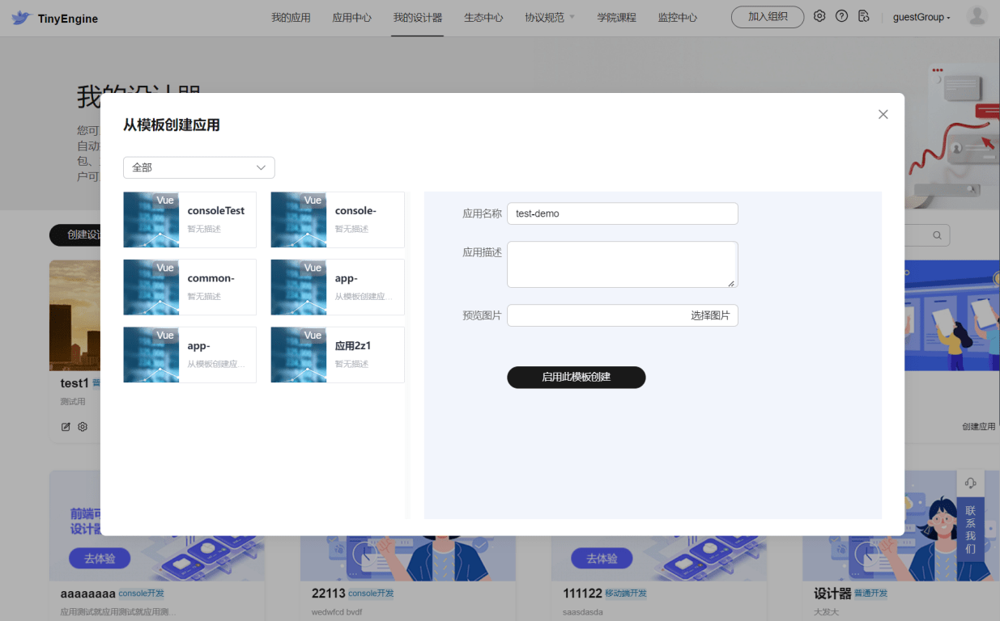

# 关于应用

## 如何创建应用
设计器定制完成后，用户可以在 [我的设计器](https://www.opentiny.design/tiny-engine#/my-platform) 中创建应用。选择对应的设计器，在设计器右下方点击“创建应用”。
创建应用有两种方式：

1.创建空白应用 &rarr; 填写必要的字段 &rarr; 保存。

2.从模板创建应用&rarr; 选择应用模板 &rarr; 填写必要的字段 &rarr; 保存。

