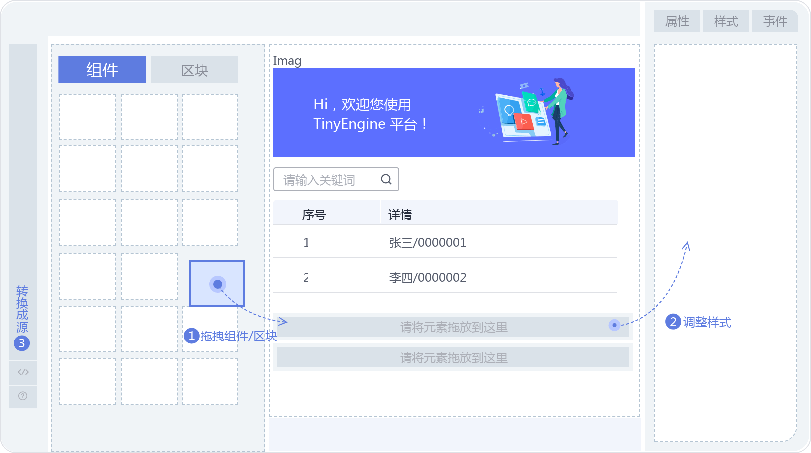

# 关于物料资产包

## 什么是物料

物料是可视化页面搭建的原料，按照粒度可分为组件库和区块

1. **组件库**：组件库一般是按照组件的性质进行组织。组件是页面搭建最小的可复用单元，其只对外暴露配置项，用户无需感知其内部实现。组件库在设计器定制完成后 **不能再次添加与删除** 。
2. **区块**：区块可以包含一个或多个组件也可以包含其他区块，带有一定的业务逻辑，能够实现更丰富的功能与表现。区块分为**消费侧**和**管理侧**，在区块管理侧，用户可以向设计器中拖入一个区块后可以编辑其内部的组件和区块配置，暴露区块的属性和事件供消费区块的时候使用，最后发布区块，消费侧区块就会更新为最新的区块内容。区块在设计器定制完成后仍能添加与删除。

设计器中的物料需要进行一定的配置和处理，才能让用户在设计器使用起来。这个过程中，需要一份配置文件，也就是物料资产包。物料资产包文件中，针对每个物料定义了它们在设计器中的使用描述。

## 什么是物料资产包

在设计器中，我们可以看到，组件与区块面板不只提供一个组件或区块，它们是以集合的形式提供给设计器的，而物料资产包正是这些组件与区块构成的集合。

