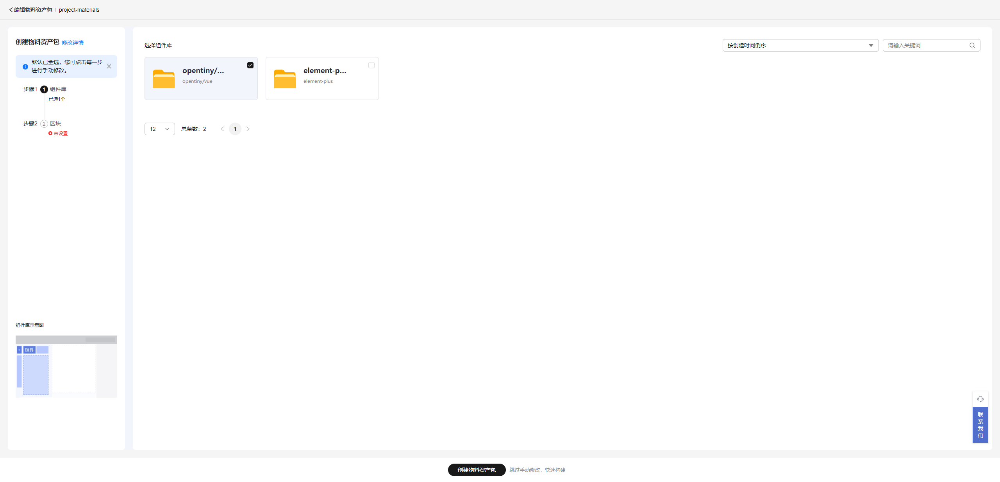
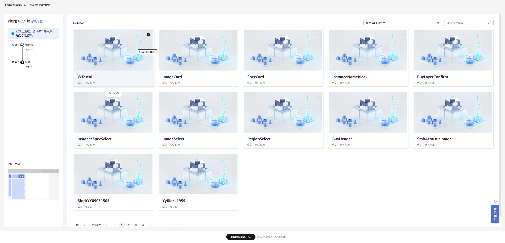
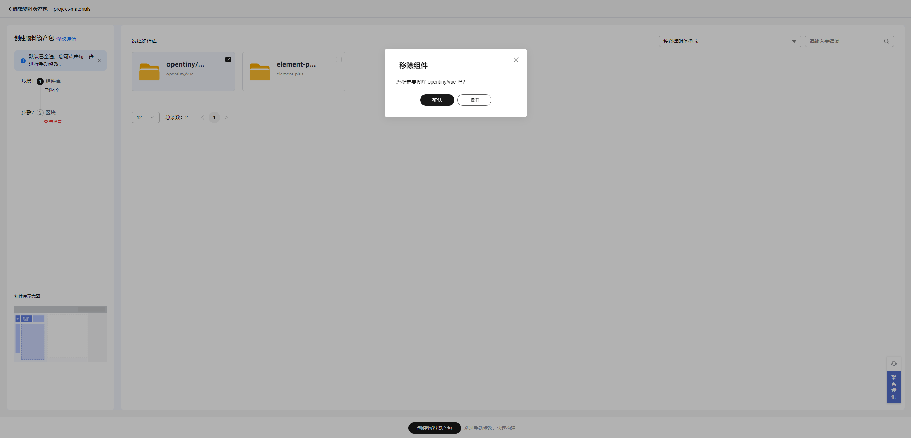
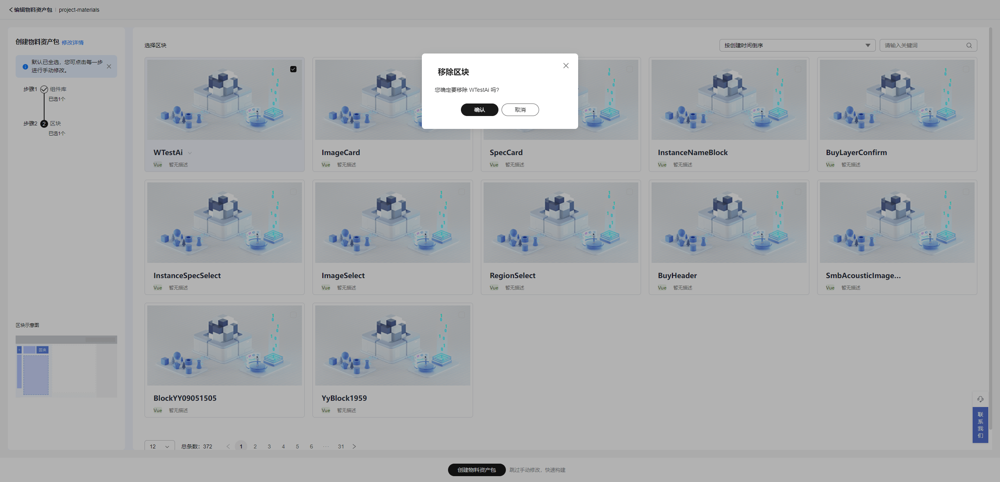

# 添加组件库/区块

## 如何添加组件库与区块

可视化设计器已为您提供官方组件库与一些区块，物料资产包创建完成后会自动打开编辑页面，用户可以在这里添加组件库与区块，如下图：

* **添加组件库:** 选中未选择的组件库

* **添加区块：** 选中未选择的区块

* **移除组件库：** 取消选中已经选择的组件库，并且确认

  
* **移除区块：** 取消选中已经选择的区块，并且确认

* 用户也可以在生态中心录入自己的组件库与区块。