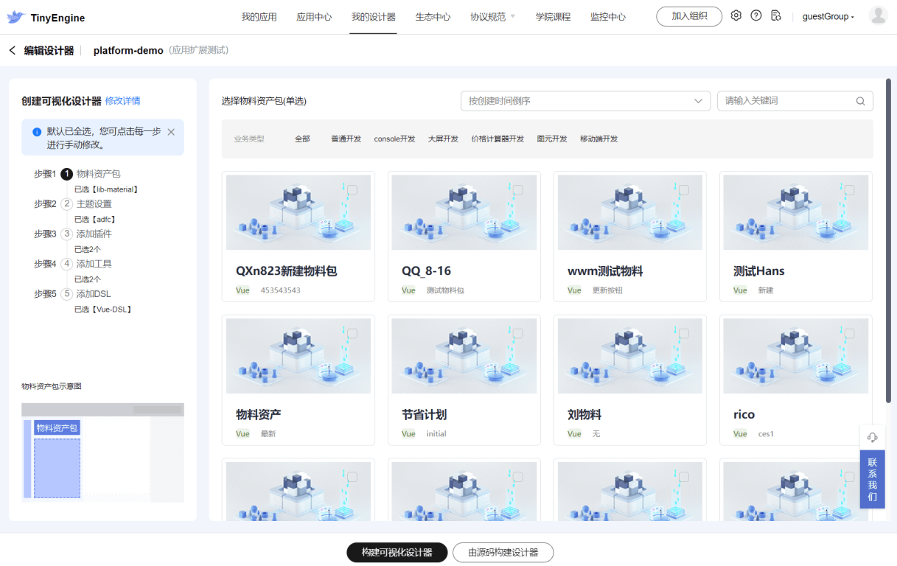
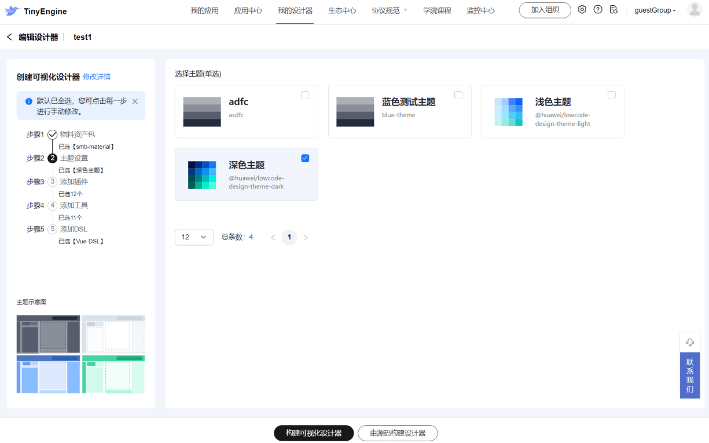
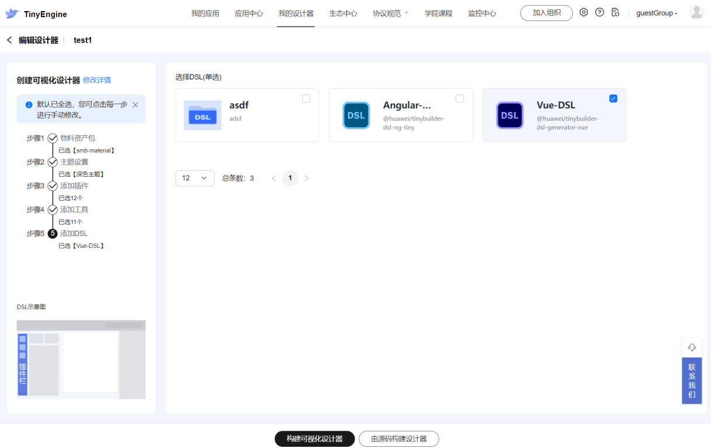
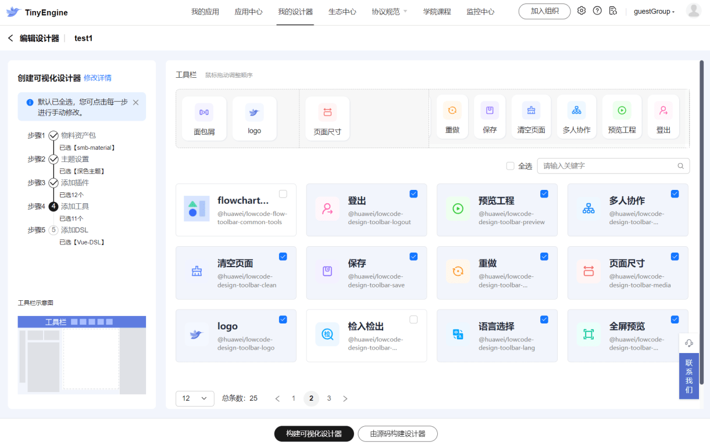
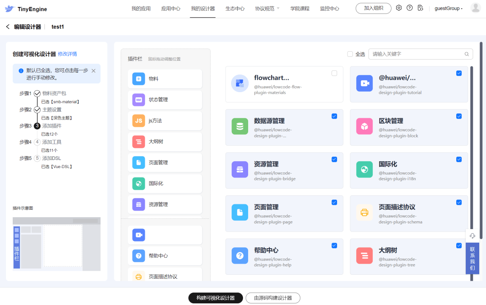

# 关于设计器

## 如何定制物料资产包、主题、DSL、工具栏和插件栏

设计器创建完成后会自动打开编辑页面，用户可以在这里定制设计器的*物料资产包*、*主题*、*工具*、*插件*和*DSL*，如下图：

1. **定制物料资产包：** 物料资产包  **必选且唯一**  , **不允许删除** 物料资产包，可以添加其他物料资产包来替换当前的。

2. **定制主题：** 主题 **必选且唯一** ，**不允许删除** 主题，可以添加其他主题来替换当前的

3. **定制DSL：** DSL为 **单选**。DSL是将物料的Schema 解析成不同技术栈源码的转换工具，所以DSL的必须和选择的物料在技术栈保持一致。

4. **定制工具：** 可以将工具拖入上方位置栏，规划定制的设计器里工具的位置。工具可以多选，也可以删除。

5. **定制插件：** 可以将插件拖入中间位置栏，规划定制的设计器里插件的位置。插件可以多选，也可以删除。
