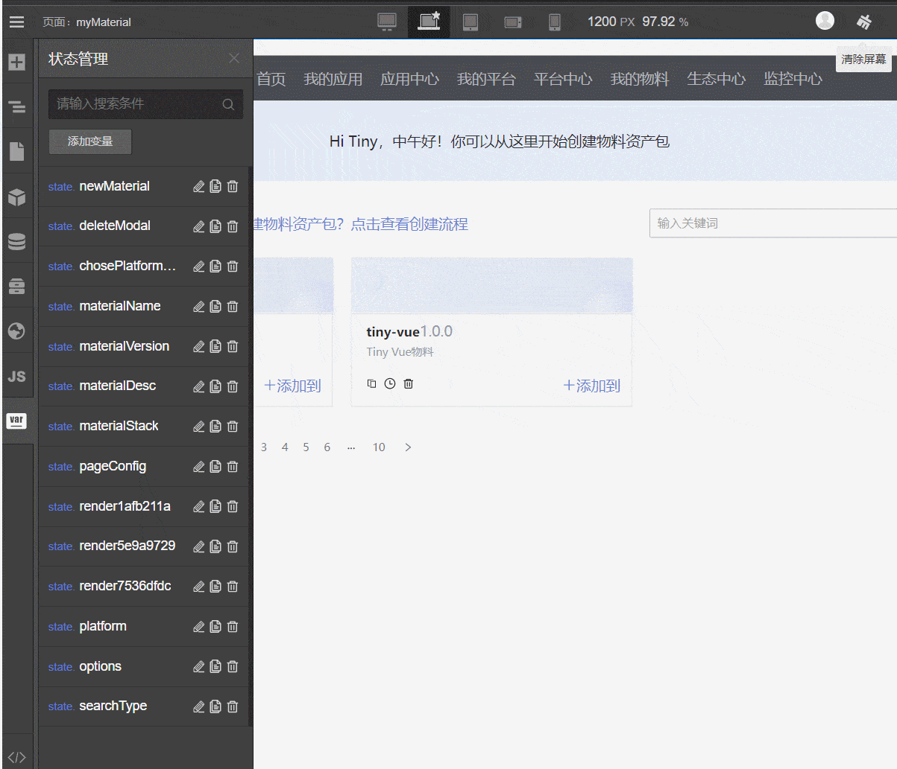
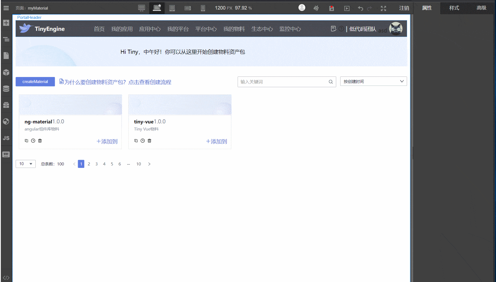
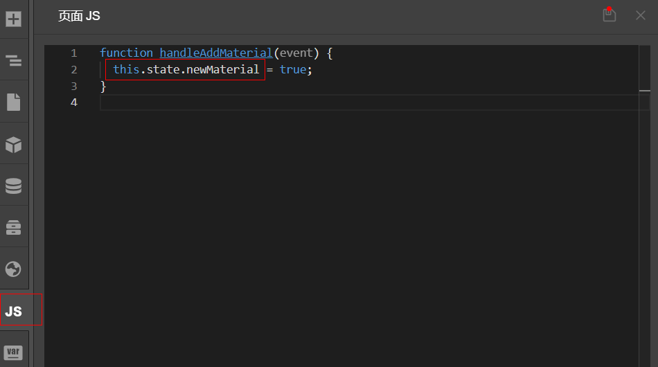

# 使用状态管理和变量绑定

state 是响应式的数据，状态管理面板对 state 的响应式变量进行系统管理，包含添加、删除、搜索、编辑 state

- 在状态管理面板添加 state 变量。

- 使用添加的 state 变量
- 在画布中选中需要绑定 state的组件。
- 在右侧设置面板属性栏中点击代码 icon，选择需要绑定的 state。

- 改变state

我们添加的 state 通常是一个可以随不同状态有不同值的变量，如果想要改变 state，可以在 JS 面板中通过 `this.state.xxx` 获取到 state并且改变之。

