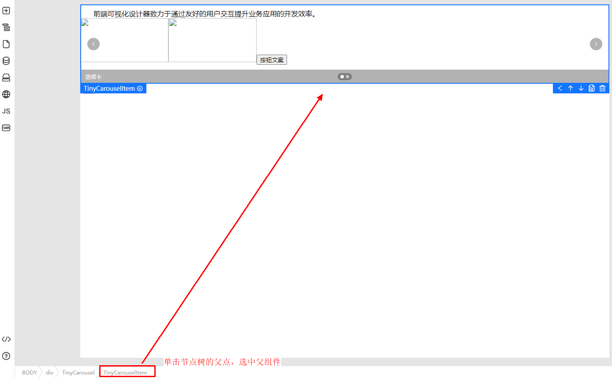

# 使用组件

## 概述

组件是低代码开发的构建块，就像积木一样。它们是可重复使用的小部件，可以轻松搭建和管理网页。举个例子，按钮、导航栏和表单都可以是组件。这有助于您快速搭建网站。

下面介绍如何在低代码中使用组件，实现页面快速搭建。

## 从物料面板中添加组件

1. 在左侧插件栏中，单击，展开物料资产包。
2. 在物料资产包中选择组件，并拖拽至中心画布中。

## 从画布中直接添加组件

对于复杂的页面，嵌套层级可能很深，直接拖拽并不能很好的拖入到指定的层级中，所以，设计器提供在画布中右键精准添加组件的能力。

1. 画布中选中组件，然后单击鼠标右键。
2. 选择“插入“，可以向前、向后、向中间位置进行插入（相对于当前选中组件而言）。

   **图 1**  插入组件
   

   **图 2**  选择插入位置
   

3. 弹框中选择待插入的组件，即可插入指定位置。

   **图 3**  选择组件  
   

## 选中组件

添加了组件之后，您可以选中组件，对组件进行修改、删除、移动等操作。

以下为选中组件的相关方法：

- 从画布中直接单击组件选中组件

  **图 4**  直接单击选中组件 
  

- 在左侧大纲树插件中，以树的形式展示了当前页面中所有的组件，单击树节点选中画布中的组件

  **图 5**  单击树节点选中组件  
  

- 底部节点树展示了从根节点到当前选中组件的层级节点，单击底部的节点树的某一个节点，选中父组件

  **图 6**  展示当前选中组件的层级节点 
  

  **图 7**  单击节点树的父点，选中父组件
  

## 编辑组件

选中了组件之后，您还可以设置组件的属性、样式和绑定事件，同时可以对组件进行上移、下移、复制和删除等操作。

**图 8**  组件上移  

**图 9**  组件下移 

**图 10**  复制组件  

