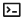

# 国际化资源管理

## 使用说明

同一个项目，可能需要同时支持多个语言，设计器提供了中英文切换，在能够一键切换语言，提升开发效率与开发体验。 国际化是应用级别的，在任何一个页面都可以访问。

>  **说明：**
> 注意的是国际化只针对画布中的项目，不针对设计器本身。

## 添加国际化词条

1. 在左侧插件栏中，单击，展开国际化资源页面。
2. 单击“新增词条”。
3. 编辑key，中文和英文内容

   >  **说明：**
   >- 创建时key会自动生成，也可以自定义输入。
   >- key需为唯一值，不可与现有key重复。
   >- 创建后key值不可修改。

   **图 1**  新增词条  
   

4. 单击页面空白处，完成国际化词条创建。

## 编辑国际化词条

1. 在左侧插件栏中，单击，展开国际化资源页面。
2. 选择待操作的词条，单击“操作”列的。

   **图 2**  编辑词条  
   

3. 重新编辑key，中文和英文内容。
4. 单击页面空白处，完成国际化词条编辑。

## 单个删除国际化词条

1. 在左侧插件栏中，单击，展开国际化资源页面。
2. 选择待操作的词条，单击“操作”列的。
3. 在弹框中单击“确定”，完成国际化词条删除。

   **图 3**  删除词条
   

## 批量删除国际化词条

1. 在左侧插件栏中，单击，展开国际化资源页面。
2. 勾选待操作的词条，单击“批量删除”。

   **图 4**  批量删除词条  
   

3. 在弹框中单击“确定”，完成国际化词条批量删除。

## 复制词条键值

1. 在左侧插件栏中，单击，展开国际化资源页面。
2. 选择待操作的词条，单击“操作”列的。

   页面显示“复制成功”，完成词条键值复制。

   **图 5**  复制词条键值 
   

## 使用国际化词条

1. 在左侧插件栏中，单击，展开物料资产包。
2. 在物料资产包中选择组件，例如button组件，并拖拽至中心画布中。
3. 选中组件，在组件属性设置面板选择“属性”。
4. 选中文案参数旁的，进行变量绑定。
5. 输入变量t\('lowcode.67564435'\)，其中lowcode.67564435为词条的key值，可参考[复制词条键值](#复制词条键值)获取。

   **图 6**  绑定变量 
   

6. 单击“确定”，变量绑定完成。
7. 单击顶部工具栏的中英文切换按钮，可进行中英文切换。

