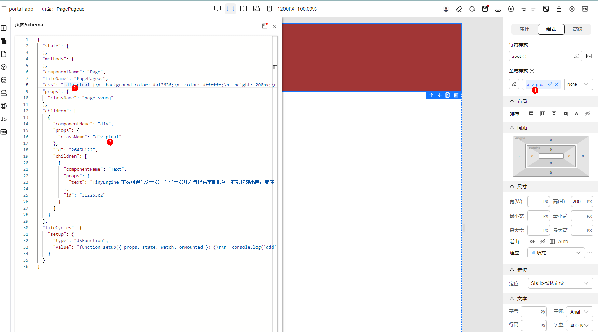

# 样式设置

> 在页面开发过程中，为了给用户友好的体验和交互能力，提供样式自定义是不可或缺的能力。因此，我们提供了样式面板提供用户修改样式的能力

在高代码编辑中，我们通常有两种方式可以对组件写入样式：

1. 行内样式，比如：

```html
<div style="display:block; color: red; font-size: 12px; background-color: #fff;">
</div>
```

2. 绑定 css 类名，然后在 css 类名中声明规则，比如：

```vue
<template>
 <div class="card">
 </div>
</template>

<style scoped>
.card {
  display: block;
  color: red;
  font-size: 12px;
  background-color: #fff;
}
</style>
```

在TinyEngine设计器中，我们同样提供了这两种声明样式的方式：

## 通过样式面板配置样式

在设计器右侧的面板中，我们提供了样式面板，可以对当前选中组件进行样式的设置。

操作步骤如下：

1. 选中组件
2. 打开右侧样式面板
3. 在样式面板设置布局、样式、间距...等等样式
4. 设置完之后，设计器会自动将样式写入到类名样式中，并绑定类名到当前组件的属性中（假如没有类名，此时会自动生成随机类名）


如上动图设置样式成功之后，样式面板会自动做以下操作：

1. 如果当前样式选择器还没有选中任何一个类名或者 ID，会自动生成随机类名
2. 将用户在样式面板设置的样式写入类名规则中
3. 将样式选择器生成或者选中的类名绑定到当前组件当中




## 直接编写样式代码

样式面板提供的直接配置的样式满足了大部分的基础样式需求，但是，如果还是不能满足我们的需求，我们还提供了直接编写样式代码的方式来配置样式。

直接编写样式代码的方式包括

### 编写行内样式

等效于直接在 html 标签 style 属性里直接声明样式，权重高，用于覆盖样式


如上动图设置成功之后，相当于做了以下操作：组件 schema 属性中，props 属性的 style 绑定了我们手动修改的样式


### 编写全局样式

点击编写全局样式，可以直接声明多条CSS样式或其他媒体查询的样式，然后通过组件的 class 或者 id 进行绑定


## 高级操作

在样式面板配置样式的时候，如果没有生成或者绑定类名，我们会自动生成类名进行绑定。但是对于专业的开发者来说，可能还需要一些高级特性做支持。所以，我们增加了样式选择器，提供部分高级操作。

### 类名新增

假如我们选中了一个组件，但是此时还没有自动生成类名，那么此时，我们可以点击输入框手动输入类名。然后继续编辑样式面板的样式。

此时，组件会自动绑定我们输入的类名，然后将我们在样式面板编辑的样式生成代码，写入到全局样式中。


### 类名修改

假如我们想要修改已有的类名，则可以通过以下步骤修改类名：

- 直接点击类名或者点击类名旁边的修改按钮（笔的 icon）
- 点击后，会自动 focus 到输入框，此时可以编辑类名
- 通过回车或者失焦的方式，即可以成功修改类名

**注意此时类名修改范围**：

- 当前组件绑定的类名会被修改
- 全局样式中同类名会被修改成新类名
- 其他组件绑定的同类名不会被修改

动图演示：


### 类名删除

如果我们想删除当前类名，可以直接通过类名旁边的删除按钮进行删除。

删除范围：当前组件属性不再绑定该类名（也就是全局样式仍保留类名与样式，防止其他组件仍在使用该类名）

动图演示：


### 已有类名选择

除了自动生成和手动新增类名之外，我们也可以通过输入框的下拉框来选择已有的类名。比如我们已经有类名 .test1、.test2、.test3 等几个类名，那么，我们可以通过下拉框选择切换编辑对应的类名的样式。

动图演示：


### 使用样式选择器搭配样式面板编辑 hover、focused、pressed、disabled 等状态的样式

在样式选择器右侧，我们还提供了一个状态选择器的下拉框。可以选择 hover、focused、pressed、disabled 等状态，选择之后，我们此时编辑样式面板，就是相当于在编辑该类名对应状态的样式。

从全局样式面板中可以看到，等效于直接编辑一下样式：

```css
.test1:hover{
  /**  这里会注入样式面板编辑的样式 */
}
```

动图演示：


### 行内样式绑定状态变量

在实际业务场景中，我们可能会有以下场景：使用JavaScript 变量动态计算位置，然后传入行内样式 style 中。

```vue3
<template>
<div
  :style="{
    top: state.position.top,
    right: state.position.right,
    bottom: state.position.bottom,
    left: state.position.left,
  }"
>
</div>
</template>
```

设计器最近（2023.12）也支持了对应的场景特性

动图演示：行内样式右侧有绑定变量的按钮，我们可以点击编辑绑定变量按钮的方式将动态变量绑定到 style 行内样式。


