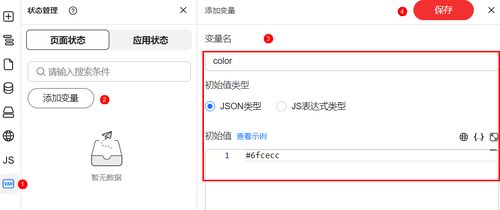
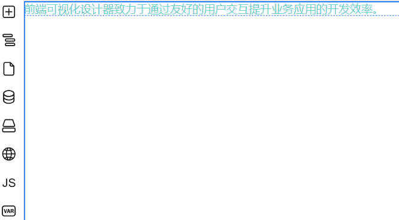
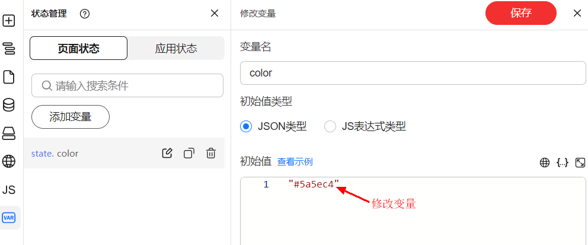
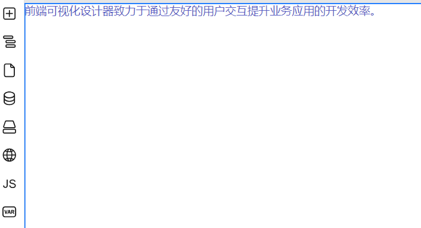

# 行内绑定状态变量

## 使用说明

设计器提供了一种功能，允许使用定义变量来动态计算组件的位置。这些计算结果随后可以直接应用到组件的行内样式style属性中，从而实现动态样式的调整和布局的优化。

## 操作步骤

1. 添加变量，例如：bgcolor，用来控制背景颜色。

   **图 1**  添加变量
   

2. 画布中选中组件，在组件属性设置面板选择“样式”。
3. 单击行内样式的编辑框后的。
4. 在弹框中进行变量绑定。

   **图 2**  绑定变量
   

5. 单击“确定”，变量绑定完成。
6. 通过修改变量，查看组件样式展示效果。

   **图 3**  修改前样式
   

   **图 4**  修改变量  
   

   **图 5**  修改后样式
   

