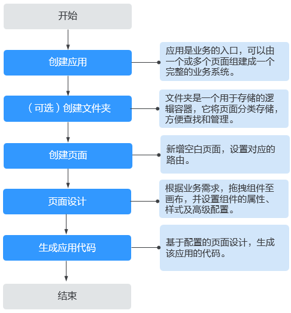
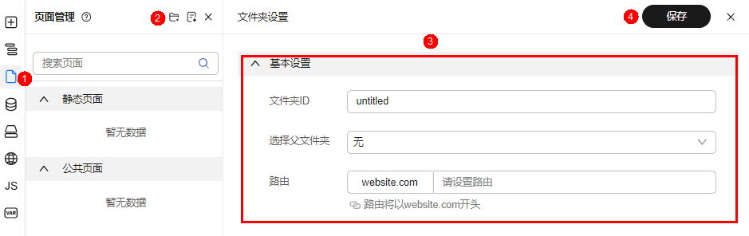
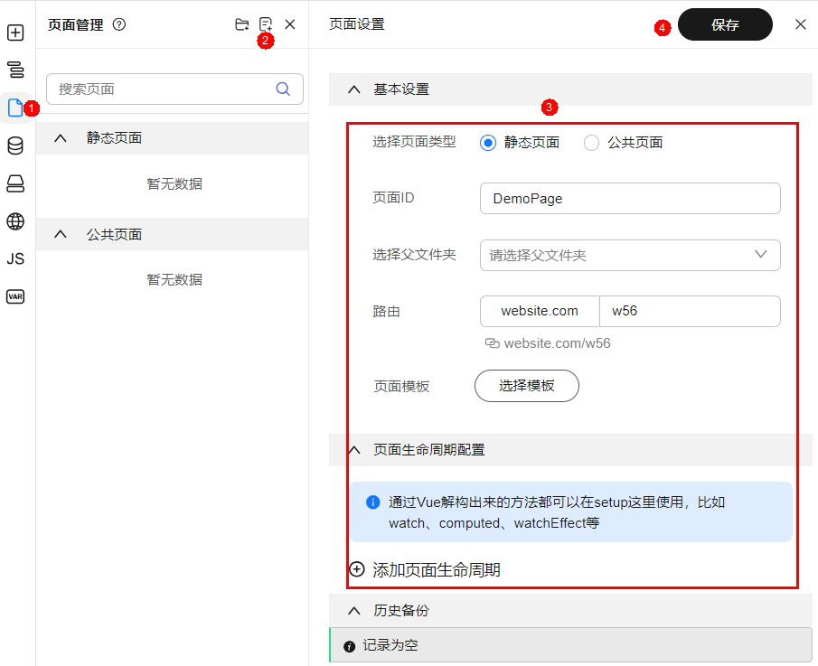
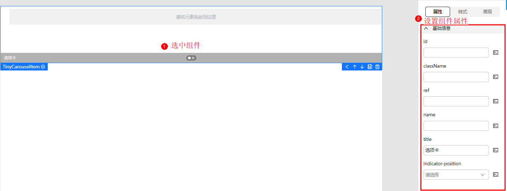
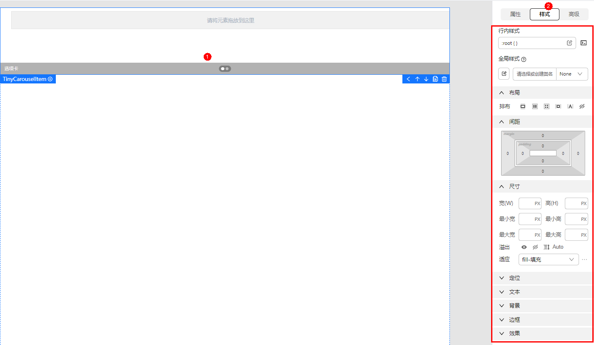
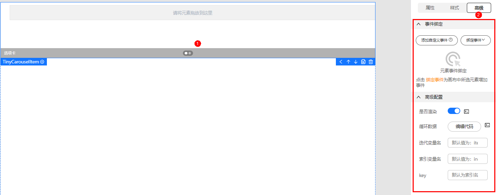
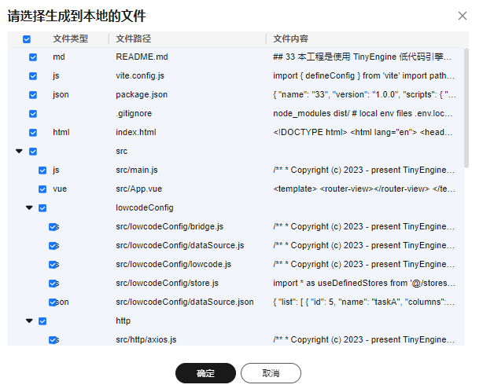

# 设计前端应用流程

前端应用可以由一个或多个页面组成一个完整的业务系统。在TinyEngine中，通过创建应用、（可选）创建文件夹、创建页面、页面设计和生成应用代码五步，即可快速完成前端应用设计，具体流程如图1所示。

**图 1**  创建应用

## 步骤一：新建文件夹

1. 单击应用模块内的“应用开发”，进入设计器。
2. 在左侧插件栏中，单击，进入“页面管理“页面。
3. 单击“页面管理“的新增文件夹按钮。
4. 设置基本属性，如输入文件夹ID及设置路由。

   **图 3**  创建文件夹
   

5. 单击“保存“，完成文件夹创建。

## 步骤二：新建一个页面

1. 单击“页面管理“的新增页面按钮。
2. 设置页面基本属性。
    - 选择页面类型：可选“静态页面”或“公共页面”。
    - 页面名称：只允许包含英文字母，且以大写开头驼峰格式，如DemoPage。
    - 选择文件夹：下拉框中选择文件夹名称。
    - 路由：输入路由信息，只允许包含英文字母、数字、下划线、中划线和正斜杠组成， 且以英文字母开头。

      **图 4**  创建页面
      

3. 单击“保存“。
4. 在弹框中输入历史备份信息，单击“确定“。

## 步骤三：页面设计

前端应用由一个或多个组件拼装而成。在左侧插件栏打开物料资产包，选择合适的组件，拖拽到中间画布中。在画布选中组件，设置组件的属性、样式、以及绑定事件。

**图 5**  添加组件

**图 6**  设置组件基本属性

**图 7**  设置组件样式

**图 8**  设置组件高级属性

## 步骤四：生成代码

根据配置的页面设计，生成应用的基本代码。代码生成后，会下载至本地，供您使用。

1. 单击顶部工具栏的“下载源码“按钮。
2. 选择下载路径。
3. 选择生成到本地的文件。

   **图 9**  选择生成文件  
   

4. 单击“确定“，代码将下载至本地路径。

