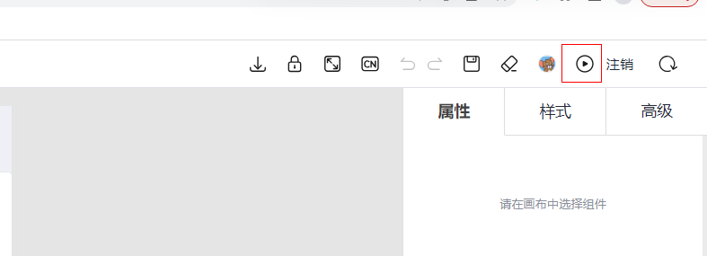
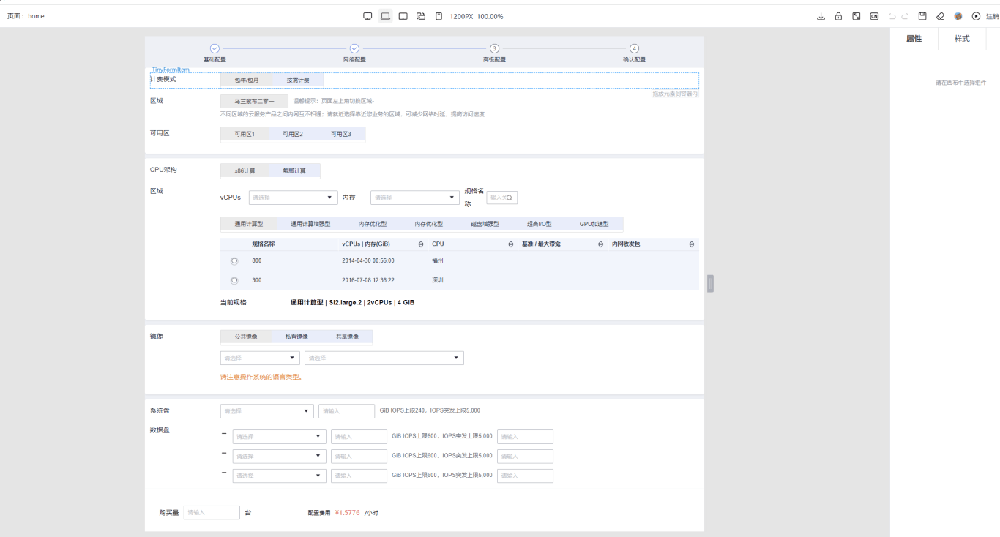
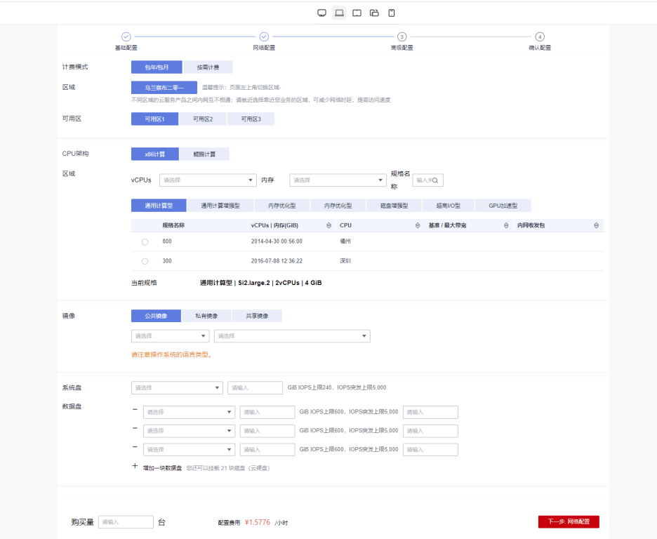

## 页面/区块预览

### 前言

在一些场景下，设计器的画布并不能使得我们直观的感受到所设计的区块或者页面最终的表现。比如说，当页面上区块和组件应用层次较多，区块之间或者组件之间交互行为较为复杂时，我们在画布上去清晰的感知页面的静态布局以及动态交互很是困难，这时候就需要设计器的**页面/区块预览**能力来为开发提供帮助

### 页面/区块预览入口

### 示例

画布上的页面结构

预览页的页面效果

页面/区块预览界面除了帮助我们直观的看到整体页面结构以及进行交互动作外，还可以提供其他功能验证
- 切换设备宽度
- 国际化语言
- state状态响应式
- 表单验证提交