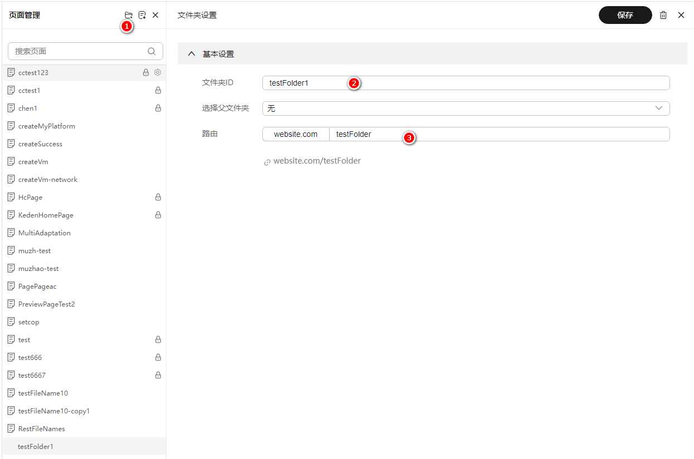
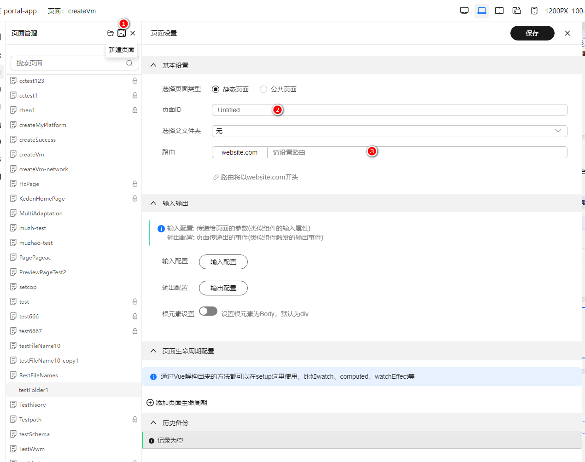
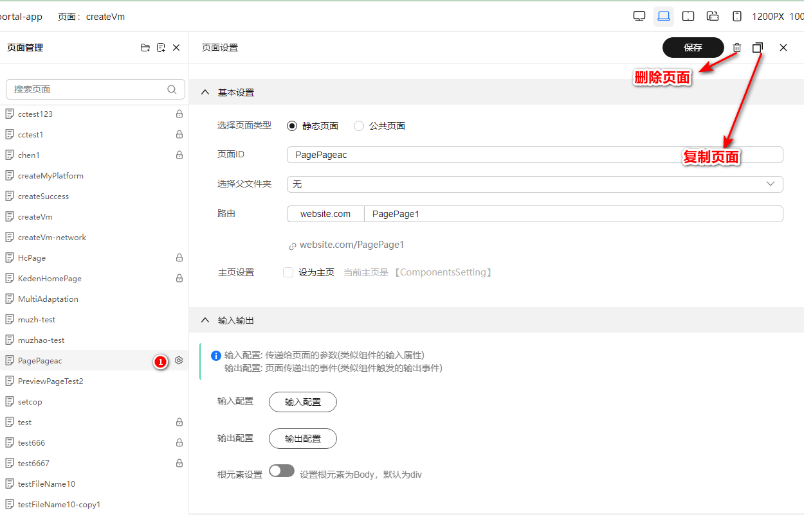
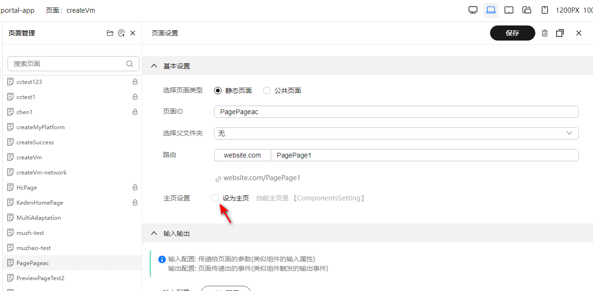
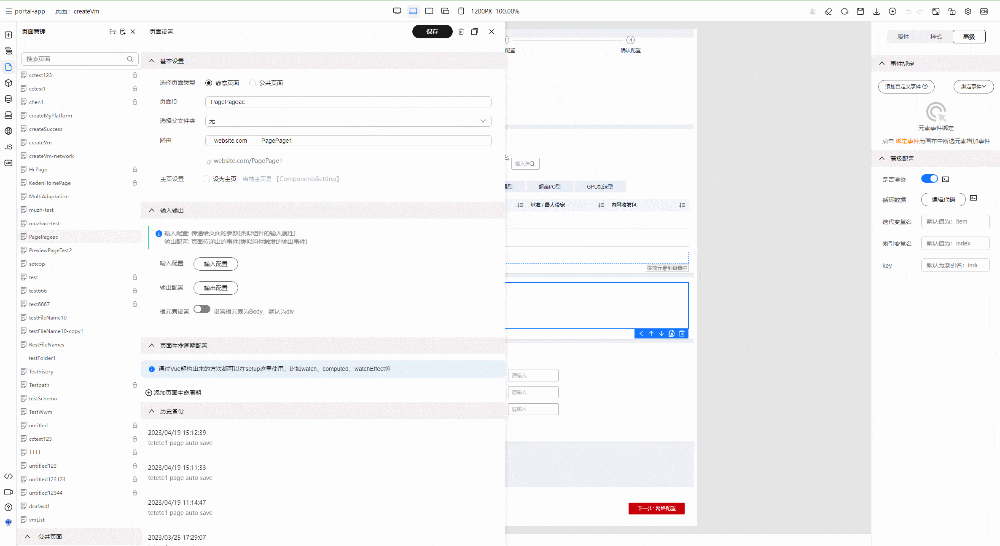
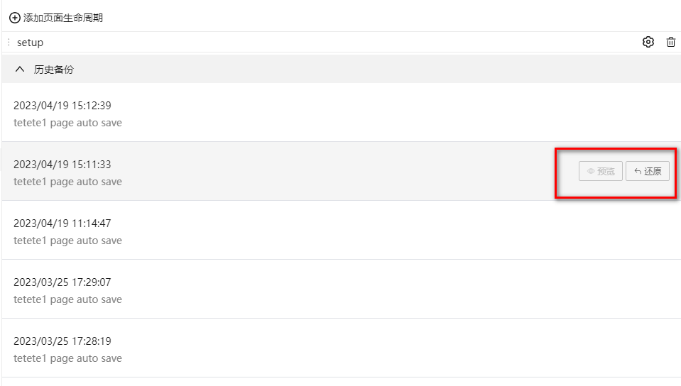

# 页面管理

> 页面管理插件可以管理该应用下的全部页面，可以新增页面，可以新增文件夹，以及对页面或者文件的增删改操作

## 页面相关概念

假如我们有一个前端工程：

```bash
- project
  - views
    |_ Index.vue
     - Page2.vue
    - TodoFolder
      |_ Todo.vue
```

我们设计器的页面概念就相当于上述工程中的一个页面或者文件夹，每个页面有对应的路由，用户可以根据路由访问对应的页面

## 基本操作

基本的操作包括页面的增删改

### 新增文件夹



文件夹的概念与操作系统中的文件夹概念一致，只需点击新增文件夹按钮，然后填入文件夹名称、路由，点击保存即可完成新增操作

### 新增页面


点击新增页面按钮，设置最基本的页面名称、路由，点击保存即可完成新增页面操作

### 删除页面/文件夹、复制页面

在页面列表右侧点击设置按钮，出来编辑面板，可以在右上角的按钮触发删除、复制页面功能



### 页面高级设置

除了基本的页面功能，我们还提供了一些相关的高级功能，比如设置主页、配置生命周期、还原页面到某一历史记录等功能

#### 设置主页

主页就是整个应用的 home 页面，我们可以在页面管理中配置主页（即 path 为 "/" 时渲染的页面）
操作：在主页设置复选框上打钩即可


#### 配置页面生命周期

在页面管理中，我们还可以配置页面的生命周期，比如在 Vue3 技术栈中，我们可以配置 onMounted、setUp、onUpdated 等生命周期函数



#### 还原页面历史

在历史备份列表中，可以点击右侧的页面按钮进行历史的备份或者还原

