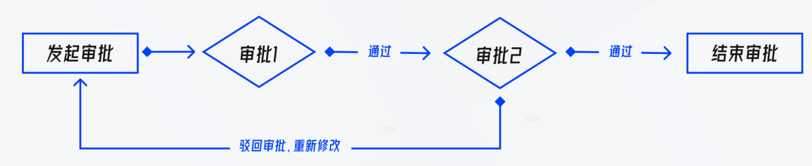
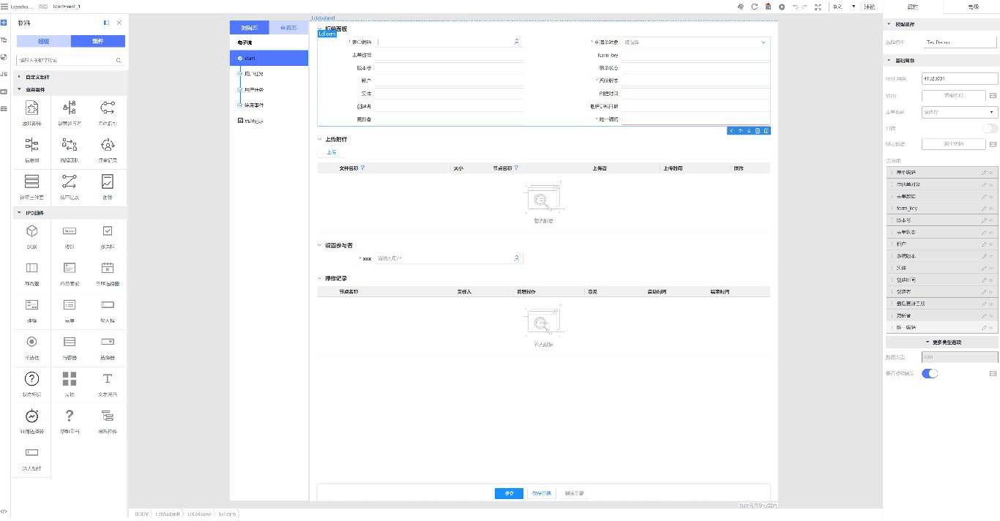

## PDM 元数据审批电子流 

<br>

审批流业务场景是现代企业运营中不可或缺的一环。业务流程从某个特定点开始，然后经过一系列的审批节点，完成流程的审批。这些节点通常由不同级别的人员担任，例如主管、经理、财务、法务和总经理等，每个人都扮演着特定的角色和职责。
</br>
</br>
假设场景如下：流程发起人 A 启动了一个电子审批流程。这个流程首先会被传递到主管进行审批。在审批过程中，主管会仔细检查初始业务流程信息和其他相关数据，然后决定是否进一步推进流程，或退回给 A 进行修订。如果主管批准了这个流程，那么它将被移交给下一级审批人，也就是经理。在经理的审批环节，他/她也会详查相关数据和信息，并基于这些以及自己的独立判断来做出决策。值得注意的是，尽管经理可以查看到主管填写的一些技术信息，但这些信息并不对财务和法务公开。也就是说，只有经理和总经理可以看到这些技术信息，财务和法务无法获知。经理会根据这些保密信息以及自己的专业判断来决定是否继续推进流程。
</br>
</br>
如果经理也批准了该流程，那么它将被送至财务节点进行审批。在审批过程中，财务主要关注经济相关的问题，例如价格、付款方式等等。一旦财务审批通过，流程会被移交给法务进行审批。

与财务审批类似，法务审批主要关注法律风险和合规性问题。在审批时，法务会仔细检查相关的合同、协议等法律文件，并评估是否存在任何法律风险或合规性问题。一旦法务批准了流程，流程将被移交给总经理进行最后的审批，以完成整个审批流程。

  </br>
  </br>
  
  </br>
  </br>
  需要注意的是，这种审批流业务场景并不是只有一个，而是有很多个。例如，除了上述的采购流程，还有其他业务流程需要进行审批，比如：数据入库流程、报价流程等等。每个流程都有自己的特点和审批节点数量不一。有些流程可能只需要两三个节点就可以完成审批，有些则可能需要十几个节点才能完成。但是，所有类型的审批流大致相似。如：页面上常见的元素包括表单、表格以及常用的审批组件等。
  </br>
  </br>
  技术分析：若采用传统的开发方式，每当新增一种流程时，前端开发人员都需要开发所有审批节点的审批页面，并重新进行发布流程。同样地，服务端开发人员也需要重新建立一个审批流，通过特定页面录入各节点审批人，并编写相应的审批流规则。显然，这对于前端和服务端开发人员来说都是十分繁琐的工作。<br><br>


<b>解决方案：</b> 基于 TinyEngine 低代码引擎，开发出一个专为电子审批流设计的低代码平台。然后，将所有与流程相关的组件，如模板、评审记录和流程指引等导入到平台的物料区域。最后，将这个专注于开发审批流的低代码平台集成到 PDM 元数据电子流业务模块中。在低代码平台上，想要开发任意一个流程的审批页面，只需要将流程模板拖入，并在模板中嵌入本流程的表单或表格，即可轻松完成该节点的审批页面，极大地提高了开发效率和便利性！
服务端也将采用另一种特定于 flow 类型的低代码平台（将在后续内容中详细介绍），以实现对审批流程人员编排。这样，前后端之间的连接就实现了完美的贯通。<br><br>



- ### 技术实现细节

  第一步：下载源码，熟悉文件内容。<br/>
  遵循 TinyEngine 推荐的开发风格，按照以下目录来进行开发，canvas 中为画布模块，controller 为控制器逻辑，common 存放公共逻辑，toolbars/plugins/settings 对应上、左、右区域的插件，theme 对应主题，addons 为当前应用所引入的插件：

  ```js
  |-- canvas
  |-- controller
  |-- common
  |-- plugins
  |-- settings
  |-- toolbars
  |-- theme
  |-- index.html
  |-- main.js
  |-- App.vue
  |-- addons.js
  `-- vite.config.js
  ```

第二步： 增加流程审批树，用于编辑各个审批节点的页面。 <br/>

经过调研，发现TinyEngine 提供了一套完善的插件体系，涵盖了插件开发所需的基础 UI 库、工具库、插件面板的显示控制、生命周期管理、公共 API 注册与共享等。这一体系使得开发者只需遵循简单的规范，即可快速开发出业务所需的插件，从而极大地提高了开发效率和灵活性。通过使用 TinyEngine 提供的插件体系，开发者可以更加轻松地管理和维护复杂的插件生态系统，同时降低维护成本。<b>那么只需要按照规范开发一个流程审批树的插件即可。</b>
最后在addons插件配置文件中引入，就完成一个完整的插件开发了

```js
import Materials from '@xxxx/lowcode-plugin-materials'

export default {
  plugins: [
    Materials,
    // ...
  ],
  toolbars: [
    // ...
  ],
  settings: [
    // ...
  ],
}
```

第三步： 增加审批流程的模板和组件，并暴露各个组件的配置项 <br/>

由于该低代码平台主要是用来开发流程审批流，所以有大量流程中用到的组件和模板。需要安装组件录入协议导进平台里面使用

```json
// 以下JSON为节选按钮暴露的属性
{
  "schema": {
    "type": "object",
    "properties": {
      "size": {
        "title": "定义按钮尺寸",
        "type": "string",
        "enum": ["large", "medium", "small", "mini"],
        "enumNames": ["较大尺寸", "中等尺寸", "较小尺寸", "迷你尺寸"],
        "default": ""
      },
      "text": {
        "title": "设置按钮显示的文本",
        "type": "string",
        "default": ""
      }
    },
    "events": {
      "onClick": {
        "label": {
          "zh_CN": "鼠标单击时触发",
          "en_US": "Triggered on mouse click"
        },
        "description": {
          "zh_CN": "鼠标单击时触发的回调函数"
        },
        "type": "event",
        "defaultValue": ""
      }
    }
  }
}
```

第四步：服务端接收页面保存的 schema，然后生成源代码。并进行构建部署

</br>

<br>
