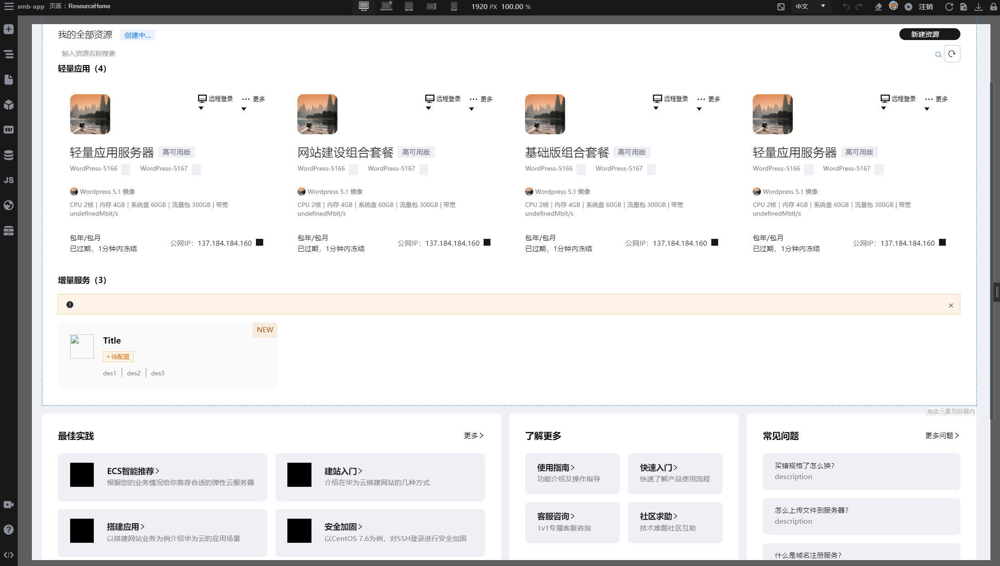
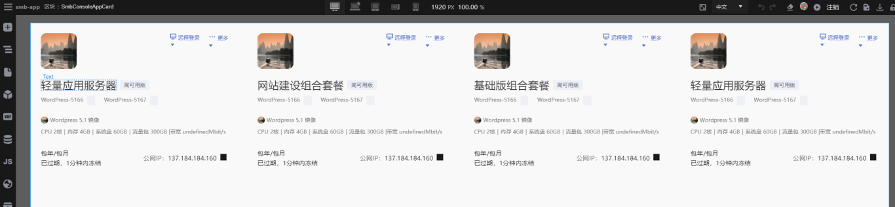
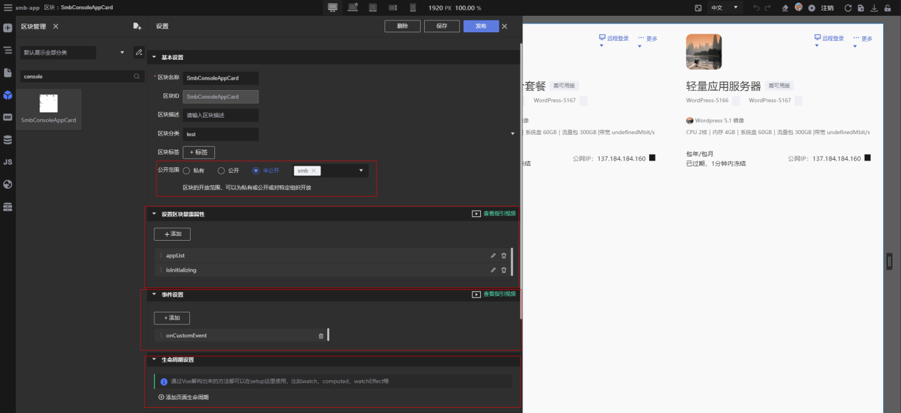
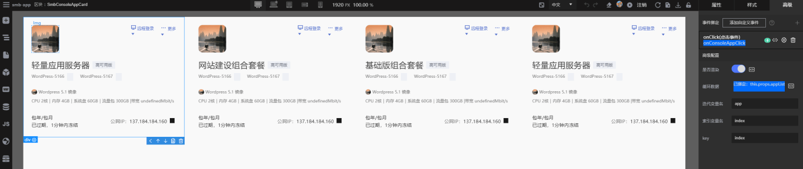
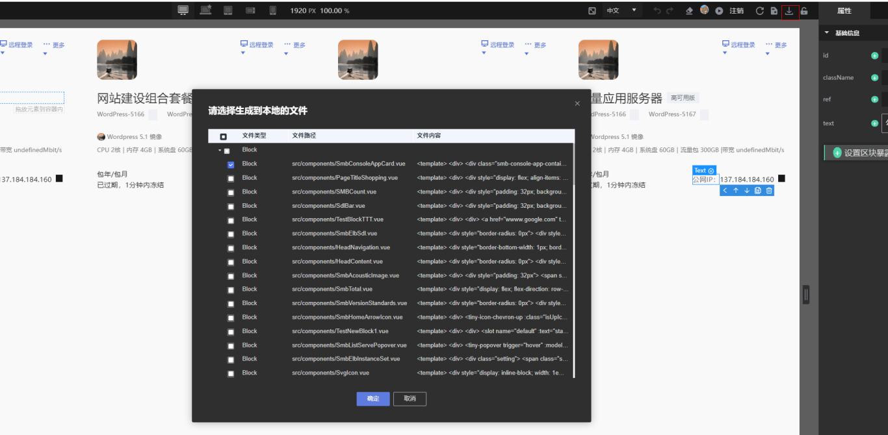
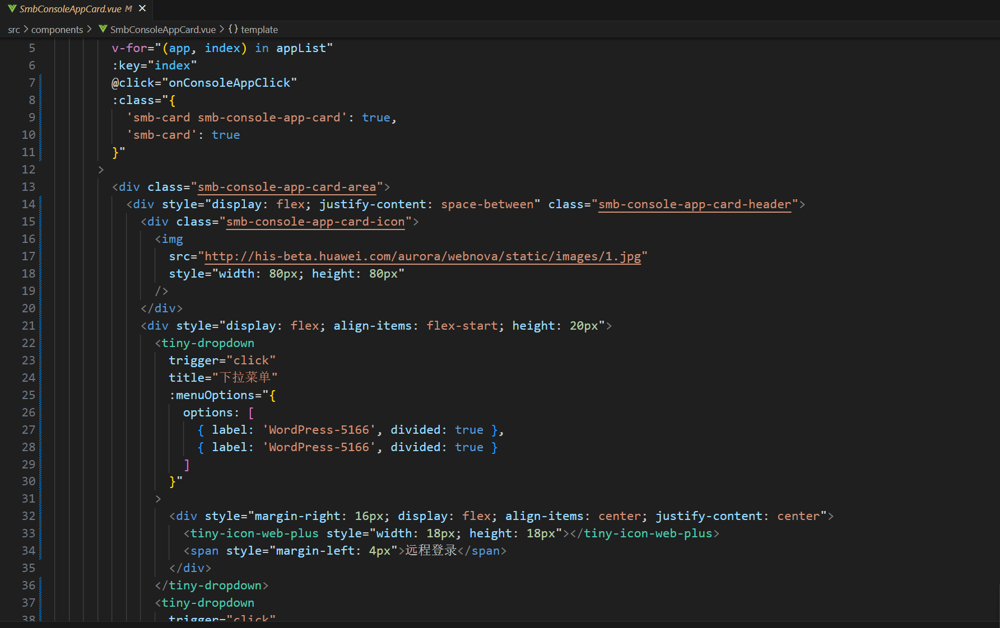

## 前言

SMB项目立项之初即采取TinyEngine设计器进行开发以及项目管理，其中很多区块以及页面都是在设计器上开发完成的，在积累使用设计器进行应用开发经验的同时也帮助不断完善设计器。下面主要介绍下SMB项目中如何使用设计器进行应用开发。

## 基于TinyEngine设计器开发的SMB项目

在使用TinyEngine设计器开发SMB项目初期，主要是先了解设计器所具备的能力，重点关注点在组件、区块、页面三个模块。
这里以SMB项目中的首页举例，首先看下SMB项目中使用设计器搭建的首页部分内容

可以看到这个页面中包含众多信息，比如说资源的搜索栏、资源的概览信息、增量服务、最佳实践、了解更多等等内容，而这些内容都是从设计器最基本的能力开始一步步聚沙成塔，都是由组件与区块之间的嵌合形成。
 

以其中的轻量应用区块进行详细的开发流程解析

### 如何开发区块

区块的主要目的有两点：
    
    1. 对多页面中可复用的功能或是逻辑组件化
    2. 对复杂页面中的功能可以进行多人协作开发并将模块之间解耦开

在开发区块时主要关注点如下图

    区块的公开范围会影响到他人使用集成区块
    区块的暴露属性等同于vue component 中的 props属性
    区块的事件则是区块emit出去的事件，可以在上层应用区块的页面或区块进行监听捕获
    同时在这里我们还可以设置区块的生命周期函数，来完成开发中在某一生命周期对应的逻辑，比如说对区块初始化处理

开发区块过程中还需要关注搭建区块时使用的组件的属性和事件，利用好这些条件能让区块的开发工作更加顺利，如下图，我们可以通过绑定事件来对交互逻辑进行实现。从图中可以看到，设计器还提供了配置循环数据的能力，示例区块中的4个相同的小区块就是使用这种能力实现的

### 下载代码到本地

开发完成后，我们可以将区块以及页面代码下载到本地进行高代码开发去完善逻辑，具体操作过程如图所示，之后就可以在本地项目中看到区块对应的代码了

本地代码生成结果

