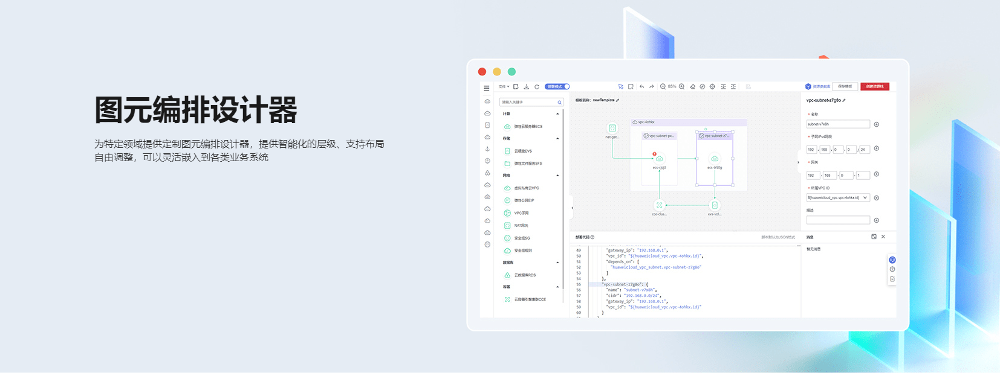
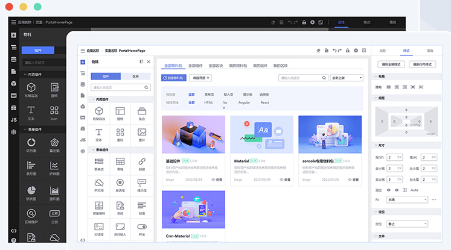
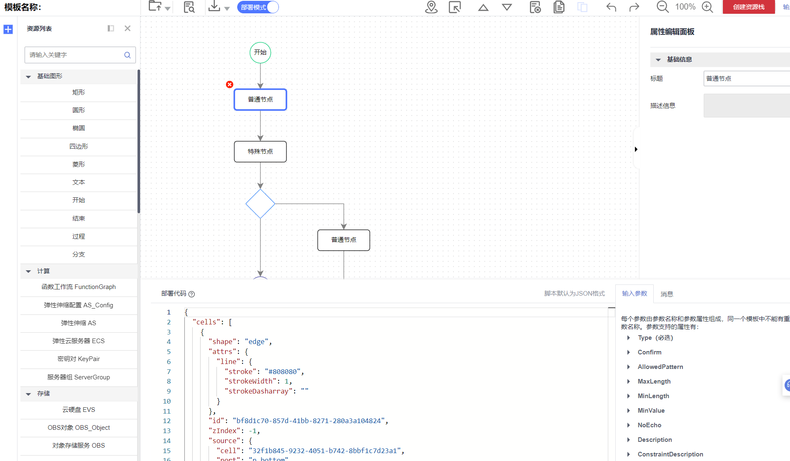
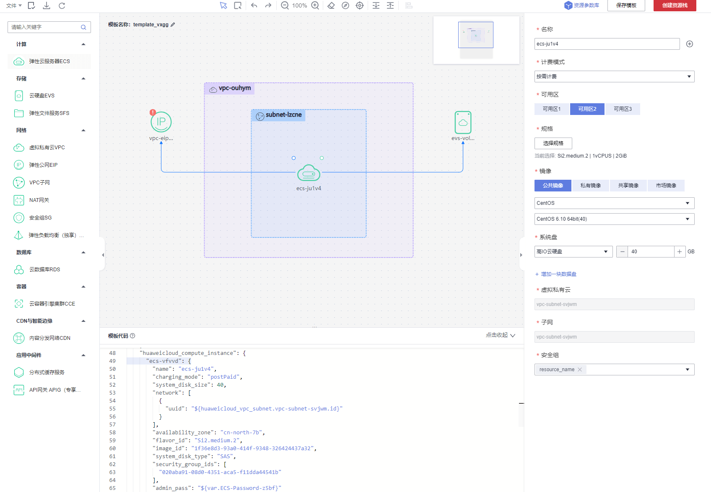

# 图元编排设计器

‍

​​

## 背景

图形编排有着广泛的使用场景，如在各类流程图，审批流，部署流水线，架构图中都能看到它的身影。资源编排正是这样一个类似的场景，只是编排的主体变成了云服务资源。

资源编排遵循基础设施即代码（Infrastructure as Code, IaC）的设计理念，区别于之前需要单独管理每一种云服务资源，通过资源编排设计器，用户无需手动创建多个资源，在平台通过设计器拖拽配置即可生成模板，并一键部署多个资源。

因此，对于资源编排服务场景，需要定制一个专用的设计器来满足用户编排的需求。

## 述求与选型

核心诉求围绕拖拽配置与模板生成，因此需要有完备的画布拖拽、绘图核心能力与灵活的配置及自定义能力，并通过人性化的交互，来为用户提供强大的在线设计器，顺利生成资源模板，实现一键部署。

考虑到需要支持大量的云服务资源，同时每一个云服务资源需要配置的属性也是不一样的，因而采用传统开发方式，为每一种云服务资源开发专门的属性设置页面是不可行的。在属性配置上需要能够能力自定义渲染。

同时模板是极为重要的一环，关系到最终资源的部署，模板需要符合特定的标准格式，因此画布和属性面板的输入需要最终体现到最终的模板中。

整理出主要的述求：

* 整体页面需要至少包含：资源列表、画布、属性设置
* 画布有拖拽、连线等绘图核心能力
* 属性面板需要能支持自定义配置渲染
* 支持拓展出其他能力

分析述求后，可以判断使用传统方式工作量极大，实现上不太现实，同时发现，资源编排设计器与低代码设计器有许多的相似性，都涉及到基础的资源、拖拽、配置，只有画布区域有差异：由前端组件搭建的页面变成云服务资源图元组成的自由图形，因此考虑借助低代码设计器能力搭建的思路。

针对低代码设计器场景，TinyEngine通过优秀的整体架构提供了高度自由的定制能力，可以像搭积木一样选择不同的积木搭建一个专属的设计器，同时属性面板全部通过JSON配置文件渲染，无需编写代码，灵活而强大，能够大大减少开发的成本。设计器布局类似VS Code，核心模板与功能区域划分清晰，上手即用。插件化架构也方便了自由拓展业务相关功能。最终决定使用TinyEinge开发图元编排设计器。

## 快速原型

​​

TinyEngine基础设计器中分为顶部工具栏、左侧插件栏、右侧属性配置栏、中央画布区四个部分，同时还可以支持自定义主题配置。

因此基于TinyEngine开发资源编排设计器，变成了一件较为简单的事情，只需替换Web专用画布为绘图画布，再添加必要的功能插件即可。

遵循TinyEngine推荐的开发风格，按照以下目录来进行开发，canvas中为画布模块，controller为控制器逻辑，common存放公共逻辑，toolbars/plugins/settings对应上、左、右区域的插件，theme对应主题，addons为当前应用所引入的插件：

```js
.
|-- canvas
|-- controller
|-- common
|-- plugins
|-- settings
|-- toolbars
|-- theme
|-- index.html
|-- main.js
|-- App.vue
|-- addons.js
`-- vite.config.js
```

引入TinyEngine相关模块后，对比分析后使用开源的Antv X6开发画布区域，同时按照物料协议与属性面板协议录入一份资源编排所需的物料后，即完成一个简陋但初具雏形的资源编排设计器Demo了。

​​

## 开发插件

### 整体插件架构介绍

TinyEngine整体架构优秀之处在于，提供了一套完备的插件体系，包含了插件开发所有的基础UI库、工具库、插件面板的显示控制、生命周期管理、公共API注册与共享等，因而遵循简单的规范即可快速开发出业务所需的功能插件。

TinyEngine中的插件根据位置，有大致分为三类：toolbars/plugins/settings，分别对应顶部区域、左侧区域、右侧区域，toolbars插件主要偏向于无需UI或者UI较为简单的工具插件，plugins是业务功能插件，显示在左侧(或下方)抽屉页面，可以通过点击进行展开收起或切换。

### 遵循插件规范开发

TinyEngine插件开发需要遵循一定的开发规范，主要是文件规范与导出规范：

* 文件规范，必须包含下面几个文件

```bash
pluginProject
 - src 插件源码
 - index.js 注册插件入口，需要导出约定的数据结构
 - package.json
```

* 导出规范， index.js 文件需要导出一个对象来声明基础信息

```javascript
import component, { api } from './src/Main.vue'

export default {
  id: 'pluginId', // 插件id
  title: 'pluginName', // 插件名
  icon: 'js', // 插件 icon
  align: 'top', // 插件位置，左侧插件可选值：'top' | 'bottom'  工具栏可选值：'right' | 'center' | 'left'
  component, // 插件面板打开时渲染的组件
  api, // 插件暴露的 api，可以提供给其他插件调用
}
```

在此基础上就可以按照业务需要自由开发相关逻辑代码。

最后在addons插件配置文件中引入，就完成一个完整的插件开发了。

```js
import Materials from '@xxxx/lowcode-plugin-materials'

export default {
  plugins: [
    Materials,
    // ...
  ],
  toolbars: [
    // ...
  ],
  settings: [
    // ...
  ]
}
```

如此根据业务需要开发基本工具栏插件、导出插件、主题、属性配置插件、模板转换插件，微调整体设计器样式，就快速的完成了一个资源编排领域的图元编排设计器。

​​​​

## 总结

在资源编排等图元编排场景，与低代码Web页面编排有很多相似之处，也同样可以借助TinyEngine的基础引擎能力，快速搭建出PoC原型，再此基础上，利用其优秀的插件架构和提供的插件公共能力，添加业务相关插件，快速开发出一个领域定制的专属设计器。