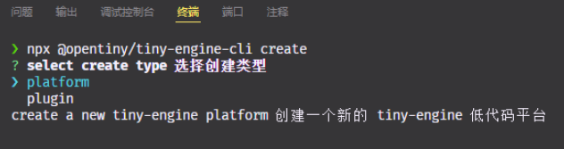
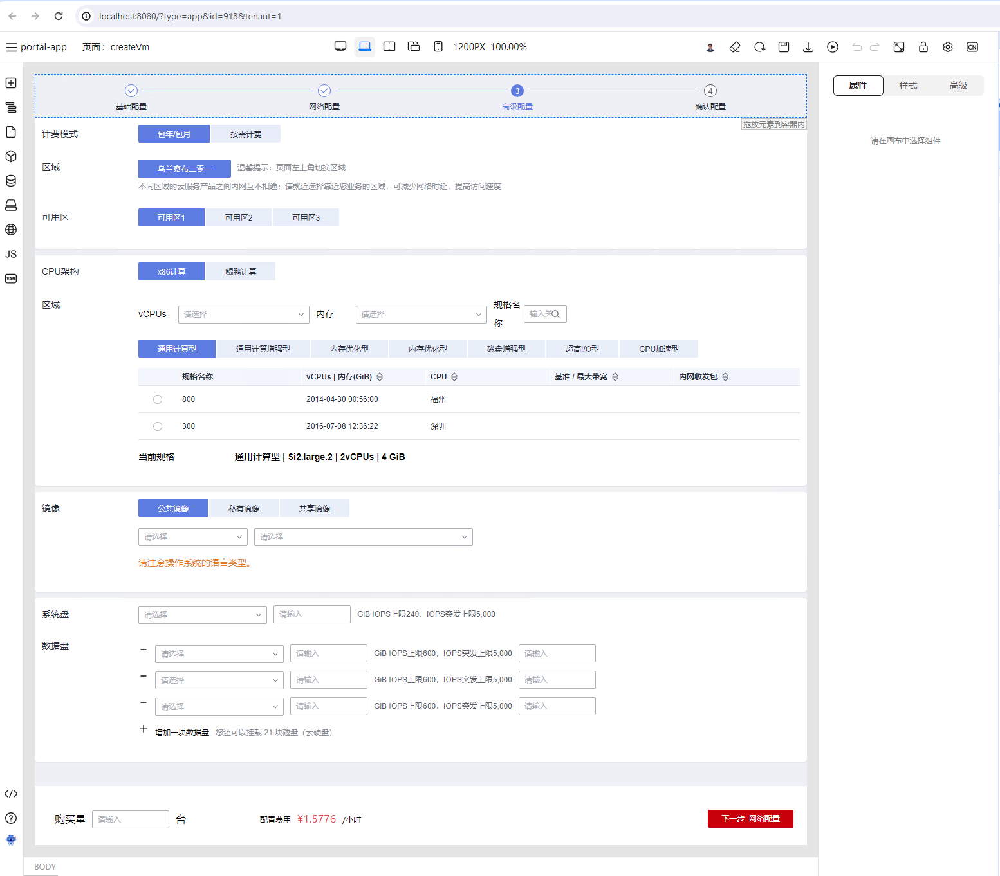
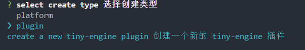
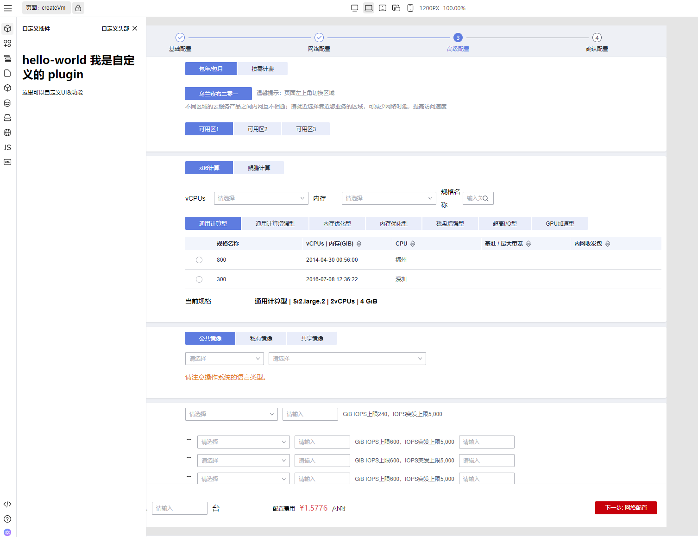

# 快速上手

本篇会讲解两种上手模式：一种是使用Cli工具快速搭建本地项目进行低代码平台开发，另外一种是下载/克隆源码，直接在源码上进行开发。

## 一、环境准备

在开始上手之前，先确保我们的开发环境以及⼯具齐全： 

- Node.js v18+版本
- pnpm 包管理⼯具
- 前端项目代码编辑器
- git 代码版本管理⼯具
-  chrome浏览器 110+ 版本
- 以及其他必要的开发前端开发环境、⼯具等。


## 二、Tiny Engine CLI

 TinyEngine提供了CLI⼯具⽅便⽤户⼆次开发，通过CLI，⼀⾏命令即可基于TinyEngine 创建出全新的低代码项⽬、低代码插件项⽬，未来还会陆续增加创建设置器插件，创建新主 题，新布局，新物料包等能⼒。

### 2.1 一行命令创建自己的专属低代码设计器


#### 2.1.1 创建低代码设计器


执行engine-cli create，选择platform以创建一个新的设计器

```sh
npx @opentiny/tiny-engine-cli@2.0.0 create
```

执行后首次会提示是否安装`@opentiny/tiny-engine-cli`，输入“Y”并回车

之后会提示选择要创建类型，选择platform之后，输入设计器名称，如：lowcode-designer，即可完成新设计器项目的创建。

查看当前文件目录，看发现已经创建出了 lowcode-designer 代码目录。



#### 2.1.2 启动低代码设计器

执行下面命令安装依赖并启动项目：

```shell
# 安装依赖
pnpm i  

# 启动项目
pnpm dev  
```

启动完项目之后，我们应该能看到浏览器打开的默认的低代码设计器：




### 2.2 通过开发插件扩展设计器新功能

#### 2.2.1 一行命令创建新插件

另起一个终端，在当前目录下，输入下面命令，选择创建plugin类型，创建一个新的插件

```shell
npx @opentiny/tiny-engine-cli@2.0.0 create
```



输入插件名称：demo-plugin

之后就可以在demo-plugin目录看到新创建的插件，进去该目录安装依赖：

```shell
cd demo-plugin && npm install
```

#### 2.2.2 将插件接入设计器

使用VS Code打开设计器项目，修改registry.js

```diff
import { Breadcrumb, Fullscreen, /* ... */, GenerateCodeService } from '@opentiny/tiny-engine'
import engineConfig from './engine.config'
++ import DemoPlugin from './demo-plugin'

export default {
	// ...
--  plugins: [Materials, Tree, Page, Block, Datasource, Bridge, I18n, Script, State, Schema, Help, Robot],
++  plugins: [DemoPlugin, Materials, Tree, Page, Block, Datasource, Bridge, I18n, Script, State, Schema, Help, Robot],
  dsls: [{ id: 'engine.dsls.dslvue' }],
  settings: [Props, Styles, Events],
  canvas: Canvas
}

```

#### 2.2.3 开发调试插件

重新打开项目页面，可以看到侧边栏多了一个新的插件：



修改插件代码，设计器界面也会实时刷新。

之后可以尝试完成以下功能：

- 为插件实现一个“添加按钮”，点击按钮展开插件二级页面
- 在二级面板中添加一个输入框，并实现保存功能，点击保存按钮将输入框内容显示到一级面板中

如此即完成了一个简单的TinyEngine侧边栏插件开发全流程。

## 三、源码开发
虽然不推荐此方案，但是 TinyEngine 2.0版本仍然提供了源码开发的模式给开发者使用。具体使用步骤如下：

### 3.1 克隆或下载源码

前往[Tiny Engine github](https://github.com/opentiny/tiny-engine/tree/v2.0.0) 地址，选择分支为：`refactor/develop`，或者选择Tags为 v2.0.0或者其他2.0版本，克隆或下载源码。

克隆下来可以看到我们的目录结构如下

```
...
├─ designer-demo # 此处为高度可定制化的低代码平台，即用户自己的低代码设计器     
│  ├─ env
│  ├─ public 
│  ├─ src
│  ├─ engine.config.js
│  ├─ index.html
│  ├─ package.json
│  ├─ preview.html
│  ├─ registry.js # 用户注册表
│  ├─ vite.config.js
├─ pnpm-workspace.yaml
├─ package.json
├─ README.md
└─ README.zh-CN.md
...
```

### 3.2 安装启动低代码设计器

执行下面命令安装依赖并启动项目：

```shell
# 安装依赖
pnpm i  

# 启动用户的低代码设计器
pnpm dev:demo  
```

启动完项目之后，我们应该能看到浏览器打开的默认的低代码设计器：


