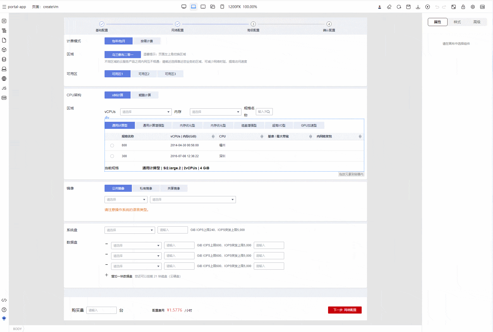

# 出码功能简介与使用

## 什么是出码

在TinyEngine低代码引擎中，用户搭建的页面，会使用符合TinyEngine页面搭建协议规范的JSON数据来描述，也即页面Schema，而用户需要的最终产出物为源代码文件，出码模块就是沟通两者的桥梁，它的作用是将符合协议规范的JSON格式Schema数据，转换成符合语义的、可读性好的源代码文件。

```json
{
  "componentName": "div",
  "props": {
    "style": "color: red; text-align: center;"
  },
  "children": [
    {
      "componentName": "Text",
      "props": {
        "text": "TinyEngine 前端可视化设计器，为设计器开发者提供定制服务，在线构建出自己专属的设计器。"
      }
    }
  ]
}
```

转换成 vue 代码之后则会变成:

```vue
  <div style="color: red; text-align: center;">
    <span>TinyEngine 前端可视化设计器，为设计器开发者提供定制服务，在线构建出自己专属的设计器。</span>
  </div>
```

## 为什么需要出码

基于 schema 自定义运行时引擎固然有保存之后即可看到渲染效果的好处，但是，在我们实战经验中却发现随着需求的变更以及时间的变迁，运行时引擎的代码会膨胀的非常巨大，运行时引擎内部的架构也越来越复杂，会带来一些明显的痛点：

- 由于运行时引擎代码复杂，正常的需求迭代与变更中，如果场景测试不完全，可能会导致线上基于运行时引擎的页面崩溃。
- 运行时为了兼容各种功能与需求，本身体积会越来越大，导致页面打开速度与响应速度会受到一定影响。
- 运行时引擎需无法很好地与现有项目进行相结合（部分页面使用低代码搭建，或者是部分子页面使用低代码搭建的场景）。

在经历一番探索之后，我们发现使用出码的方案可以相对完美的解决以上痛点：

- 运行时引擎仅在设计态搭建页面的时候存在，正式上线的代码是人工可读的高代码，可以走代码托管平台（比如GitHub或者Gitlab）的MR review 流程。及时发现出码的错误。即使当前页面出码有 bug，只会影响当前页面，而不会导致整个应用的崩溃
- 生产环境不存在运行时引擎，也就不会因为运行时引擎体积的问题导致页面打开速度与相应速度变慢，理论上来说，出码之后，还可以正常走 SSR 等服务端渲染方案。
- 支持仅出码部分页面，直接与现有项目相结合。

基于以上的一些考虑，TinyEngine提供了schema to code 的出码能力，以及自定义出码的能力。

## 如何使用出码

使用出码包括使用官方自带出码能力以及自定义出码两种。

### 直接使用官方自带出码能力

在工具栏顶部，自带有应用出码的工具。点击即可将当前应用转换成应用代码。



### 使用官方出码能力进行自定义调整

请查看[如何自定义出码](./如何自定义出码.md)章节
