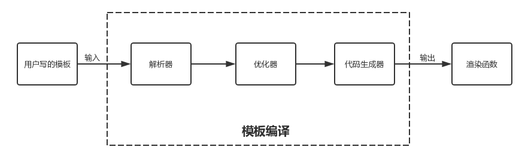

# 如何自定义出码

## 出码的核心过程

在[出码功能简介与使用](./出码功能简介与使用.md)章节中，我们知道了出码的核心是将符合TinyEngine协议规范的 schema 转换成符合语义的、高质量可读的代码。但是，工程化代码（基础项目代码）、代码风格、具体 schema to code 具体细节等等的情形可能每个团队都有不同的选择，所以也就诞生了自定义出码的需求。下面，我们针对“基于官方出码能力增加出码插件”以及“自定义插件完成 schema to code 的转换”两种情形进行介绍。

## 基于官方出码能力自定义出码

官方默认提供了 vue composition api 风格的出码能力，还提供了一系列的钩子，满足用户对出码细节进行调整的需求。

### 官方默认出码流程概述

官方的出码流程与 vue 模板编译流程相似。我们先看看 vue 模板编译的流程：



TinyEngine 出码整体流程：


从上述流程图可以看到，TinyEngine出码流程主要有以下步骤：

- 输入应用 Schema。
- 调用 transformStart 阶段的插件，对应用 Schema 进行解析以及前置处理，比如：合法性解析、schema协议的转换处理。
- 依次调用 transform 阶段的插件执行代码生成，得到目标生成代码。比如：调用 genRouterPlugin 插件执行生成路由配置文件。
- 依次调用 transformEnd 阶段的插件，对生成的代码进行后置处理，比如：执行代码格式化。

### 官方出码包的使用

#### 安装

```bash
npm install @opentiny/tiny-engine-dsl-vue
```

#### 使用官方默认配置出码

```javascript
import { generateApp } from '@opentiny/tiny-engine-dsl-vue'

// 得到出码实例 CodeGenInstance
const instance = generateApp()

// 调用实例 generate 方法，传入应用协议数据 appSchema
const res = await instance.generate(appSchema)
```

#### 传入配置出码

我们可以根据 API 文档提供的配置，对出码的部分细节进行调整。

```javascript
import { generateApp } from '@opentiny/tiny-engine-dsl-vue'

const instance = generateApp({
  pluginConfig: {
    // 对 formatCode 插件传入自定义配置
    formatCode: {
      singleQuote: false,
      printWidth: 180,
      semi: true
    }
  }
})

const res = await instance.generate(appSchema)
```

### 替换官方出码插件或增加插件

官方提供了以下几个出码插件：

- template 生成静态出码模板
- block  生成区块代码
- page  生成页面代码
- dataSource 生成数据源相关代码
- dependencies 将组件依赖的 package 注入到 package.json 中
- i18n 生成 i18n 国际化数据
- router 生成路由文件
- utils 生成 utils 工具类文件
- formatCode 格式化已经生成的文件
- parseSchema 解析、预处理 schema
- globalState 生成全局状态文件

如果在使用过程中不能满足需求，我们可以通过传入自定义插件的方式覆盖官方插件。
例如：

```javascript
import { generateApp } from '@opentiny/tiny-engine-dsl-vue'

const customDataSourcePlugin = () => {
  return {
    name: '',
    description: '',
    run: () {
      // ... 自定义出码逻辑
    }
  }
}

const instance = generateApp({
  customPlugins: {
    // 使用自定义插件替换官方 dataSource 生成的插件
    dataSource: customDataSourcePlugin(),
    // 传入自定义插件 customPluginItem，替换官方的 template 插件
    template: customPluginItem(),
    // 传入 customRouterPlugin 插件，替换官方的 router 生成路由插件
    router: customRouterPlugin()
  }
})

const res = await instance.generate(appSchema)
```

更多信息请查看 [如何自定义出码插件](./如何自定义出码插件.md) 以及 [官方出码能力API](./官方出码能力API.md) 章节

## 自定义出码 package 完成 schema to code 的转换

假如应用出码目标非 vue 技术栈，或者目标出码与官方出码差异太大。那么，我们可以借鉴官方出码的方式，完全自定义自身的出码。本质上只要符合输入输出的相关规范即可。


