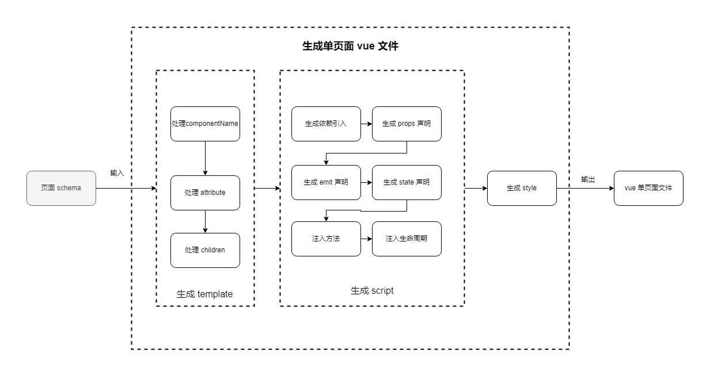

# 自定义页面出码插件

页面出码是整体应用出码中的核心组成部分。关于页面出码也有很多的定制化需求，比如 vue 出码可以选择 composition api 的风格、可以选择 options 的风格，可以选择 return jsx 的出码风格。为了满足二次开发用户自定义页面出码的需求。我们提供两种自定的方式，下面是具体介绍：

## 自定义插件替换页面出码与区块出码

第一种方式，假如用户想出码成 vue options 风格的页面，与官方的出码存在较大差异，则官方建议自定义插件。替换官方的页面出码插件与区块出码插件。
例如：

```javascript
import { generateApp } from '@opentiny/tiny-engine-dsl-vue'

const customOptionStylePlugin = () => {
  return {
    name: '',
    description: '',
    run: (schema, context) {
      // ... 自定义出码逻辑
      const res = '' // ... 这里自定义 option style 的 vue 文件

      const file = {
        fileType: 'vue',
        fileName: 'fileName.vue',
        path: blockBasePath,
        fileContent: res
      }

      this.addFile(file)
    }
  }
}

const instance = generateApp({
  customPlugins: {
    // 替换官方页面出码插件
    page: customOptionStylePlugin(),
    // 替换官方区块出码插件
    block: customOptionStylePlugin(),
  }
})

const res = await instance.generate(appSchema)
```

## 基于官方出码自定义

第二种方式，假如用户想在官方出码的基础上进行一些增量或者细节调整，则可以传入 hook 函数到官方插件中。进行出码的细节或者增量调整。

### 官方页面出码流程

在说明如何传入 hook 到官方插件中实现细节调整之前，我们不妨先看看官方页面的出码流程。对整体页面出码流程有大致的印象。

单页面出码流程图：



#### 单页面出码流程说明

##### 输入页面 schema

调用 `genSFCWithDefaultPlugin(schema)` 函数，传入页面 schema

##### 处理生成 template

遍历传入的页面 schema，递归处理 schema.children，得到 template 内容

```javascript
// 大致逻辑
function genTemplate(schemWithRes, globalHooks, config) {
  schema.schema.children.map(() => {
    // 存储中间态的数据
    const optionData = {
      schema: schemaItem,
      voidElement: false,
      componentName: componentName ?? component ?? '',
      prefix: [],
      attributes: [],
      children: [],
      suffix: []
    }

    for (const hookItem of [...genTemplateHooks, genTemplate]) {
      // 使用 genTemplateHooks 处理 componentName、attributes、children
      // 数组最后是 genTemplate 函数，即调用自身递归处理 children
    }

    // 拼接得到 jsx，比如 <div class="container"></div>
    return `
${optionData.prefix.join('')}${startTag}${optionData.children.join('')}${endTag}${optionData.suffix.join('')}`
  })
}
```

处理完成最终得到如 `<template><div></div></template>` 的template 内容

##### 生成 script

从流程图可以看到，我们按顺序调用指定的 hook 生成依赖引入、props 声明、emit 声明、state声明、方法声明、生命周期。最终得到单页面中的 script，如：

```vue
<script setup>
import * as vue from 'vue'
/*...*/

const props = defineProps({ ...})

const emits = defineEmits([...])

const state = reactive({ ... })

/** ...method */

/** 生命周期 */
</script>
```

##### 生成 style

生成 style 的内容很简单，我们只需简单拼接 css 字符串即可，最终得到 style 内容，如：

```vue
<style scoped>
//... TinyEngine 生成的 css 字符串
</style>
```

##### 返回最终结果，得到vue单页面文件内容

最终我们拼接得到的 template、script、style，最终得到单文件字符串

### 官方页面出码能力详解

得知了官方页面出码插件的出码流程之后，让我们看看我们能够用他来做些什么。

#### 生成 template

##### 转换 componentName

比如将内置的 Text 组件转换成 html 的 span 标签：

```javascript
function handleComponentName(optionData) {
  if (optionData.componentName === 'Text') {
    optionData.componentName = 'span'
  }
}
```

##### 处理 attributes

以官方的 TinyGrid 组件为例，我们可以处理其中的 mock 属性，处理插槽组件的特殊 props。
假如我们有如下的 schema 片段：

```javascript
{
  "componentName": "TinyGrid",
  "props": {
    // data 和 fetchData 同时存在，tinyGrid 会优先使用 data
    // 但是 data 可能仅只有 Mock数据，实际生成代码时
    "data": {...},
    "fetchData": {...},
    "columns": [
      {
        "editor": {
          // 这里的 component 当前只是一个字符串，实际出码过程中，我们需要变成 TinySelect 的引用
          // 并且在 script 中声明引入依赖
          "component": "TinySelect"
          // ... 其他属性
        }
      }
    ]

  },
  "children": []
}
```

则我们可以使用如下的 hooks 进行处理：

```javascript
const handleTinyGrid = (optionData, globalHooks, config) => {
  const { componentName, props } = optionData.schema

  // 同时存在 data 和 fetchData 的时候，删除 data
  if (componentName === 'TinyGrid' && props?.data && props?.fetchData) {
    delete props.data
  }

  // 处理 TinyGrid 插槽
  if (componentName !== 'TinyGrid' || !Array.isArray(props?.columns)) {
    return
  }

  // 处理 TinyGrid 组件 editor 插槽组件使用 opentiny/vue 组件的场景，需要在 import 中添加对应Tiny组件的引入
  props.columns.forEach((item) => {
    if (item.editor?.component?.startsWith?.('Tiny')) {
      const name = item.editor?.component

      // 使用 globalHooks 往 script 中注入依赖引入
      globalHooks.addImport('@opentiny/vue', {
        destructuring: true,
        exportName: name.slice(4),
        componentName: name,
        package: '@opentiny/vue'
      })

      // 处理 component 组件，变成引用
      item.editor.component = {
        type: 'JSExpression',
        value: name
      }
    }

    if (typeof item.slots === 'object') {
      Object.values(item.slots).forEach((slotItem) => handleTinyGridSlots(slotItem?.value, globalHooks, config))
    }
  })
}

// 传递到页面和区块出码插件
const instance = generateApp({
  pluginConfig: {
    page: { sfcConfig: { genTemplate: [handleTinyGrid] } }
    block: { sfcConfig: { genTemplate: [handleTinyGrid] } }
  }
})
```

##### 处理children

假如我们的 schema 片段有特殊的 children，那么我们可以提前处理，而不需要等到递归处理

比如：我们有如下的 schema 片段:

```javascript
{
  "componentsName": "div",
  "props": {},
  // children 是一个表达式
  "children": {
    "type": "JSExpression",
    "value": "should render ? 'aa' : 'bbb'"
  }
}
```

则我们可以使用函数处理该 children

```javascript
const handleExpressionChildren = (schemaData = {}, globalHooks, config) => {
  const { children, schema } = schemaData
  const type = schema?.children?.type
  const isJSX = config.isJSX
  const prefix = isJSX ? '{' : '{{'
  const suffix = isJSX ? '}' : '}}'

  // 如果是 js expression 类型
  if (type === JS_EXPRESSION) {
    specialTypeHandler[JS_RESOURCE](schema.children, globalHooks, config)

    // 直接生成 children 字符串
    children.push(
      `${prefix} ${schema.children?.value.replace(isJSX ? thisRegexp : thisPropsBindRe, '') || ''} ${suffix}`
    )

    // 删除 schem.children 属性，避免后续 hooks 重复处理 children
    delete schema.children
    return
  }
}

// 传递到页面和区块出码插件
const instance = generateApp({
  pluginConfig: {
    page: { sfcConfig: { genTemplate: [handleExpressionChildren] } }
    block: { sfcConfig: { genTemplate: [handleExpressionChildren] } }
  }
})
```

#### globalHooks使用

相信细心的你已经看到了，在上述的例子中，我们可能会频繁的使用 globalHooks，接下来，让我们看看 globalHooks 的相关能力。

globalHooks 在 genTemplate、parseScript、genScript 等钩子函数中都可以使用。可以往 script 中注入相关引用，可以往 style 中注入 css。

##### 插入声明语句

我们可以往 script 中插入声明语句

```javascript
globalHooks.addStatement({
  // position 标识插入位置
  position: 'AFTER_IMPORT',
  // 插入的 javascript 语句
  value: 'const test = "hello world"',
  // 语句的 唯一 key，可以避免重复插入，如果 key 重复，会导致插入失败
  key: 'test'
})
```

同样，我们可以使用 `globalHooks.getStatements()` 获取当前所有的语句

##### 插入、获取方法声明

```javascript
// 插入方法，第一个参数为 唯一 key，唯一 key 冲突则插入不成功，建议使用函数名作为 唯一 key
globalHooks.addMethod('testfun', 'function testfun() { console.log("插入方法成功") }')

// 获取schema以及注册的方法
globalHooks.getMethods()
```

##### 增加、获取状态变量

```javascript
globalHooks.addState(key: any, value: any): boolean

// 示例：
// 第一个参数 key 为唯一 key，避免冲突，第二个参数为增加的 状态变量字符串，为实际向状态变量注入的 key 和 value
globalHooks.addState('test', 'test: "hello world"')

// 注入成功后出码示例：
const state = reactive({
  //... 其他状态变量省略
  test: "hello world"
})
```

获取状态变量：

```javascript
// 返回使用 globalHooks.addState 方法注入的 state
globalHooks.getState()
```

##### 注入、获取依赖

```typescript
interface IConfig {
  destructuring: boolean; // 是否解构
  exportName: string; // 导出名称
  componentName: string; // 别名
}
// 插入依赖声明
globalHooks.addImport(packageName: string, config: IConfig)

// 获取当前所有的 import
globalHooks.getImport(): IConfig[]
```

比如，我们想要注入指定的依赖 @vueuse/core：

```javascript
globalHooks.addImport('@vueuse/core', {
  destructuring: true,
  exportName: 'useLocalStorage',
  componentName: 'useLocalStorageAlias'
})
```

则会生成声明语句：`import { useLocalStorage as useLocalStorageAlias } from '@vueuse/core'`

##### 设置、获取 script 标签配置

在生成 script 标签的时候，我们可以有：`<script setup lang="jsx">`，即 setup 和 lang 两个属性配置。如果我们想要设置这两个 config，则可以使用该 api，比如：

```javascript
globalHooks.setScriptConfig({
  lang: 'jsx', // 或者是 'tsx'
  setup: true // 默认为 true
})

// 获取当前 script 的配置
globalHooks.getScriptConfig()
```

##### 设置、获取 css 配置

同样的，css 的 `<style>` 可以设置 `lang` 和 `scoped` 两个属性。

```javascript
globalHooks.setStyleConfig({
  scoped: true, // 默认为 true
  lang: 'less', // 默认无
})

// 获取当前 style config
globalHooks.getStyleConfig()
```

##### 添加CSS

我们可以往 css styles 中插入 css，如：

```javascript
globalHooks.addCss(cssString)
```

#### 处理 script相关能力

经过 template 的处理之后，我们已经得到了一部分的 statement、import、state、methods。现在，我们可以结合 schema 原有的内容，拼装生成我们的 script 内容。拼装过程中，会经历 parseScript 阶段和 拼装 script 的阶段。

##### parseScript 阶段

该阶段提供使用 globalHooks 处理的最后时机，比如：

```javascript
// 自定义处理函数
function parseScript(optionData, globalHooks) {
  // 可以使用上述 globalHooks 的能力注入 statement 或者 依赖引入
  globalHooks.addStatement({...})
}

// 传递到页面和区块出码插件
const instance = generateApp({
  pluginConfig: {
    page: { sfcConfig: { parseScript: [parseScript] } }
    block: { sfcConfig: { parseScript: [parseScript] } }
  }
})
```

##### 拼接 script，顺序拼装 script

该部分官方已经内置插件进行组装，原则上不建议用户自行定义。但我们仍然暴露了插槽函数，提供用户替换生成。如：

```javascript
const instance = generateApp({
  pluginConfig: {
    page: { sfcConfig: { genScript: {
      GEN_IMPORT: function (schema, globalHooks) {
        // 自定义生成 import 语句
        return '....'
      },
      GEN_PROPS: function (schema, globalHooks) {
        // 自定义生成 props 声明语句
        return '....'
      },
      GEN_EMIT: function (schema, globalHooks) {
        // 自定义生成 emit 语句
        return '...'
      }
    } } }
    block: { sfcConfig: { genScript: {
      // ...
    } } }
  }
})
```

具体可供自定义的插槽为：

- GEN_IMPORT  生成 import 依赖声明语句
- GEN_PROPS  生成 props 声明
- GEN_EMIT  生成 emit 声明
- GEN_STATE  生成 emit 声明
- GEN_METHOD  生成 method 声明
- GEN_LIFECYCLE  生成 lifecycle 声明

### 页面出码插件 API 说明

```typescript

interface IConfig {
  pluginConfig: {
    page: {
      pageBasePath: string; //  默认为 './src/views'
      sfcConfig: ISFCConfig;
    },
    block: {
      blockBasePath: string; // 默认为 './src/components'
      sfcConfig: ISFCConfig;
    }
    //... 其余省略
  }
  //... 其余省略
}

function generateApp(config: IConfig): CodeGenInstance

interface ISFCConfig {
  blockRelativePath: string; // 声明 block 依赖引用时的相对路径，默认为 '../components/'
  blockSuffix: string; // 默认为 '.vue'
  scriptConfig: { lang?: 'jsx' | 'tsx'; setup?: boolean };
  styleConfig: { scoped?: boolean; lang?: 'less' | 'scss' };
  hooks: {
    // 对单个 schema 片段进行校验，如果返回 false，则该 schema 片段不会被转化成代码
    templateItemValidate: Array<(schemaData: IOptionData, globalHooks: IGlobalHooks, config) => boolean>;
    // 可以处理 componentName、props、children
    genTemplate: Array<(schemaData: IOptionData, globalHooks: IGlobalHooks, config) => void>;
    parseScript: Array<(schema: IPageSchema, globalHooks: IGlobalHooks, config) => void>;
    genScript: {
      GEN_IMPORT?: (schema: IPageSchema, globalHooks: IGlobalHooks) => string;
      GEN_PROPS?: (schema: IPageSchema, globalHooks: IGlobalHooks) => string;
      GEN_EMIT?: (schema: IPageSchema, globalHooks: IGlobalHooks) => string;
      GEN_STATE?: (schema: IPageSchema, globalHooks: IGlobalHooks) => string;
      GEN_METHOD?: (schema: IPageSchema, globalHooks: IGlobalHooks) => string;
      GEN_LIFECYCLE?: (schema: IPageSchema, globalHooks: IGlobalHooks) => string;
    }
  }
}

// 页面 schema
interface IPageSchema {
  state: Record<string, any>;
  methods: Record<string, any>;
  componentName: 'Page';
  css: string;
  lifeCycles: Record<string, any>;
  children: Array<ISchema>;
  props: Record<string, any>;
}

// schema 片段
interface ISchema {
  componentName: string;
  props: Record<string, any>;
  children: Array<ISchema>
}

interface IOptionData {
  schema: ISchema;
  voidElement: boolean; // 是否是自闭合标签
  componentName: string; // 生成的 componentName
  prefix: string[]; // 标签前缀，如要生成条件渲染 jsx 时，为 { render && <div></div> }，则此时前缀则为 ["{", "render &&"]
  attributes: string[]; // 往 tag 上注入的属性，如 [':visible="true"', 'v-if="shouldRender"']
  children: string[]; // 递归生成的children 字符串
  suffix: string[]; // 配合 prefix 可拼接生成 jsx
}

interface IGlobalHooks {
  addStatement(statement: { key?: string; value: { value: string; position: IInsertPosition } }): boolean;
  getStatements(): Record<string, any>;
  addMethods(key: string, value: any): boolean;
  getMethods(): Record<string, any>;
  addState(key, value): boolean;
  getState(): Record<string, any>;
  addImport(packageName: string, config: { destructuring: boolean; exportName: string; componentName: string; });
  getImport(): Record<string, any>;
  setScriptConfig(config: { lang?: 'jsx' | 'tsx'; setup: boolean }): void; 
  getScriptConfig(): { lang: 'jsx' | 'tsx' | ''; setup: boolean };
  setStyleConfig(config: { lang?: 'jsx' | 'tsx'; scoped: boolean }): void; 
  getStyleConfig(): { lang: 'jsx' | 'tsx' | ''; scoped: boolean };
  addCss(css: string): void;
}

type IInsertPosition = 'AFTER_IMPORT' | 'BEFORE_PROPS' | 'AFTER_PROPS' | 'BEFORE_EMIT' | 'AFTER_EMIT' | 'BEFORE_STATE' | 'AFTER_STATE' | 'BEFORE_METHODS' | 'AFTER_METHODS'
```
