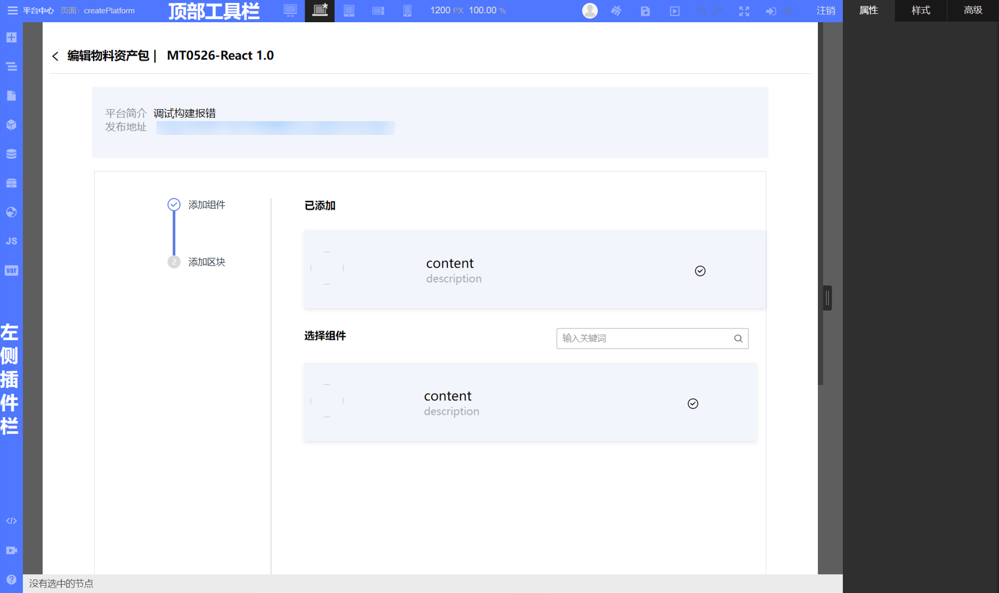
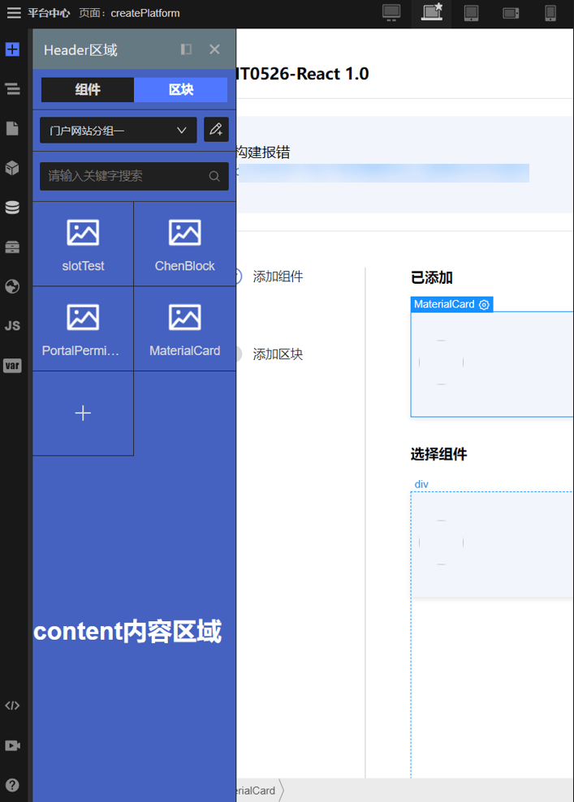
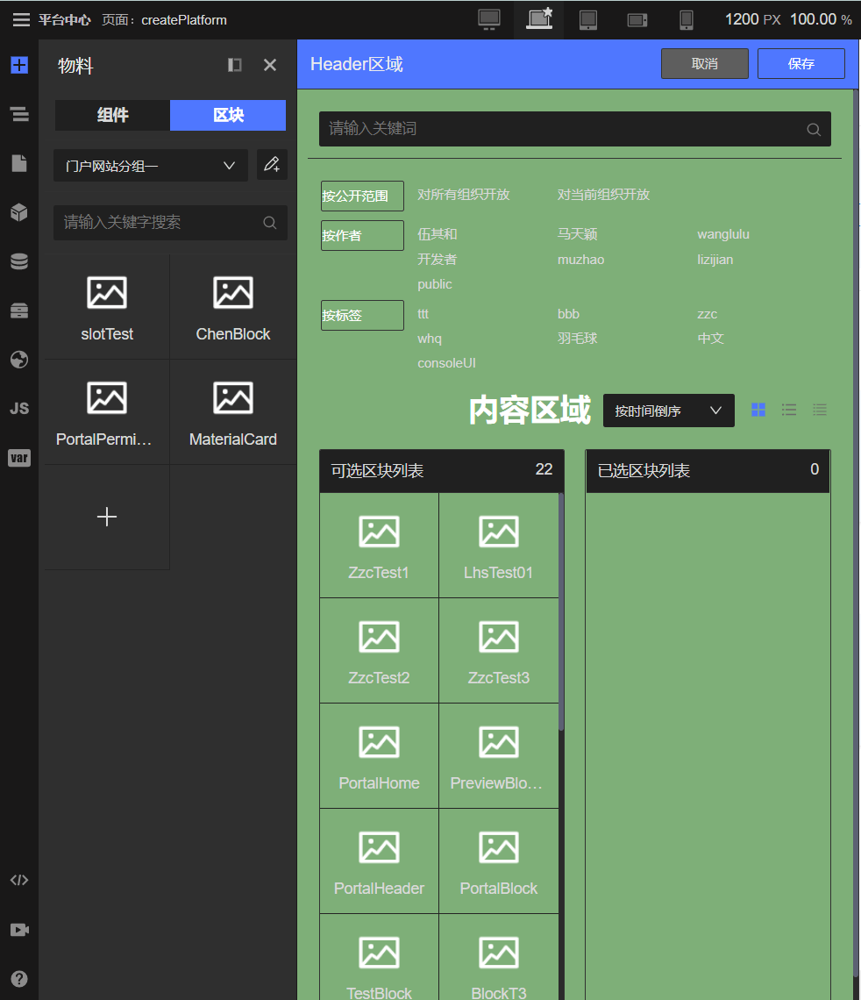
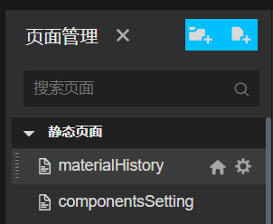
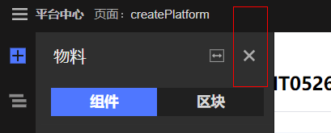
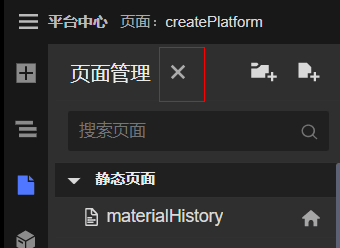

# 插件开发

## 插件相关概念

在设计器中，插件的范围包括顶部工具栏、左侧插件栏。


官方实现了很多插件，但是可能无法满足部分人的需求，所以，我们提供插件定制功能，通过插件定制和使用我们提供的能力，可以满足绝大部分人的需求。

插件提供的能力：

- 获取 schema 或操作 schema
- 通过画布暴露的逻辑与画布交互
- 通过插件面板实现其他自定义逻辑

## 插件从开发到上线使用的完整流程

- 开发插件
- 联调
- 发布插件
- 在生态中心中录入插件（左侧插件则到插件生态中录入，工具栏插件则到工具栏生态中录入）
- 在编辑设计器页面中选择刚刚发布的插件，重新构建设计器
- 到应用中查看并使用插件

## 插件模板工程

一个 minimal 的插件模板工程的核心文件或文件夹有以下几个：

```bash
pluginProject
 - src 插件源码
 - index.js 注册插件入口，需要导出约定的数据结构
 - package.json
```

其中 index.js 文件需要导出一个对象来声明插件的 id、标题、icon、插件位置、插件面板打开时渲染的组件，这样，核心工程里面才能正确注册并渲染插件。同时，还可以暴露出来其他 api，提供给其他插件调用

```javascript
import component, { api } from './src/Main.vue'

export default {
    id: 'pluginId', // 插件id
  title: 'pluginName', // 插件名
  icon: 'js', // 插件 icon
  align: 'top', // 插件位置，左侧插件可选值：'top' | 'bottom'  工具栏可选值：'right' | 'center' | 'left'
  component, // 插件面板打开时渲染的组件
  api, // 插件暴露的 api，可以提供给其他插件调用
}
```

## 插件UI

- 对于左侧插件，我们提供了 `PluginPanel` 和 `PluginSetting` 两个组件给用户使用
  - PluginPanel

  

  `PluginPanel` 用于点击左侧插件后展开的面板，分为 header 区域和 content 区域，其中 Header 区域主要显示插件标题、关闭按钮，具体使用方法请看下一节

  - PluginSetting

  

  `PluginSetting` 是在插件展开面板之后展开的面板，主要是可以提供更多的空间展示并提供设置更具体的细节，同样分为两部分，一部分是 Header 区域，一部分是 content 内容区域，具体使用方法请看下一节

- 对于工具栏插件，我们建议不要放置复杂的UI到工具栏插件中，顶部工具栏插件应该是一些快捷操作的按钮或者是一些状态的展示

### 插件面板组件

左侧的插件展开组件 `PluginPanel` ，引入方式为：

```javascript
import { PluginPanel } from '@opentiny/tiny-engine-common'
```

使用方式为：

```vue
<plugin-panel title="插件 教程" isCloseLeft="false 关闭图标是否在左侧（挨着标题），默认 false，在右侧">
    <template #header>
      这里是头部插槽
    </template>
    <template #content>
      这里是内容插槽（上面 PluginPanel 示意图中 content 内容区域（蓝色背景））
    </template>
</plugin-panel>
```

头部插槽示意图(天蓝色背景区域)：



`isCloseLeft: false` 默认关闭按钮在 Header插槽后面



`isCloseLeft: true` 关闭按钮在 title 后面



如果不使用提供的面板组件，实现自定义的UI（比如 Script 面板），则需要额外定义关闭按钮，并且在关闭按钮点击的时候 emit close 事件，这样，才能将面板关闭。例如

```vue
<span class="icon-wrap">
  <icon-close @click="$emit('close')"></icon-close>
</span>
```

### 插件设置面板组件

插件设置面板组件 `PluginSetting` 为在插件面板右侧展开的组件

引入方式：

```javascript
import { PluginSetting } from '@opentiny/tiny-engine-common'
```

使用方式：

```vue
<plugin-setting
  v-if="isOpen"
  :title="插件设置面板"
  :isSecond="false"
  @cancel="关闭设置面板的回调方法"
>
  <template #header>
    头部插槽
  </template>
  <template #content>
    内容插槽（上图 PluginSetting 中内容区域，即绿色背景区域）
  </template>
</plugin-setting>
```

头部插槽示意图（红框区域）：


props 说明

- title 设置面板的标题
- isSecond 是否为二级设置面板（一级设置面板为挨着展开组件 PluginPanel  展开，二级设置面板挨着一级设置面板展开）
- cancel 点击取消按钮的回调（用户关闭设置面板）

注意：

- 展开关闭需要用 `v-if` 来主动控制
- 如果需要更改设置面板的宽度，可以声明 css 变量 `--base-collection-panel-width` 如：

```html
<plugin-setting style="--base-collection-panel-width: 50vw">...</plugin-setting>
```

## 插件使用其他核心 API

插件本身仅仅是一个暴露给用户的插槽，如果想要实现与画布交互、与 schema 交互，还需要使用我们提供的其他核心能力。

### 获取 Schema

schema （生成页面的 JSON 信息） 基本结构：

```javascript
{
  componentName: 'Page', // 当前页面类型，"Page" 表示 页面 "Block" 表示区块
  css: '', // 当前页面或者区块的 CSS
  props: {}, // 当前页面或者区块接收外部传入的 props
  lifeCycles: {}, // 绑定的生命周期，以 vue 为 例，可以绑定：onMounted setUp onUpdated 等等
  children: [], // 用户拖拽搭建的组件数据
  dataSource: { // 数据源
    list: [] // 数据源列表
  },
  methods: {}, // 自定义的 JS 方法
  bridge: {  // 桥接源
    imports: [] // 数据源列表
  },
  state: {}, // 自定义的状态
  inputs: [], // 页面接口：输入类型
  outputs: [] // 页面接口：输出类型
}
```

schema 中 children 的结构：

```javascript
interface IComponentSchema { // 组件 schema
  componentName?: string;     // 页面
  blockName?: string;     // 区块
  id: string;
  props?: { // 组件绑定的属性
      condition?: boolean | IBindProps; // 条件渲染判断值
      ref?: {  // 定义组件引用 ID
          name: string; 
          type: string; 
      };
      style?: string; // 行内样式
      className?: string; // 绑定的样式类名
      [prop:string]?: IEventProps | IBindProps | any;
  };
  children?: Array< IComponentSchema > | string;
}
```

详细的协议规范、数据含义及类型请阅读[低代码协议](https://www.opentiny.design/tiny-engine#/protocol)

了解了基本的协议规范之后，我们就可以通过 `useCanvas` 拿到当前页面的许多页面状态信息。比如拿到页面 schema 或者当前选中节点的 schema 了

```javascript
import { useCanvas } from '@opentiny/tiny-engine-controller'
const schema = useCanvas().getPageSchema() // 获取整个页面的 schema
const currentSchema = useCanvas().getCurrentSchema() // 获取当前选中节点的 schema
```

### 获取页面状态

在设计器中，除了 schema 之外，还有许多表示当前页面的状态，我们先了解一下这些状态有哪些

```javascript
{
    currentSchema: null, // 当前选中节点的 schema
  pageSchema: null, // 页面 schema
  isSaved: true, // 页面是否已保存
  isLock: false, // 页面是否上锁
  isBlock: false, // 当前页面类型是否是区块
  nodesStatus: {}, // 节点状态是否隐藏（设计态隐藏，即仅仅在画布中隐藏）
  loading: false // 页面状态，是否在加载中
}
```

了解了有哪些页面状态之后，我们看看如何拿到这些状态

```javascript
import { useCanvas } from '@opentiny/tiny-engine-controller'
const isBlock = useCanvas().isBlock(); // 当前编辑类型是否是区块
const isSaved = useCanvas().isSaved(); // 当前保存态，是否已保存
const isLoading = useCanvas().isLoading(); // 当前loading状态，是否已完成页面 loading
// 清空当前画布，将当前 schema 从画布中移除
useCanvas().clearCanvas();
// 重置画布状态
useCanvas().resetCanvasState(pageState);
const { pageState } = useCanvas(); // 可以拿到全部的 pageState
```

### 获取全局配置

全局配置可以获取在新增设计器、编辑设计器时候的配置，主要的全局配置有：

```javascript
{
    dslMode: 'Vue', // 当前的技术栈 Vue 或者 Angular
  theme: 'dark', // 设计器的主题，dark 或者 light
  lifeCyclesOptions: { // 生命周期
    Vue: ['setup', 'onBeforeMount', 'onMounted', ...],
    Angular: [...],
  },
  platformId: 666, // 当前设计器编辑的应用所属的平台 id
}
```

获取全局配置

```javascript
import { getGlobalConfig } from '@opentiny/tiny-engine-controller'
const lifeCycles = getGlobalConfig()?.lifeCyclesOptions[getGlobalConfig()?.dslMode] // 生命周期
const theme = getGlobalConfig()?.theme?.includes('dark') // 设计器的主题
```

### 插件调用画布核心API

#### 选中组件

```javascript
import { selectNode } from '@opentiny/tiny-engine-canvas';

selectNode(node) // node: 节点 id，传入节点 id，选中组件，返回选中组件的 schema
```

#### 插入组件

```typescript
// 使用
import { insertNode } from '@opentiny/tiny-engine-canvas';

insertNodde(...参数)

interface Node {
    node: NodeSchema; // 父节点的 schema，需要从api中拿到（getCurrent），而不是直接写 schema，如果不传的话，则是插入根节点中
  data: NodeSchema; // 要插入的新节点的 schema
}
// insertNode 接口
function insertNode (
    node: Node,
  position: 'top' | 'bottom' | 'left' | 'right' | 'in' | 'forbid', // 插入位置
  select = true // 插入后是否选中插入组件
): void;
```

#### 移除组件

```typescript
interface Param {
    parent: NodeSchema
  node: NodeSchema
}
// 接口描述
function removeNode(param: Param): void;

// 使用例子
import { removeNode, getCurrent } from '@opentiny/tiny-engine-canvas';

let { schema, parent } = getCurrent() // 获取当前选中节点的 schema，当前父节点的 schema

removeNode({ parent, node: schema }) // 移除当前节点

```

#### 拖拽组件到画布

在物料插件中，我们可以将组件或区块使用拖拽的方式拖拽到画布中，其背后的原理就是：

- 监听拖拽定位
- 监听拖拽释放，释放后，定位释放的位置对应的 schema，插入 schema
- 画布响应式更新

假如我们也想实现自己的拖拽组件到画布中，我们提供了 `CanvasDragItem` 帮助用户快速实现这一功能，具体用法是：

```vue
<template>
  <canvas-drag-item :data="generateNode({ component: 'snippetName' })">
    // 这里展示组件示意图之类的UI
  </canvas-drag-item>
</template>
<script>
import { useResource } from '@opentiny/tiny-engine-controller'
import { CanvasDragItem } from '@opentiny/tiny-engine-canvas'
export default {
    components: {
      CanvasDragItem,
  },
  setup() {
      const { generateNode } = useResource()
    return {
        generateNode
    }
  }
}
</script>
```
