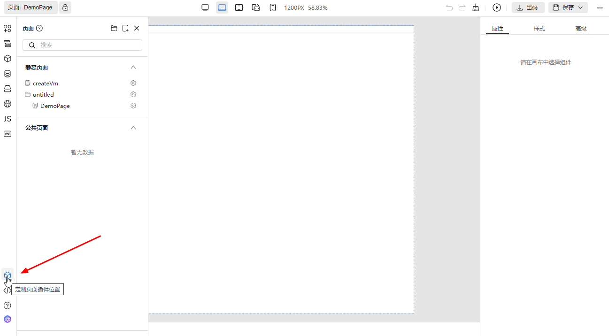
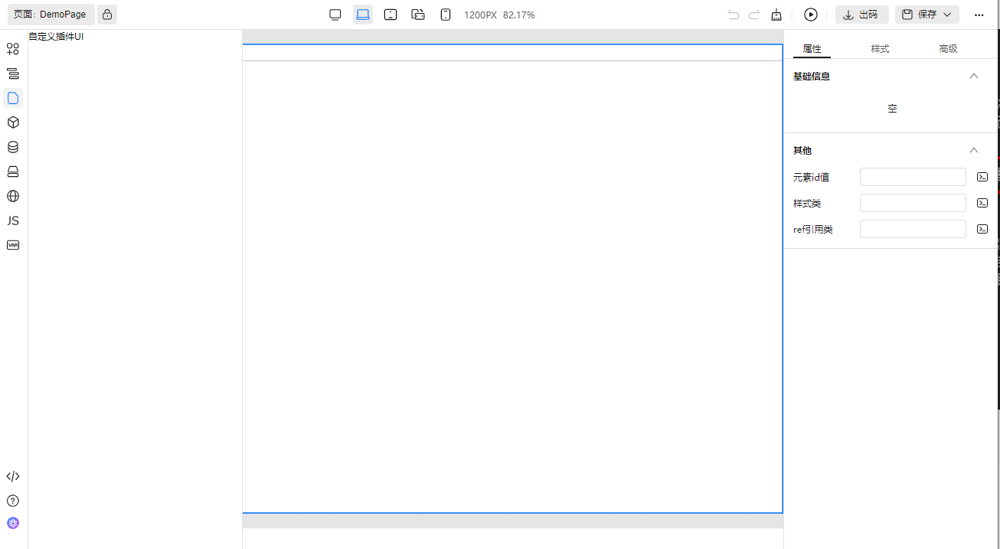

# 定制插件 UI

我们提供了定制插件 UI 功能，比如替换图标、位置、甚至整个插件页面

## 通过配置项来定制

对于插件元应用，可以直接替换元应用的属性来定制部分 UI。有如下属性可供替换

- `title`。标题
- `icon`。图标，可以为字符串或者组件。如果是字符串，则会使用 tiny-engine 自带的 svg 图标
- `align`。对齐位置，根据插件位置的不同可以为不同的值。如果是顶部工具栏，可以为 `left`, `center`, `right`；如果是左侧插件栏，可以为 `top`, `bottom`

比如替换 Page 插件的图标和对齐位置

```js
// registry.js
export default {
  // ...
  plugins: [
    // ...
    {
      ...Page,
      title: '定制页面插件位置',
      icon: 'box',
      align: 'bottom'
    }
    // ...
  ]
  // ...
}
```



## 直接替换插件页面

根据替换页面的颗粒度不同，你可以替换 `components` 对象下的局部页面来实现小颗粒度的替换，`components` 下可以替换哪些局部页面取决于插件的设计；也可以直接替换 `entry`，将整个页面入口替换成你自己的页面

例如替换整个 Page 插件页面

```js
// registry.js
import CustomPage from './custom-page'
export default {
  // ...
  plugins: [
    // ...
    { ...Page, entry: CustomPage }
    // ...
  ]
  // ...
}
```

```vue
<!-- custom-page.vue -->
<template>
  <div>{{ title }}</div>
</template>

<script setup>
import { ref } from 'vue'

const title = ref('自定义插件UI')
</script>
```


