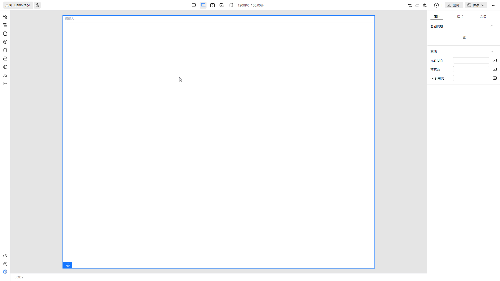

# 开发设置器组件

## 相关概念

设置器组件本质上就是一个 Vue 单文件组件。在设计器页面右侧的属性面板中，设置器组件用于设置画布中选中的组件的属性的值。你可以把属性面板看做一个大表单，每个设置器组件用于一个表单项的输入。比如下图的输入框设置器组件


## 开发

设置器组件可以有多种形式，它们都需要遵循以下规范：

- 是一个 vue 的单文件组件
- 组件的 props 必须要有 `modelValue` 属性
- 组件的 emits 必须支持 `update:modelValue` 事件

例如我们使用 TinyVue 的 Input 组件开发一个输入框设置器，输入的字符只支持字母或者数字，代码如下

```vue
<template>
  <span>我是自定义的 input configurator</span>
  <tiny-input v-model="value" :type="type" :placeholder="placeholder" @update:modelValue="change"> </tiny-input>
</template>

<script>
import { ref } from 'vue'
import { Input } from '@opentiny/vue'

export default {
  name: 'MyInputConfigurator',
  components: {
    TinyInput: Input
  },
  props: {
    modelValue: {
      type: String
    },
    type: {
      type: String
    },
    placeholder: {
      type: String
    }
  },
  emits: ['update:modelValue'],
  setup(props, { emit }) {
    const value = ref(props.modelValue)

    const change = (val) => {
      value.value = val
        .split('')
        .filter((c) => /[A-Za-z0-9]/.test(c)) // 判断字符串中的每个字符是否属于字母或者数字
        .join('')
      emit('update:modelValue', value.value)
    }

    return {
      value,
      change
    }
  }
}
</script>
```

你会发现写设置器组件和平时写地组件似乎没有很大区别，只需要输入(props)和输出(emits)都满足规范即可

## 使用

开发了设置器组件后，接下来我们想用在属性面板上

1. 注册设置器
   通过 engine-cli 工具创建出来的设计器平台，在 `src/configurators/index.js` 文件中配置我们需要使用到的设置器

   ```js
   import MyInputConfigurator from './MyInputConfigurator.vue'

   export const configurators = {
     MyInputConfigurator
   }
   ```

2. 物料中使用设置器

   使用 TinyInput 组件的物料为例。将 `component` 替换成我们注册设置器组件时对应的名称，这里是 `MyInputConfigurator`。另外，与 `component` 同级的 `props` 对象则会传入到设置器组件中

```json
{
  "name": {
    "zh_CN": "输入框"
  },
  "component": "TinyInput",
  "icon": "input",
  "description": "通过鼠标或键盘输入字符",
  //  ...
  "schema": {
    "properties": [
      {
        "label": {
          "zh_CN": "基础信息"
        },
        "description": {
          "zh_CN": "基础信息"
        },
        "content": [
          {
            "property": "modelValue",
            "label": {
              "text": {
                "zh_CN": "绑定值"
              }
            },
            "required": true,
            "readOnly": false,
            "disabled": false,
            "cols": 12,
            "widget": {
              // "component": "I18nConfigurator",
              "component": "MyInputConfigurator",
              "props": {}
            },
            "description": {
              "zh_CN": "双向绑定值"
            },
            "labelPosition": "left"
          }
        ]
      }
    ],
    "events": {
      //...
    },
    "slots": {
      // ...
    }
  },
  "configure": {
    // ...
  }
}
```

按照上述步骤配置好了之后，启动 TinyEngine 设计器。最终效果如下

