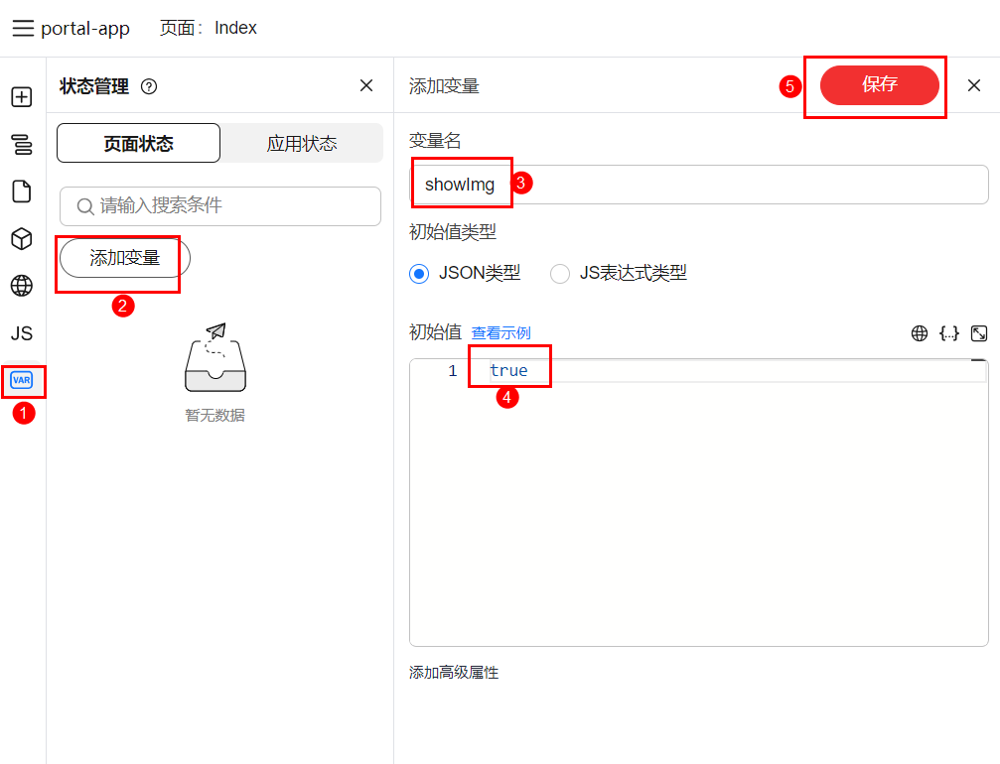

# 快速上手

为了帮助开发者迅速掌握TinyEngine并深入理解其核心特性，我们设计了一个简单的实践上手案例：“开关按钮控制图片显示与隐藏”。
这个案例直观展示了TinyEngine在交互设计，允许用户通过一个简单的开关按钮来控制图片的显示与隐藏状态。  

通过这个案例，开发者可以快速学习如何利用TinyEngine的低代码特性，实现界面交互逻辑。

### 效果图

### 第一步，新建页面

### 第二步，拖入元素

### 第三步，设置状态变量

### 第四步，设置文本和图片地址：
修改text属性，修改文本为：“图片显示开关”
设置src属性，修改图片地址为：`https://res.hc-cdn.com/lowcode-portal/1.1.65/img/home/top-banner.jpg`

### 第五步，设置图片样式和绑定显示变量

### 第六步，给开关绑定事件

### 第七步，绑定点击事件并预览

### 恭喜你，完成了这个小案例。

