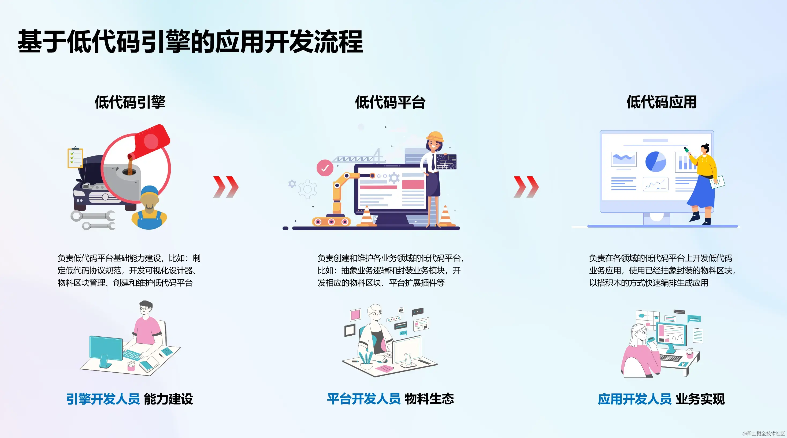
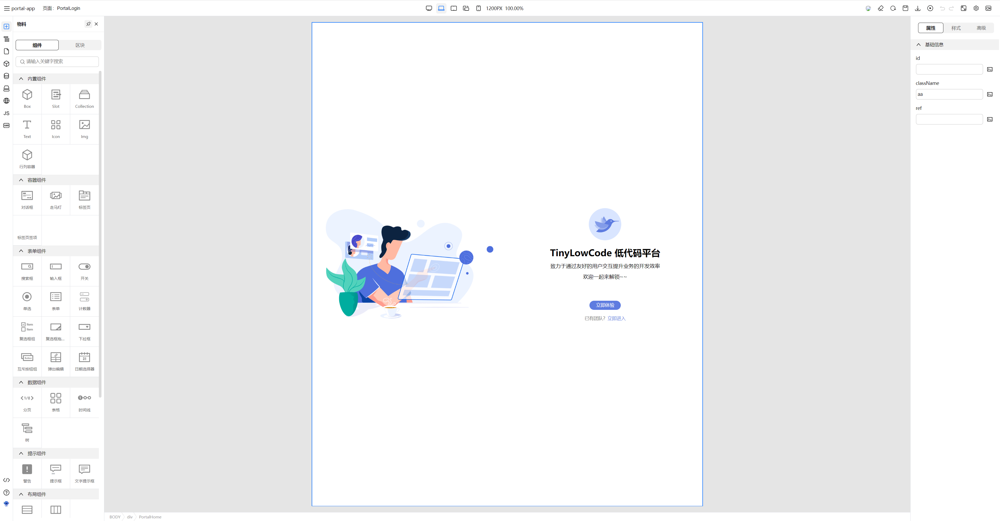

# 简介

<b>低代码平台</b>是一种应用程序开发平台，允许用户以图形化方式构建应用程序，通过拖放组件、模板和可视化界面，降低了开发者和非技术用户的技能门槛。用户只需编写少量代码，便可以实现复杂的功能。这种方式不仅提高了开发速度，
随着数字化转型的加速，企业越来越多地寻求降低开发成本、提升开发效率的解决方案。

## 低代码引擎背景：

随着公司的发展，各种垂直领域的低代码平台如雨后春笋般涌现。这些低代码平台在基本需求上大致一致，包括物料导入、页面编排以及属性和样式设置等功能。然而，这种高度的一致性导致了大量重复的基础建设。因此，低代码引擎应运而生，以解决这一问题。

## 低代码引擎的定位：

低代码引擎它内置了一个功能强大的低代码设计器，用户可以基于低代码引擎定制（开发）出各种低代码平台，如：流程编排平台、页面编排平台、图元编排平台、移动端页面开发平台
、大屏开发平台等等......

## TinyEngine 低代码引擎介绍

1. 可以定制开发低码平台： TinyEngine 提供了一套完善的插件体系，涵盖了插件开发所需的基础 UI 库、工具库、插件面板的显示控制、生命周期管理、公共 API 注册与共享等。

2. TinyEngine 有开放的物料协议和扩展接口：得益于 TinyEngine 强大的开放物料设计，可直接导入第三方组件库，例如 elementUI 和 AntDesign 等UI组件库

3. TinyEngine 支持高低代码混合开发：高低代码混合的方式，则可以通过低代码进行常规业务的快速开发，对于特殊的业务逻辑，则由专业开发人员通过高代码进行实现，这样就可以更好地满足业务需求的变化

4. TinyEngine 支持 AI 辅助开发：低代码平台与 AI 的结合具有巨大的发展潜力

5. 基于洛书一体化的架构，能够快速对TinyEngine进行定制化开发，满足业务系统的需求

