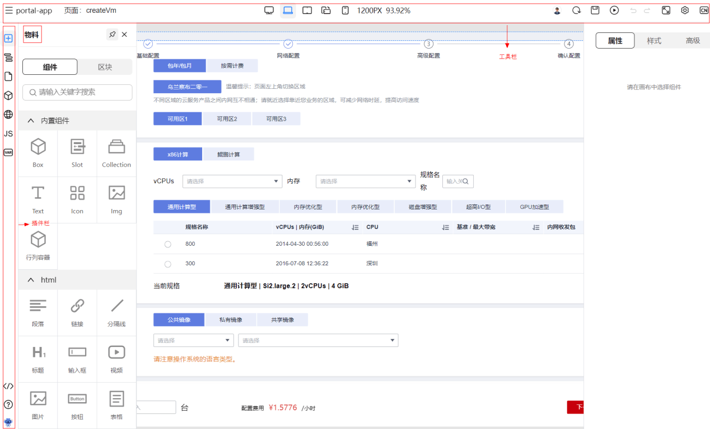

## 生态中心概述

生态中心包含了创建可视化设计器的重要组成部分，包括物料生态、插件生态、工具栏生态、主题生态和 DSL 生态，如下图所示：

物料是可视化页面搭建的原料，按照粒度可分为组件和区块，物料包时组件与区块的集合。
工具栏与插件是在可视化搭建时用到的功能，例如撤销、恢复、保存等工具，数据源、国际化等插件。
主题决定了设计器的 UI 风格。DSL 是页面 Schema 生成源代码的能力。
官方提供核心的组件、区块、物料包、主题、插件、工具、DSL 供用户使用，未来将支持接入第三方组件库以及支持用户自己开发生态。