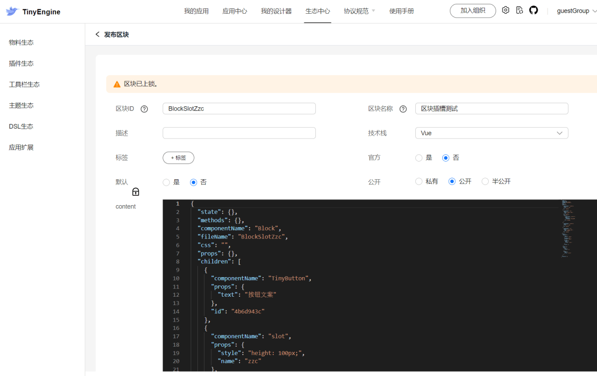

## 如何发布区块

区块录入需要根据

 [区块协议](portal-only-prefix/protocol/app) 填写 content 字段
 因为区块可以简单理解为组件的组合，content 内每个属性的含义也可以参考课程 如何发布组件，在那个课程里详细介绍了每个属性的含义。
 需要注意的是：区块录入之后，需要在设计器中发布区块之后，才能够加入物料包中使用，用户可以参考应用开发者-区块管理课程。
 也就是说，区块录入只是替代了在设计器里新建和搭建区块的步骤。
