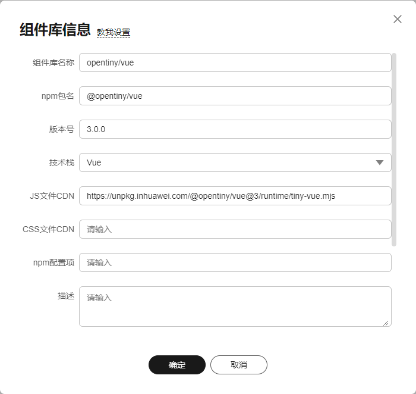
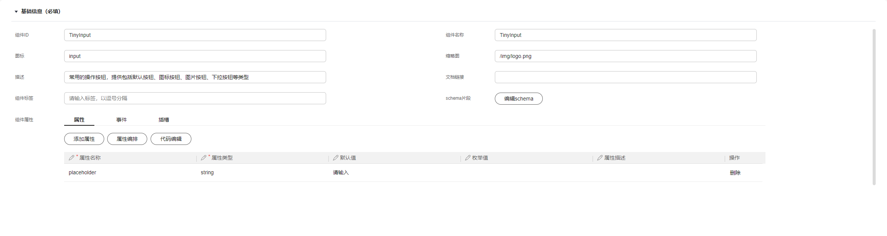
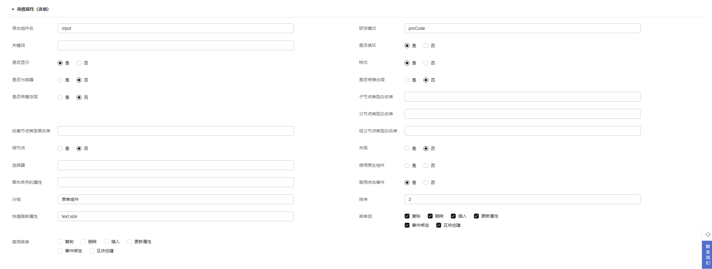

# 如何导入组件库

## 介绍
组件是页面搭建最小的可复用单元，组件库是一系列已经封装好的可复用组件的集合。通过导入第三方组件库，可以利用已经开发好的功能，无需从头开始编写，大大节省了开发时间。同时，这些组件通常经过优化，具有较高的性能和可扩展性。

## 导入组件库

### 录入组件库基本信息

| 字段名称 | 描述 |  
| --- | --- |  
| 组件库名称 | 填写组件库名称，用于列表展示和搜索。 |  
| npm包名 | 发布到npm仓库中的组件库包名，可在package.json文件中查看name字段的值。 |  
| 版本号 | 已发布的版本号。符合软件版本号规范。 |
| 技术栈 | 组件库依赖的JavaScript框架。 |
| JS文件CDN | 必填，[ESModule格式](https://tc39.es/ecma262/#sec-modules)的JS文件CDN地址，如果地址错误或文件不可用将导致画布无法渲染组件。 |
| CSS文件CDN | 样式文件CDN地址。 |
| 组件库描述 | 关于组件库的描述信息，会在组件列表中展示。 |
| 缩略图地址 | 组件库列表中展示的图片。 |
| 公开范围 | 可选择的权限范围。私有，只能用户自己使用和编辑；公开，所有用户都可以使用；半公开，仅勾选的组织内成员可以使用。 |
| 标识官方物料 | 管理员可选，组件库列表中该物料会携带“官方”标识 |
| 标识默认物料 | 管理员可选，在构建物料包时，会默认勾选该组件库。 |

### 组件配置
为了充分使用组件的功能，需要根据组件协议填写每个字段，以 TinyInput 为例：

#### 基本信息

| 字段名称 | 描述 |  
| --- | --- |  
| 组件ID | 决定组件的使用方式<tiny-input></tiny-input> | 
| 组件名称 | 设计器物料面板中组件显示的名称 | 
| 图标 | 设计器物料面板中组件显示的图标 | 
| schema片段 | [决定组件在画布上的显示效果](./imgs/componentConfigSchema.png) | 
| 组件属性 | 包含属性、事件、插槽，对应设计器中右侧属性面板可配置的属性、插槽及高级面板中的事件配置 | 

#### 高级属性

| 字段名称 | 描述 | 
| --- | --- |  
| 导出组件名 | 该组件从组件库中导出时的命名，如TinyInput导出时命名为Input |  
| 研发模式 | 组件研发模式，proCode/lowcode。保留字段，暂未用到。 | 
| 关键词 | 保留字段，暂未用到。 | 
| 是否循环 | 设计器高级配置中是否打开循环渲染。 | 
| 是否显示 | 设计器高级配置中是否打开是否渲染。 | 
| 样式 | 是否显示样式面板 | 
| 是否为容器 | 组件是否为容器组件，如布局组件为容器组件 | 
| 是否带弹出层 | 组件是否带有弹出层，如TinyDialogBox组件带有弹出层 | 
| 是否带悬浮层 | 组件是否带浮层，如TinyTooltip组件带有悬浮层 | 
| 子节点类型白名单 | 一些组件需要组合使用，如TinyForm组件的子节点只能时TinyFormItem | 
| 父节点类型白名单 | 一些组件需要组合使用，如TinyForm组件的子节点只能时TinyFormItem | 
| 后裔节点类型黑名单 | 保留字段，暂未用到。 | 
| 祖父节点类型白名单 | 保留字段，暂未用到。 | 
| 根节点 | 保留字段，暂未用到。 | 
| 布局 | 保留字段，暂未用到。 | 
| 选择器 | 如.tiny-input | 
| 使用原生组件 | 保留字段，暂未用到。 | 
| 画布丢弃的属性 | 画布上不生效的属性，只在生成源代码时生效 | 
| 禁用点击事件 | 设计器右侧高级面板中绑定事件时不可绑定点击事件 | 
| 分组 | 决定设计器物料面板中该组件所在组件库分类下的分组 | 
| 排序 | 所在分组的排序权重，数值越大越靠前 | 
| 快捷面板属性 | 设计器画布中右键该组件弹出的右键菜单中可快捷配置的属性 | 
| 菜单项 | 设计器画布中右键该组件弹出的右键菜单列表 | 
| 禁用菜单 | 右键菜单禁用项 | 

### 完成
完成基本信息填写和组件配置后，可以在构建物料资产包时将该组件库添加到资产包中，在设计器中就可以正常使用该组件库下的组件搭建页面了。