# 区块发布方案

## 介绍

### 背景

区块发布，就是把区块的实时数据当前状态固定下来，并用相应逻辑将区块schema构建为前端可用的webcomponent，并且将构建结果(区块web component)和区块数据快照保存在block_histories表中的一个动作；

为了区块webcomponent 能够快捷引用， 服务端将区块的web component 作为一个npm包发布到npm仓库， 同时设计器通过unpkg cdn的方式加载, 利用unpkg服务的版本浮动特性， 解决设计器引入高版本区块时需重新构建的问题。

### npm发布

通过注册npmjs.com 账号，生成具有publish权限的 access token

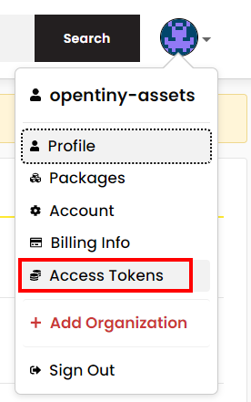

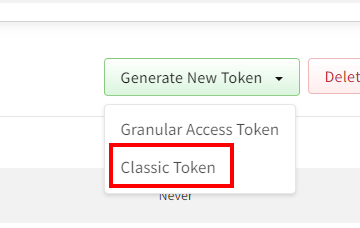

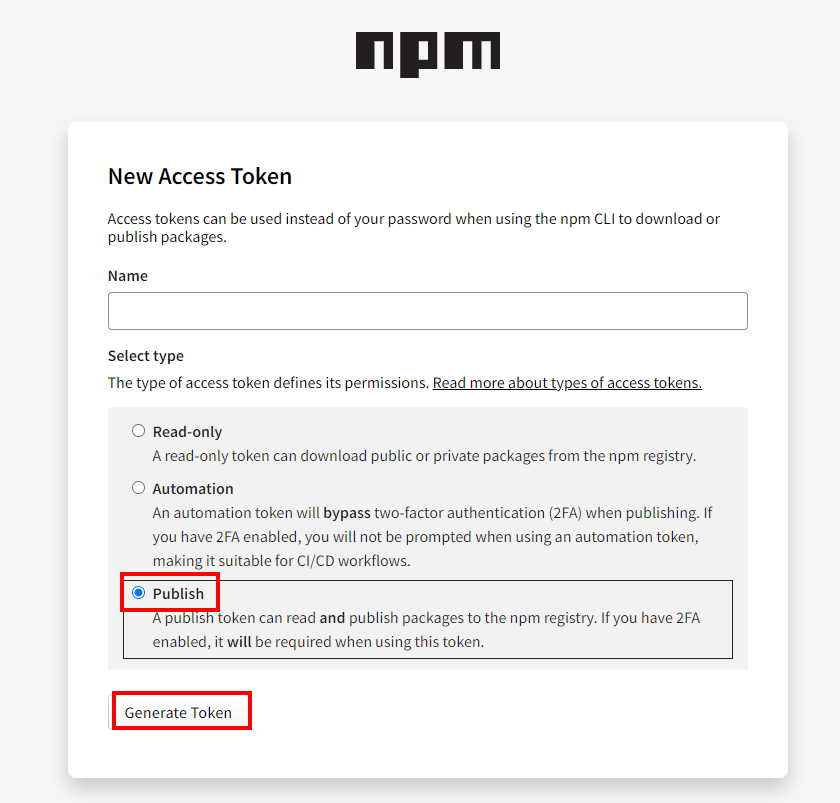

生成token 后， 配置 `NPM_AUTH_TOKEN` 环境变量, 具体配置方法参看 [此文档](./服务端部署方案.md)

#### 自定义unpkg服务及区块包名

选择合适的unpkg服务后，通过修改以下代码配置，替换成自己的unpkg服务和 区块包名

##### 修改unpkg服务链接，替换cdn服务

修改代码位置： [tiny-engine-webservice/app/service/material-center/blockBuilder.ts](https://github.com/opentiny/tiny-engine-webservice/blob/main/app/service/material-center/blockBuilder.ts)

```js
unpkgBaseUrl = 'https://npm.onmicrosoft.cn'  // 替换为自己的cdn服务
```

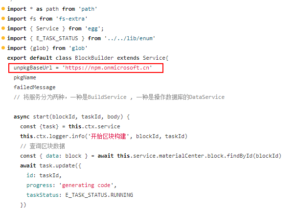 

##### 修改区块包名

npm包名的私域和npmjs 的账号名有关，所以开发者在生成npm access token 后需要修改开源代码中的 区块包名

修改代码位置： [tiny-engine-webservice/app/service/material-center/blockBuilder.ts](https://github.com/opentiny/tiny-engine-webservice/blob/main/app/service/material-center/blockBuilder.ts)

```js
const name = `@opentiny-assets/tinyengine-${env}-block-${label}-${id}` //包名根据实际情况修改
```

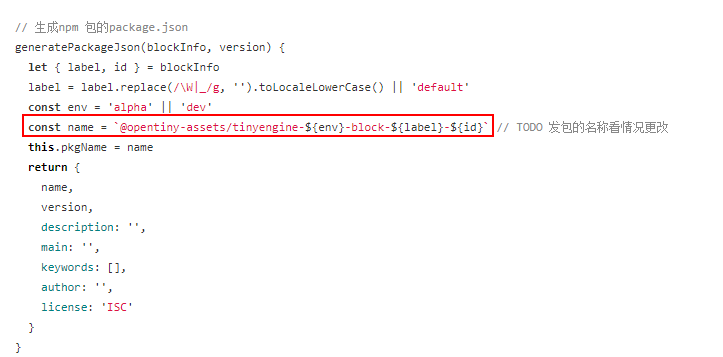 

#### unpkg选择

##### unpkg

`https://www.unpkg.com/ ` 是同步npm发布最快的unpkg服务，缺点是国内访问困难；

##### 渺软

开源代码示例使用[渺软cdn](https://cdn.onmicrosoft.cn/) ： `https://npm.onmicrosoft.cn`

cdn的使用方式和unpkg是一样的，这里不再赘述；

##### 阿里云私有仓库

阿里云私有仓库的unpkg格式和 https://www.unpkg.com/ 略有区别， cdn链接组成为：

```
https://registry.npmmirror.com/${包名}/${版本号}/files/${文件路径及文件名}
```

以vue为例：
`https://registry.npmmirror.com/vue/^3/files/package.json`

使用阿里云私有仓库的缺陷是同步npm 仓库的时限较长，导致区块在npm发布成功后，阿里云私有仓库不能及时更新版本；

### npm 私仓发布

npm 私仓部署更具公司或团体内部的npm仓库呈现形式，获取具有publish 权限 access token, 然后配置 `NPM_AUTH_TOKEN` 环境变量，配置方法可查看 [此文档](./服务端部署方案.md)

注意：开发者自己公司内部的 npm 私仓需要同时支持unpkg cdn， 否则区块版本浮动功能无法使用, 在区块消费时固定区块包的版本；

## 研发准备

- mysql 数据库
- npm 或内部npm仓库的 auth token ， npm 账号创建地址
- 配置环境变量 NPM_AUTH_TOKEN， 值为npm仓库的 access token

## 服务启动

- 启动data-center 服务，请查看 [此文档](https://github.com/opentiny/tiny-engine-data-center/blob/main/README.md)
- 启动webservice 服务 请查看 [此文档](https://github.com/opentiny/tiny-engine-webservice/blob/main/README.md)

## 区块发布服务前端调用

执行流程如下：

  - 创建区块

  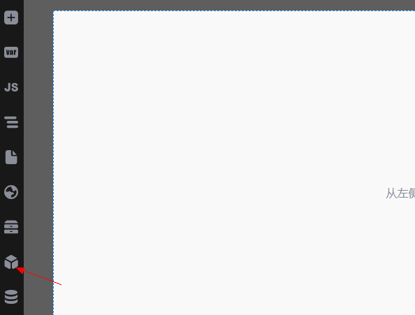

  - 编辑区块并保存

  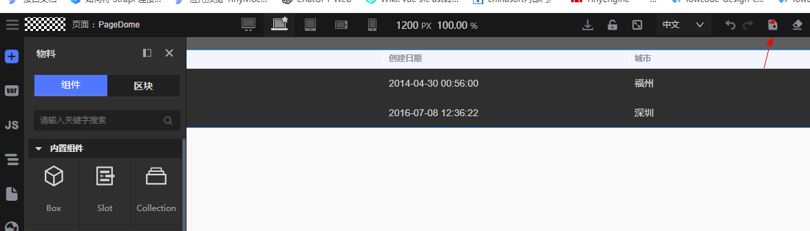

  - 区块发布

  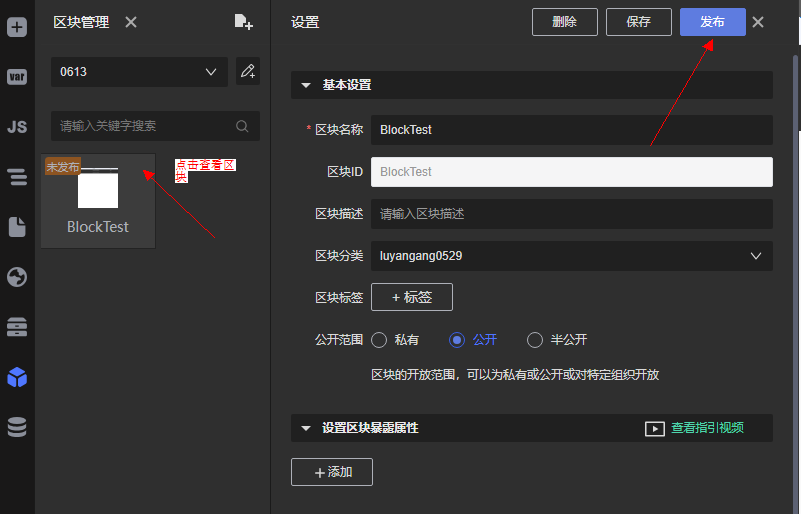
    
    输入区块发布版本及描述
   
  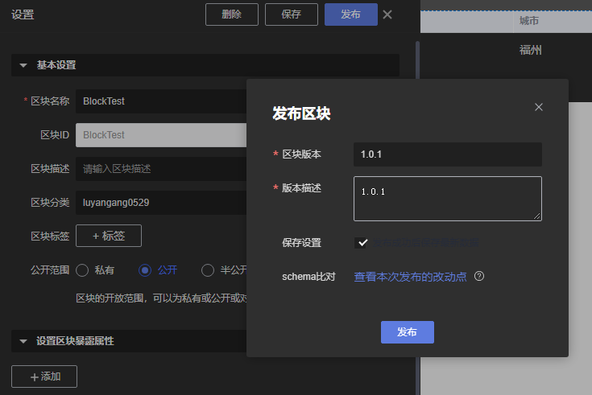
    
    发布完之后，就能将区块添加到物料中

  - 添加区块到物料
  
  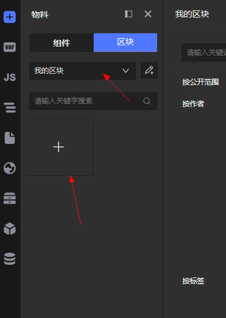
    
    点击可选区块列表刚才发布的区块，移动到右侧已选区块列表，点击保存

  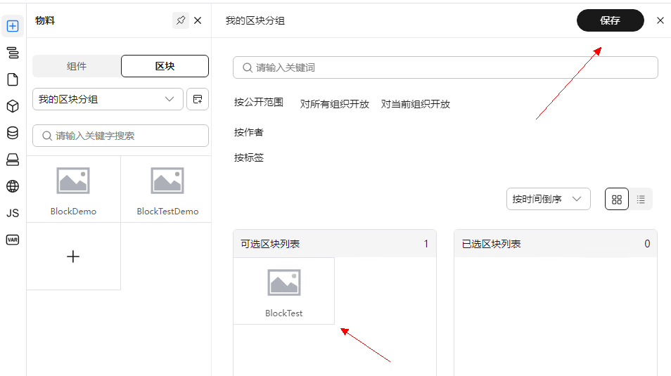
    
    至此就可以在物料的区块里找到自己发布的区块并使用了

  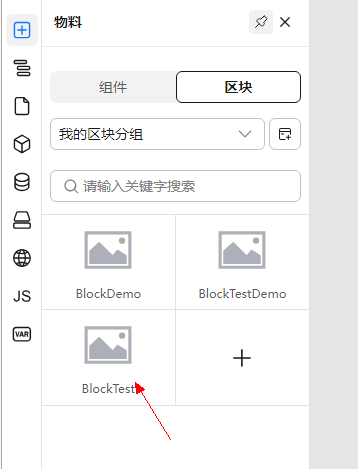

- 先调用区块发布接口 触发区块发布任务

- 根据区块发布接口返回的任务id 轮询 任务查询接口，更新前端展示的区块发布进度

### 1. 区块发布接口

- 接口地址： /material-center/block/deploy

- 请求方式： POST

- 参数：

  ```js
  {
      "deploy_info": "构建某某区块",  // 发布区块时的信息
      "block": {},  //  区块信息
      "needToSave": true, // boolean 是否保存当前区块信息到block表
      "version": "1.0.0"  // 区块包的版本号，需符合npm仓库版本号规范
  }
  ```

- 接口说明：发布区块到npm仓库， 在nodejs中执行一个异步任务， 并返回此任务信息

- 返回值：返回一个任务信息

  ```js
  {
    "data": {
        "id": 100,
        "teamId": 0,
        "taskTypeId": 5,   // 任务类型 5为区块发布任务
        "uniqueId": 1001, // 被发布区块的id
        "taskName": "PortalBlock", // 任务名称
        "taskStatus": 0, // 任务状态
        "taskResult": null,
        "progress": "",  // 任务进度 描述
    }
  ```

### 2. 任务查询接口

- 接口地址：/app-center/api/tasks/status/:taskId

- 请求方式：GET

- 参数： taskId 任务id， 从区块发布接口返回数据获取

- 接口说明： 轮询此接口，获取区块发布异步任务的执行状态

- 返回值：

  ```js
  {
    "data": {
      "id": 100,
      "teamId": 0,
      "taskTypeId": 5,
      "uniqueId": 2020,
      "taskName": null,
      "taskStatus": 2,
      "taskResult": "",
      "progress": "building completed",
      "ratio": null,
      "progress_percent": 80,
      "indicator": null
    }
  }
  ```