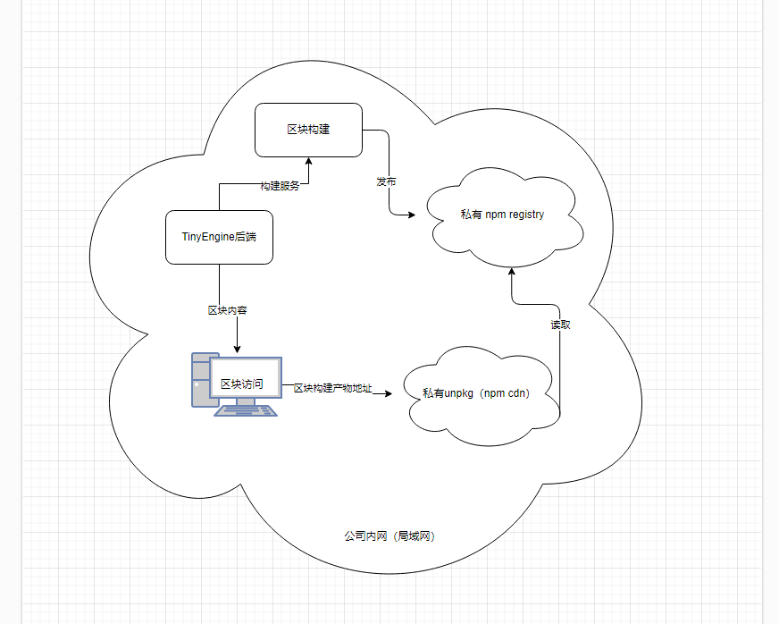
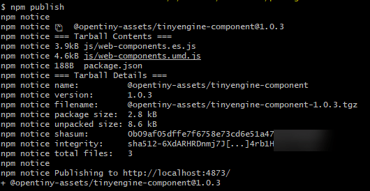
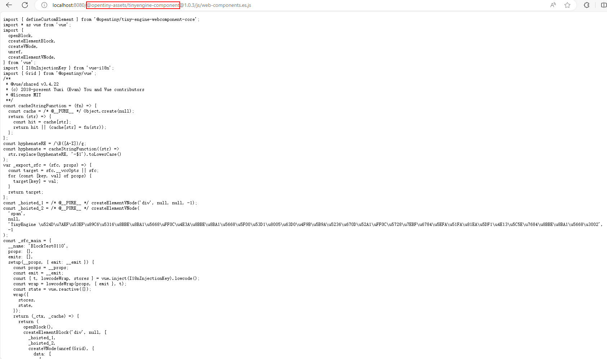
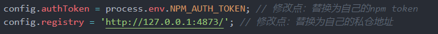
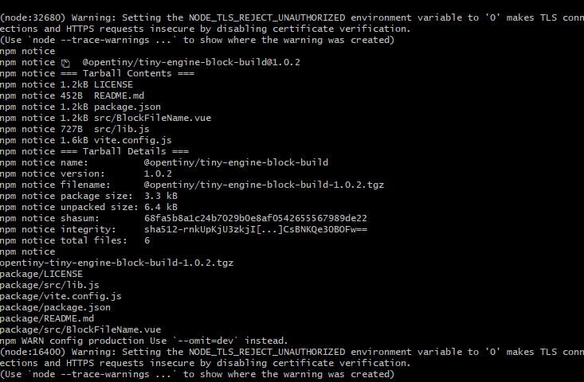
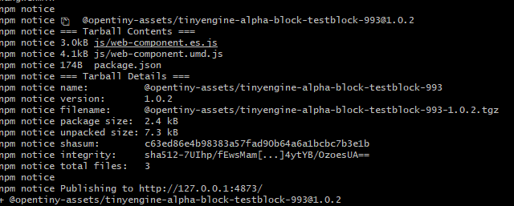
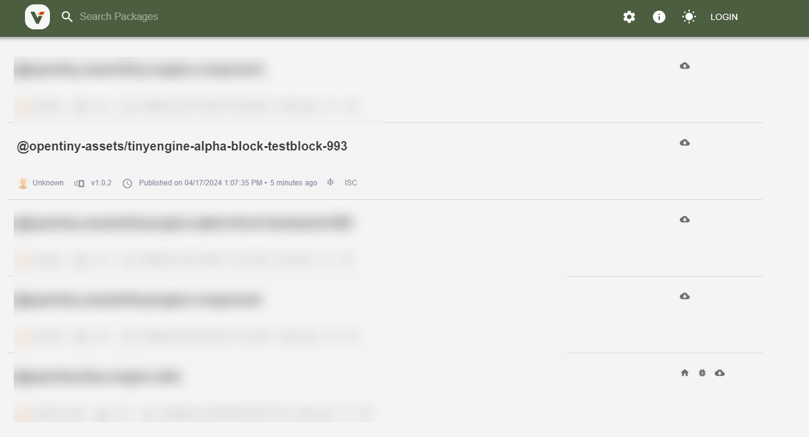
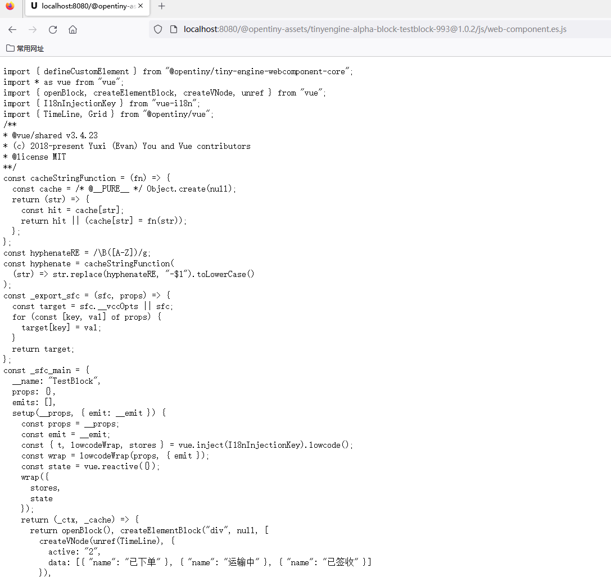

# 区块局域网发布方案

在TinyEngine开源后，对私有化部署存在诉求的用户越来越多，而当前TinyEngine多项内容都依托在公网中，当前官网提供的[区块发布方案](./区块发布方案.md)，为公网环境下的发布，不能完全满足部分用户的需求。因此需要提供用户能够在内网环境下，也能够正常使用TinyEngine全部功能的方案。

现在提出区块发布私有化的两种解决方案给用户自行选择：

- 公司内部搭建unpkg（npm cdn）和私仓环境，将区块发布到npm私仓中；
- 将区块发布到数据库中，从库中直接读取区块产物。

**我们推荐使用第一种方式**，因为采用私仓的方式能尽可能保留我们当前的模式，以及能够使用区块版本浮动功能，并且在我们基础物料组件库中，我们也能将组件库上传到私仓里，达到基础物料的私有化。

> 注： 
> - 搭建 unpkg：基于开源unpkg（[https://github.com/mjackson/unpkg](https://github.com/mjackson/unpkg)），在公司内部搭建 npm 的 cdn 环境
> - 私仓环境：在公司内部搭建一个私有的 npm registry，提供发布和拉取能力。


# 方案一、将区块发布到npm私仓中



## 一、安装 verdaccio

当前业界内存在很多搭建 npm 私仓的方案，如: verdaccio, neuxs, cnpmjs 等，大家可以自行选择。在此以使用 verdaccio为例，可以查看verdaccio 官网文档或者相关学习文档来安装使用verdaccio ，在这里只做简单介绍。

### 1.1 verdaccio安装

本地直接通过npm下载

```shell
npm install verdaccio -g
```

本地启动

```shell
verdaccio
```

或者使用pm2本地启动

```shell
# 启动verdaccio
pm2 start verdaccio
# 查看进程
pm2 log verdaccio 
```
> 若windows系统下启动verdaccio报错，可以尝试到verdaccio的全局安装目录的bin目录下执行pm2 start ./verdaccio，或者根据报错内容自行搜索解决方案。


通过docker拉取镜像

```shell
docker pull verdaccio/verdaccio
```

启动

```shell
docker run -it  -p 4873:4873 verdaccio/verdaccio
```

**线上使用请配置数据持久保存，以免数据丢失**

### 1.2 注册用户

```shell
npm login --registry=http://localhost:4873/
```
### 1.3 创建token，此token替换原npm上申请的token，用于发包

```shell
npm token create --registry=http://localhost:4873/
```
token生成完后，需要配置到环境变量`NPM_AUTH_TOKEN`中，后续webService会使用；本地运行时的配置：

`vi ~/.bashrc`

```shell
export NPM_AUTH_TOKEN=xxxx  # 填入刚生成的token

```
设置完后，重新打开命令行或在当前命令行执行以下命令，让设置的环境变量生效。(git bash中设置的环境变量无法适用于powershell 和cmd)

`source ~/.bashrc`

### 1.4 安装后验证

安装完毕后，可以在本地发布一个npm包进行测试，使用npm publish发布。如：




发布完成后， 访问 [http://localhost:4873/](http://localhost:4873/) ，在 verdaccio 的管理界面能看到发布上去的npm包表示安装成功。 


建议发布的测试包名称格式：@公司码/组件名，以便于后续搭建 unpkg 时测试使用。

## 二、安装 unpkg

在 verdaccio 安装好后，我们的包已经能够正常发布在私仓上，如果想要在TinyEngine的页面上去获取到私仓里的包，正确的显示区块，我们还需要借助unpkg去获取到包的数据，而由于公网的unpkg无法直接读取npm私仓里的包，因此还需要搭建自己的unpkg服务器，结合私有的unpkg，才能在TinyEngine的页面上显示你所建的区块。

unpkg的搭建，大家可以自行在网上参考相关文档，将官方的unpkg源码下载下来，进行改造，也可以参考别人的成功案例。改造成功后，访问 [http://localhost:8080/](http://localhost:8080/) 能看到 unpkg 服务启动成功

  

然后访问之前发布的测试包： `http://localhost:8080/@公司码/组件名` ，如能显示 js 文件内容, 则表示 unpkg 安装成功。



## 三、修改 tiny-engine-webservice

### 3.1 修改 app/service/material-center/blockBuilder.ts 的 代码

```typescript
public unpkgBaseUrl = 'http://localhost:8080'; // 修改为unpkg服务的ip端口
```

```typescript
generatePackageJson(blockInfo, version) {
  let { label, id } = blockInfo
  label = label.replace(/\W|_/g, '').toLocaleLowerCase() || 'default'
  const name = `@opentiny-assets/tinyengine-block-${label}-${id}` // 修改点：发包的名称根据自己情况更改, @opentiny-assets改成 @用户的公司码
  this.pkgName = name
  return {
    name,
    version,
    description: '',
    main: `js/web-component.es.js`,  // 修改点：main 必须是 js/web-component.es.js , 否则 unpkg 无法读取到 js 文件
    keywords: [],
    author: '',
    license: 'ISC'
  }
}
```

### 3.2 修改 config.default.ts 的代码

替换registry为自己的私仓地址

```typescript
  config.registry = 'http://127.0.0.1:4873/'; // 修改点：替换为自己的私仓地址
```


**注意：** 在1.3小节里，我们已经生成了npm token，写入到了`NPM_AUTH_TOKEN`环境变量。因此本文件中`authToken`的赋值就不用再修改了，若是没有更换的话，记得参考1.3小节，去替换你的环境变量。

### 3.3 修改app/service/cnpm.ts的代码

去掉 `--access=public`

``` typescript

  async publishCnpm(packagePath) {
    const commands = ['npm publish']; // 修改点：去掉原先的--access=public
    return this.ctx.helper.execCommandWithCatch(commands, { cwd: packagePath }, 'publish cnpm');
  }

```


## 四、在 TinyEngine 中发布区块

以上步骤完成后，可以启动tiny-engine进行区块发布测试。验证过程中可以通过查看 tiny-engine-webservice的发布过程排查问题，TinyEngine会生成组件包:



然后发布到私仓:



发布完成之后，可以打开 [http://localhost:4873/](http://localhost:4873/) 验证是否发布成功



并且查看本地启动的unpkg，是否能够正常访问刚才发布的区块。



验证完成后，可以在物料中把刚才发布的区块进行添加，添加完毕后就可以正常的使用区块功能。

## 五、服务部署

当前步骤都是在电脑本地环境下运行调试的，在本地验证正确后，可以自行部署到服务器中。实际生产部署模式以企业、组织内部具体情况具体分析，具体安装以及启动操作流程都跟本地一致，可能会有安装目录位置的差异。


# 方案二、将区块发布到数据库


## 一、方案目的

原有的区块托管于npm，通过cdn获取已发布区块内的文件，如果没有公网环境，且不使用私仓的情况下，为区块的托管提供数据库托管方案，使得区块的使用不在依赖于公网环境和cdn

## 二、设计思路

- 将原有的区块发布修改成把区块构建产物转成二进制数据存储到数据库

- 后端生成构建产物链接，替换原有区块发布后托管在unpkg的连接，格式为：http://localhost:7011/material-center/api/block/read/@opentiny-assets/tinyengine-dev-block-testceshi11-2328@1.0.17/js/web-components.umd.js

- 提供链接访问获取文件的后端方法

## 三、简单demo，仅供参考

### 1. 新增存储数据库的表，字段如下：
 
| id  	        |int(10)   	    |自增id
|------        |------        |------|
| file_name  	|varchar(255)	|文件名
|package_name 	|varchar(255)	|包名
|file_content  	|longtext	    |文件内容
|version	    |varchar(255)	|版本
|created_at	    |timestamp	    |创建时间
|updated_at	    |timestamp	    |更新时间

strapi生成表可以在管理面板创建，也可以在tiny-engine-data-center服务根目录api文件夹下自己编辑代码，无需手动在mysql创建表


```json
{
  "kind": "collectionType",
  "collectionName": "block_file_store",
  "info": {
    "name": "block-file-store",
    "description": ""
  },
  "options": {
    "increments": true,
    "timestamps": true
  },
  "attributes": {
    "package_name": {
      "type": "string",
      "required": true
    },
    "file_name": {
      "type": "string",
      "required": true
    },
    "version": {
      "type": "string",
      "required": true
    },
    "file_content": {
      "type": "text",
      "required": true
    }
  }
}
```


### 2. 修改发布方法

config.default.ts文件中新增配置


```typescript 
config.dataBaseUrl = 'http://localhost:7011/material-center/api/block/read';

```
发布接口在文件夹路径`/tiny-engine-webservice/app/service/material-center/blockBuilder.ts`下，实现如下：


```typescript 
private async publish(folder, blockInfo, version): Promise<any> {
    let { label, id } = blockInfo;
    label = (label as String).replace(/\W|_/g, '').toLocaleLowerCase() || 'default';
    const env = 'alpha'; // 视具体情况而定，可以从RUN_MODE环境变量取，也可以不使用
    const name = `@opentiny-assets/tinyengine-${env}-block-${label}-${id}`;
    this.pkgName = name;
    
    const prefix = `${this.config.dataBaseUrl}/${this.pkgName}@${version}`;
    const files = await globPromise(`**/*.*`, {
      cwd: folder
    });
    for(const file of files){
      const fileContent = await fs.readFile( path.join(folder, file));
      // 文件转二进制
      const base64Data = fileContent.toString('base64');
      const filename = file.substring(file.lastIndexOf('/') + 1);
      // 存储数据库
      await this.service.material.blockFilesStore.create({
        package_name: name,
        file_name: filename,
        version: version,
        file_content: base64Data
       });
     }
    return this.filterFiles(files, prefix);
  }
```

### 3、新增后端获取区块产物api接口：

#### 3.1 接口

|Method  |URI  |Description
|------  |------|------|
|GET     |material-center/api/block/read/|根据区块链接信息读取文件


##### 3.1.1 请求request

|Name |Mandatory |Type |position |Description
|------|------   |------|------  |------|
|file_name|M|string|body|文件名|
|version|M|string|body|版本
|package_name|M|string|body|包名


##### 3.1.2 响应Response

|Name|Mandatory|Type|Description
|------|------|------|------
|data|O|object|响应数据实体


在 `router/materialCenter/base.ts` 新增路由：

```typescript 
// 路由获取文件链接读取文件
subRouter.get('/block/read/*', controller.materialCenter.block.readFileContentLink);
```


**接口实现**：


```typescript 
async readFileContentLink() {
  const params = this.ctx.params;
  const paramTemp = params[0];
  const filename = paramTemp.substring(paramTemp.lastIndexOf('/') + 1);
  const versionRegex = /@([\d.]+)/;
  const version = paramTemp.match(versionRegex)
    ? paramTemp.match(versionRegex)[1]
    : null;
  const package_name = '@' + paramTemp.split('@')[1];
  const paramTemps = {
    file_name: filename,
    version: version,
    package_name: package_name,
  };
  const res = await this.service.materialCenter.blockFileStore.find(paramTemps);
  this.ctx.type = 'text/javascript';
  this.ctx.body = Buffer.from(res.data[0]?.file_content, 'base64').toString(
    'utf8'
  );
}

```


  在data-center里block-file-store/controller下block-file-store.js新增根据文件名和包名查询最新一条的最高版本的文件信息的方法：

 
```typescript 
 module.exports = {
    async find(ctx) {
        const { fileName, packageName} = ctx.request.query;
        return strapi.services['block-file-store'].find({
            file_name: fileName,
            package_name: packageName,
            _sort: 'version:DESC',
            _limit: 1
        });
      }
};
```

**效果展示**

1. 后端用postman调用访问文件链接效果如下：

  

2. 在环境上部署后，新建区块，对区块进行发布后，将区块加入在物料中，在画布里使用区块时，会成功返回`web-components.umd.js`文件，并且与刚才发布的区块版本、包名一致，能够正确显示区块内容。


# 总结

当前介绍了两种方案的具体实现方式

- 使用方案一可以最大的提高区块发布的灵活性，并且也可以使用版本浮动功能，但是代价就是需要搭建局域网内的私仓服务和unpkg服务；
- 使用方案二数据库存托管的方式看似更加方便，但是可能会造成数据库存储的内容过于庞大。

大家可以根据实际情况选择最符合自己场景需求的方案，若是您有不同的想法或者建议，也欢迎您一起参与讨论，在[这里](https://github.com/opentiny/tiny-engine/discussions) 留下您宝贵的思路。