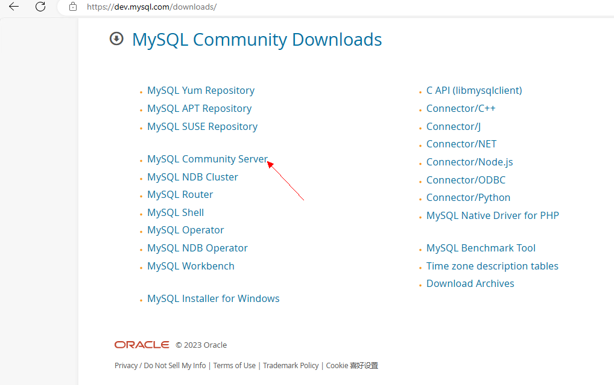

# 部署前的准备

* clone  tiny-engine-webservice 微服务 ： [代码仓库](https://github.com/opentiny/tiny-engine-webservice)
* clone tiny-engine-data-center 微服务： [代码仓库](https://github.com/opentiny/tiny-engine-data-center)
* mysql 数据库

mysql官网下载 https://dev.mysql.com/downloads/

选择如图所示



根据操作系统选择相应版本下载


下载sql文件

- [基础数据SQL文件](https://tinyengine-assets.obs.cn-north-4.myhuaweicloud.com/files/%E5%9F%BA%E7%A1%80%E6%95%B0%E6%8D%AE.sql)

- [自实现数据中心-设计器涉及表](https://tinyengine-assets.obs.cn-north-4.myhuaweicloud.com/files/%E8%87%AA%E5%AE%9E%E7%8E%B0%E6%95%B0%E6%8D%AE%E4%B8%AD%E5%BF%83-%E8%AE%BE%E8%AE%A1%E5%99%A8%E6%B6%89%E5%8F%8A%E8%A1%A8.sql)

**注意**

1. 我们推荐使用mysql 5.7,  遇到其他版本如果data-center服务启动报错:
  `Client does not support authentication protocol requested by server； consider upgrading MySQL...`
  mysql 8 之前的版本中加密规则是`mysql_native_password`,而在mysql8之后,加密规则是`caching_sha2_password`，所以需要**改变mysql的加密规则。**
  
2. 请先执行 `自实现数据中心-设计器涉及表.sql` 创建数据库和表， 之后再执行 `基础数据.sql` 插入示例数据。再启动data-center服务。
  *如果您不想使用我们的data-center，准备自实现数据中心或无数据中心直连数据库，步骤顺序也是跟上面一致*

# 环境变量配置

TinyEngine服务端需要配置的环境变量清单如下：

## 环境变量清单

### tiny-engine-webservice 环境变量配置

|变量名称|说明
|---|---|
|GIT_USERNAME|应用发布时具备push代码权限的代码仓用户名|
|GIT_EMAIL|应用发布时具备push代码权限的代码仓的用户邮箱|
|GIT_USER_TOKEN|应用发布时具备push代码权限的代码仓token|
|GIT_REPO|应用发布时的代码仓地址|
|GIT_BRANCH|应用发布时默认提交代码的分支
|DATA_CENTER_URL|数据中心地址，例如： `https://www.mydatacenter.com` |
|PROXY_SERVER|选择性设置，如果自己的服务器需要代理服务才能访问外部数据，需要配置代理服务的地址|
|OPENAI_API_KEY|AI接口 openai的 API key|
|WENXIN_ACCESS_TOKEN|AI接口 文心一言的access_token (30天一更新)|
|NPM_AUTH_TOKEN| npmjs.com 的用户具备publish权限的authToken, 用户发布区块|

以下为参考环境变量配置项：

#### obs 配置

此次开源代码提供了搭配华为云obs的使用示例：

|变量名称|说明
|---|---|
|OBS_AK|obs AK 本示例代码使用华为云obs，如果使用其他云服务产品请搜索相关代码修改逻辑适配|
|OBS_SK|obs SK 本示例代码使用华为云obs，如果使用其他云服务产品请搜索相关代码修改逻辑适配|
|OBS_ACCESS_URL|obs的资源访问url，例如：`https://tinyengine.obs.cn-north-4.myhuaweicloud.com/somepath/somefile.tar.gz`|
|OBS_SERVICE_URL|使用obs sdk时传入的obs服务链接参数，例如：`https://obs.cn-north-4.myhuaweicloud.com` |

#### RabbitMQ 配置

此次开源代码提供了连接RabbitMQ任务队列的使用示例（开源代码中RabbitMQ 插件处于关闭状态，如果需要请开启。 同时恢复项目根目录下`app.ts`中被注释的代码）：

|变量名称|说明
|---|---|
|MQ_IP|任务队列服务ip地址|
|MQ_PORT|任务队列服务端口，例如 5671|
|MQ_USERNAME|任务队列服务用户名|
|MQ_PASSWORD|任务队列服务密码|

如果涉及到自身服务的CI/CD 部署 或容器化部署请根据自身所属产品、工具的特点按照上面的清单配置环境变量；

### tiny-engine-data-center 环境变量配置

|变量名称|说明
|---|---|
|MYSQL_HOST|mysql服务ip地址|
|MYSQL_PORT|mysql服务端口，默认 3306|
|MYSQL_DBNAME|mysql 服务数据库名称|
|MYSQL_PASSWORD|mysql服务密码|

如果使用了redis, 配置示例如下：

|变量名称|说明
|---|---|
|REDIS_HOST|redis服务ip地址|
|REDIS_PORT|redis服务端口，默认 6380|
|RADIS_PASSWORD|redis服务密码|
|REDIS_DB|redis连接的存储区编号， 默认 2|

## 本地运行时配置方式：

### git-bash 或 bash

`vi ~/.bashrc`

```shell
export MQ_IP=192.168.0.11
export MQ_PORT=5671
# 等等环境变量
```

设置完后，重新打开命令行或在当前命令行执行以下命令，让设置的环境变量生效。(git bash中设置的环境变量无法适用于powershell 和cmd)

```sh
source ~/.bashrc
```


### windows环境


配置完毕后，关闭命令行工具重新打开

# 启动服务

## tiny-engine-data-center

进入到项目根目录下，依次执行

```sh
npm install --ignore-engines
npm run build
npm run dev
```

出现如下图所示，表示启动成功


## tiny-engine-webservice

nodejs版本选择： `>= 16`

进入到项目根目录下，一次执行：

```sh
npm install --ignore-engines
npm run dev
```

出现如下图所示，表示启动成功


## TinyEngine

修改tiny-engine项目 `packages/design-core` 目录下 `vite.config.js` 中**origin**的值为自己本地webService项目的地址端口（webService端口默认为7011）


运行如下脚本启动
```sh
pnpm install  # 第一次启动项目需要
pnpm serve:frontend
```


初次启动后，需要进行一次物料编译初始化编译，前后端同步，具体请查看 [此文档](./物料同步方案.md)

启动成功后浏览器会自动打开设计器页面


# 服务部署

本位的服务部署，以将设计器前端资源放入webService静态服务托管，并分别启动 webService 和 data-center 为例。

此示例仅供参考，实际生产部署以企业、组织内部具体情况具体分析。

## 前端资源打包

在tiny-engine项目中

修改 [此处代码](https://github.com/opentiny/tiny-engine/blob/develop/packages/design-core/vite.config.js#L18) 为：

```js
const config = {
  base: '/'
  ....
}
```

先执行`pnpm build:plugin`

再执行`pnpm run build:prod`

## Web Service 整改

### 第一步：存放静态资源

将设计器构建产物（在`tiny-engine/packages/design-core/dist`目录下）存放到 web-service 里的`/app/public` 文件夹下


在 `app` 目录下新建`view` 文件夹， 再将`public` 文件夹中的 .html 文件放入`view` 目录中：


### 第二步：安装并配置渲染引擎

安装模板渲染引擎：
`npm install egg-view-nunjucks --save`

安装完毕后配置插件： `/config/plugin.ts`

```js
const plugin: EggPlugin = {
    ....
    nunjucks: {
        enable: true,
        package: 'egg-view-nunjucks'
    }
}
```

修改配置文件: `/config/config.default.ts`

```js
export default (appInfo) => {
    ....
    config.static = {
        prefix: ''
    };
    config.view = {
        root: path.join(appInfo.baseDir, 'app/view'),
        defaultViewEngine: 'nunjucks'
    }
    ....
}
```

### 第三步：配置路由

新增Controller: `/app/controller/home.ts`

```js
export default class HomeController extends Controller {

  ....

  public async index() {
    await this.ctx.render('index');
  }

  public async canvas() {
    await this.ctx.render('canvas');
  }

  public async preview() {
    await this.ctx.render('preview');
  }

  public async previewApp() {
    await this.ctx.render('previewApp')
  }
}
```

新增路由：`/app/router.ts`

```js
export default (app: Application) => {
  const { controller, router } = app;
  ....

  router.get('/entry', controller.home.index);
  router.get('/entry/canvas', controller.home.canvas);
  router.get('/entry/preview', controller.home.preview);
  router.get('/entry/previewApp', controller.home.previewApp);
};
```

使用本地开发流程，启动服务成功后访问

`http://localhost:7011/entry?id=918&type=app`

验证是否存在问题，如正常则部署服务

## 部署服务

在本地开发 `npm run dev`  验证正确后部署服务：

### 部署data-center

进入项目根目录，依次执行以下命令：

```sh
npm install --ignore-engines
npm run build
npm run start
```

### 部署webService

首先：配置数据中心环境变量`DATA_CENTER_URL`

其次：调整日志保存路径(此处修改仅为参考，请根据实际情况修改日志保存路径)：`package.json`

```json
{
    "scripts": {
        "start": "egg-scripts start --daemon --stdout=./logs/master-stdout.log --stderr=./logs/master-stderr.log --title=lowcode-webservice",
        "stop": "egg-scripts stop --stdout=./logs/master-stdout.log --stderr=./logs/master-stderr.log --title=lowcode-webservice",
        ....
     },
}
```
> **注意：** 如果是通过docker容器的方式部署，去掉start脚本中的--daemon参数，不然docker会自动停止服务

接着进入项目根目录，依次执行以下命令：

```sh
npm install --ignore-engines
npm install egg-view-nunjucks --save
npm run tsc
npm run start
```

停止服务，执行

```sh
npm run stop
```

**注意： 生产部署启动的端口号为 7001, 此处和本地开发存在区别**

## 基础数据SQL文件
[基础数据SQL文件](https://tinyengine-assets.obs.cn-north-4.myhuaweicloud.com/files/%E5%9F%BA%E7%A1%80%E6%95%B0%E6%8D%AE.sql)


## 自实现数据中心-设计器涉及表SQL
[自实现数据中心-设计器涉及表SQL](https://tinyengine-assets.obs.cn-north-4.myhuaweicloud.com/files/%E8%87%AA%E5%AE%9E%E7%8E%B0%E6%95%B0%E6%8D%AE%E4%B8%AD%E5%BF%83-%E8%AE%BE%E8%AE%A1%E5%99%A8%E6%B6%89%E5%8F%8A%E8%A1%A8.sql)
