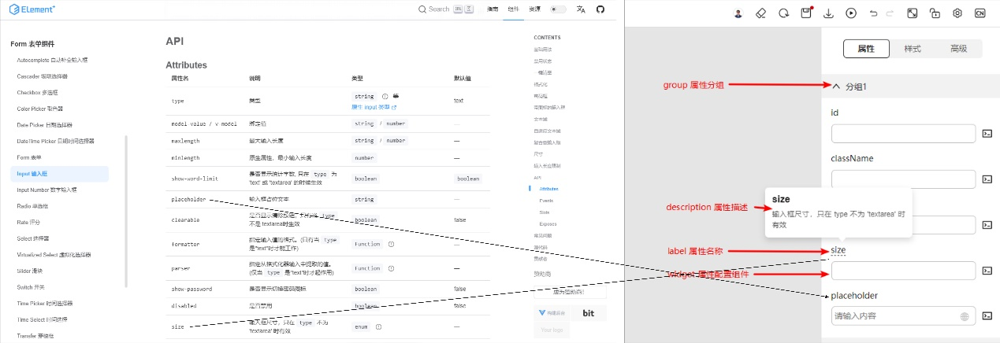
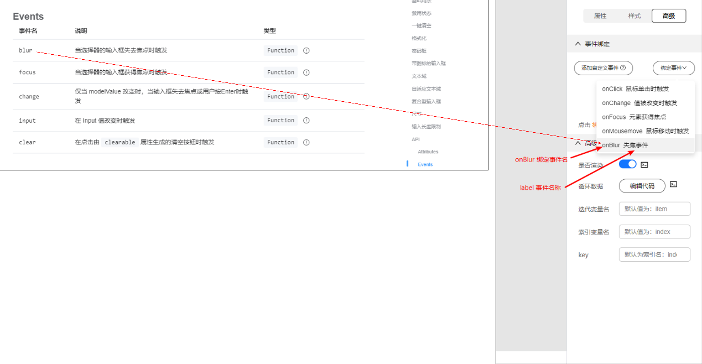
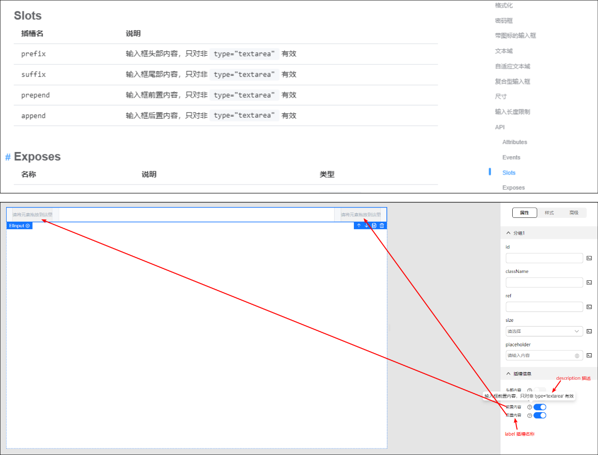
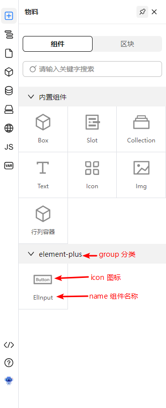

# 如何在设计器中引入第三方组件库

## 前置介绍
可拖拽到画布中渲染的我们称之为物料，物料来源于内置组件包和物料资产包，物料资产包包含组件和区块。物料资产包的配置参考[物料资产包协议](https://www.opentiny.design/tiny-engine#/protocol)。

## 配置第三方组件库组件
物料资产包默认提供了@opentiny/vue组件库的组件。在一些场景下，需要用到第三方的组件库，下面将以element-plus组件库中的输入框组件（ElInput）为例，介绍如何引入第三方组件库的组件，打通包括画布渲染，配置属性、事件、插槽以及预览的全流程。

### 配置组件
在前置介绍，我们知道了在画布中渲染组件需要将组件配置到物料资产包中，根据[物料资产包协议](https://www.opentiny.design/tiny-engine#/protocol)，配置包含两大类：组件配置components、组件面板配置snippets。下面将在协议基础上对**核心字段**作进一步的解释，可以打开源码中物料资产包文件（packages\design-core\public\mock\bundle.json）逐个理解。

#### 组件配置-components

| 字段 | 类型 | 说明 |
| --- | --- | --- |
| component         | String  | 组件名。在画布中渲染时的组件名，对标vue组件的名称，如ElInput |
| npm               | Object  | 组件npm包信息。在动态导入组件模块和预览出码时必需 | 
| npm.package       | String  | npm包名。组件所在包的名称，可在[npm](https://www.npmjs.com/)中查找到的包名，用于生成导入语句 | 
| npm.version       | String  | npm包的版本号。用于出码时写入package.json文件的依赖信息 | 
| npm.exportName    | String  | 导出名称。从npm包中import的名称，如import { ElInput } from 'element-plus' | 
| npm.destructuring | String  | 是否解构。取决于npm包导出当前组件的方式是export还是export default | 
| npm.script      | String  | 脚本文件CDN。用于画布动态导入组件和预览的importmap，必须是ESModule格式。<br>*如何获取：先到[unpkg](https://unpkg.com/)查找。如果没有找到，可以使用[esm](https://esm.sh/#docs)尝试，如：[https://esm.sh/element-plus@2.4.1]* | 
| npm.css      | String  | css文件CDN。获取方式可参考上面脚本CDN | 
| schema      | Object  | 属性-properties、事件-events、插槽-slots | 

##### 属性-properties

以ElInput的属性举例：



| 字段 | 类型 | 说明 |
| --- | --- | --- |
| property         | String  | 属性名。如：placeholder |
| type         | String  | 属性类型。如：string、boolean |
| label         | Object  | 属性显示的名称。如：输入框占位文本 |
| defaultValue         | String  | 属性的默认值。 |
| widget         | Object  | 配置属性的渲染组件和传入渲染组件的属性配置 |
| widget.component         | String  | 配置属性的渲染组件。如MetaInput、MetaSelect。一般可以通过属性的类型判断选用哪个组件，string类型一般选择MetaInput或MetaBindI18n、enum类型一般选择MetaSelect、object类型一般选择MetaCodeEditor |
| widget.props         | Object  | 配置传入渲染组件的属性配置。如options |

```json
// materials.components[index].schema.properties[0].content
[
  {
    "property": "placeholder", // 属性字段名
    "label": { // 属性名称
      "text": { 
        "zh_CN": "输入框占位文本" 
      }
    },
    "description": { // 属性说明，鼠标悬浮属性名称时显示
      "zh_CN": "输入框占位文本"
    },
    "required": false,
    "readOnly": false,
    "disabled": false,
    "cols": 12, // 属性所占宽度格数，一共12
    "labelPosition": "top", // 属性名称位置
    "type": "string", // 属性类型
    "defaultValue": "请输入", // 属性默认值
    "widget": { // 属性配置选用的组件配置
      "component": "MetaBindI18n", // 属性配置的组件
      "props": {} // 传入组件的属性
    },
    "device": []
  },
  {
    "property": "size",
    "label": {
      "text": {
        "zh_CN": "尺寸"
      }
    },
    "description": {
      "zh_CN": "输入框尺寸，只在 type 不为 'textarea' 时有效"
    },
    "required": true,
    "readOnly": false,
    "disabled": false,
    "cols": 12,
    "labelPosition": "top",
    "type": "string",
    "defaultValue": "large",
    "widget": {
      "component": "MetaInput",
      "props": {}
    }
  }
]
```

##### 事件-events

以ElInput的事件举例：



```json
// materials.components[index].schema.events
{
  "onBlur": { // 事件的名称为 on+大写字母 开头
    "label": {
      "zh_CN": "失焦事件" // 事件名称
    },
    "description": {
      "zh_CN": "在 Input 失去焦点时触发"
    },
    "type": "event",
    "functionInfo": {
      "params": [ // 事件参数
        {
          "name": "event",
          "type": "Object",
          "defaultValue": "",
          "description": {
            "zh_CN": "原生 event"
          }
        }
      ],
      "returns": {}
    },
    "defaultValue": ""
  }
}
```

##### 插槽-slots

以ElInput的插槽举例：



```json
// materials.components[index].schema.slots
{
  "prefix": {
    "label": {
      "zh_CN": "头部内容" // 插槽名称
    },
    "description": {
      "zh_CN": "输入框头部内容，只对非 type='textarea' 有效" // 插槽说明，在鼠标悬浮提示图标时显示
    }
  },
  "suffix": {
    "label": {
      "zh_CN": "尾部内容"
    },
    "description": {
      "zh_CN": "输入框尾部内容，只对非 type='textarea' 有效"
    }
  },
  "prepend": {
    "label": {
      "zh_CN": "前置内容"
    },
    "description": {
      "zh_CN": "输入框前置内容，只对非 type='textarea' 有效"
    }
  },
  "append": {
    "label": {
      "zh_CN": "后置内容"
    },
    "description": {
      "zh_CN": "输入框后置内容，只对非 type='textarea' 有效"
    }
  }
}
```

#### 组件面板配置-snippets



```json
// materials.snippets
[
  {
    "group": "element-plus", // 分类名称，折叠面板标题
    "children": [
      {
        "name": {
          "zh_CN": "ElInput" // 面板中的组件名称
        },
        "icon": "input", // 组件显示的图标，对应目录packages\design-core\assets\下的svg文件名称，如input.svg
        "screenshot": "/img/logo.png",
        "snippetName": "ElInput", // 用于检索components中的组件配置，对应组件配置中的component字段
        "schema": { // 拖拽组件到画布后插入组件schema的内容
          "children": [ // 拖拽组件到画布后默认渲染的子节点
            {
              "componentName": "Template", // Template会被识别为插槽，实际渲染时会忽略
              "props": {
                "slot": {
                  "name": "prefix" // 插槽名
                }
              },
              "children": []
            }
          ]
        }
      }
    ]
  }
]
```

### 预览
本地预览调用mockServer的接口，修改的物料资产包需要同步到mockServer的数据。
- 打开应用数据文件：mockServer\src\services\appinfo.json
- 将组件数据（bundle.json中的data.material.components）拷贝到appinfo.materialHistory.components
- 刷新页面，点击预览

## 完整的物料资产包
经过上面的介绍，我们可以生成一个以ElInput为例的物料资产包，如果需要添加其他的组件，参照本示例添加组件配置和组件面板配置即可。

```json
{
  "data": {
    "framework": "Vue",
    "materials": {
      "components": [
        {
          "id": 456,
          "version": "2.3.8",
          "name": {
            "zh_CN": "ElInput"
          },
          "component": "ElInput",
          "icon": "input",
          "description": "常用的操作按钮，提供包括默认按钮、图标按钮、图片按钮、下拉按钮等类型",
          "doc_url": "",
          "screenshot": "/img/logo.png",
          "tags": "",
          "keywords": "",
          "dev_mode": "proCode",
          "npm": {
            "package": "element-plus",
            "version": "2.3.8",
            "script": "https://unpkg.com/element-plus@2.3.8/dist/index.full.mjs",
            "css": "https://unpkg.com/element-plus@2.3.8/dist/index.css",
            "dependencies": null,
            "exportName": "ElInput"
          },
          "group": "表单组件",
          "category": "element-plus",
          "configure": {
            "loop": true,
            "condition": true,
            "styles": true,
            "isContainer": false,
            "isModal": false,
            "isPopper": false,
            "nestingRule": {
              "childWhitelist": "",
              "parentWhitelist": "",
              "descendantBlacklist": "",
              "ancestorWhitelist": ""
            },
            "isNullNode": false,
            "isLayout": false,
            "rootSelector": "",
            "shortcuts": {
              "properties": ["text", "size"]
            },
            "contextMenu": {
              "actions": ["copy", "remove", "insert", "updateAttr", "bindEevent", "createBlock"],
              "disable": []
            },
            "invalidity": [""],
            "clickCapture": true,
            "framework": "Vue"
          },
          "createdBy": 86,
          "created_at": "2023-08-29T07:45:28.000Z",
          "updated_at": "2023-09-11T09:52:11.000Z",
          "public": 1,
          "framework": "Vue",
          "isOfficial": false,
          "isDefault": false,
          "tiny_reserved": false,
          "tenant": null,
          "component_metadata": {
            "events": [],
            "attrs": [
              {
                "property": "placeholder",
                "type": "string",
                "defaultValue": null,
                "enumerateValue": null,
                "title": null,
                "_RID": "row_1"
              },
              {
                "property": "size",
                "type": "string",
                "defaultValue": null,
                "enumerateValue": null,
                "title": null,
                "_RID": "row_2"
              }
            ],
            "slots": []
          },
          "library": 1,
          "schema": {
            "properties": [
              {
                "name": "0",
                "label": {
                  "zh_CN": "分组1"
                },
                "content": [
                  {
                    "property": "size",
                    "label": {
                      "text": {
                        "zh_CN": "size"
                      }
                    },
                    "required": true,
                    "readOnly": false,
                    "disabled": false,
                    "cols": 12,
                    "labelPosition": "left",
                    "type": "string",
                    "widget": {
                      "component": "MetaInput",
                      "props": {}
                    }
                  },
                  {
                    "property": "placeholder",
                    "label": {
                      "text": {
                        "zh_CN": "placeholder"
                      }
                    },
                    "required": true,
                    "readOnly": false,
                    "disabled": false,
                    "cols": 12,
                    "labelPosition": "left",
                    "type": "string",
                    "widget": {
                      "component": "MetaBindI18n",
                      "props": {}
                    },
                    "description": {
                      "zh_CN": ""
                    },
                    "device": []
                  }
                ],
                "description": {
                  "zh_CN": ""
                }
              }
            ],
            "events": {
              "onBlur": {
                "label": {
                  "zh_CN": "失焦事件"
                },
                "description": {
                  "zh_CN": "在 Input 失去焦点时触发"
                },
                "type": "event",
                "functionInfo": {
                  "params": [
                    {
                      "name": "event",
                      "type": "Object",
                      "defaultValue": "",
                      "description": {
                        "zh_CN": "原生 event"
                      }
                    }
                  ],
                  "returns": {}
                },
                "defaultValue": ""
              }
            },
            "slots": {
              "prefix": {
                "label": {
                  "zh_CN": "头部内容"
                },
                "description": {
                  "zh_CN": "输入框头部内容，只对非 type='textarea' 有效"
                }
              },
              "suffix": {
                "label": {
                  "zh_CN": "尾部内容"
                },
                "description": {
                  "zh_CN": "输入框尾部内容，只对非 type='textarea' 有效"
                }
              },
              "prepend": {
                "label": {
                  "zh_CN": "前置内容"
                },
                "description": {
                  "zh_CN": "输入框前置内容，只对非 type='textarea' 有效"
                }
              },
              "append": {
                "label": {
                  "zh_CN": "后置内容"
                },
                "description": {
                  "zh_CN": "输入框后置内容，只对非 type='textarea' 有效"
                }
              }
            }
          }
        }
      ],
      "snippets": [
        {
          "group": "element-plus",
          "children": [
            {
              "name": {
                "zh_CN": "ElInput"
              },
              "icon": "button",
              "screenshot": "/img/logo.png",
              "snippetName": "ElInput",
              "schema": {
                "children": [
                  {
                    "componentName": "Template",
                    "props": {
                      "slot": {
                        "name": "prefix"
                      }
                    },
                    "children": []
                  }
                ]
              }
            }
          ]
        }
      ],
      "blocks": []
    }
  }
}
```