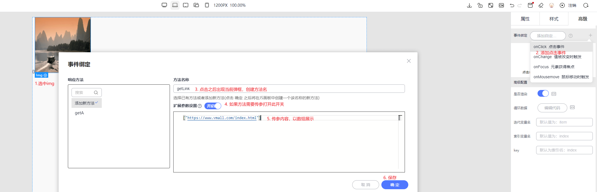
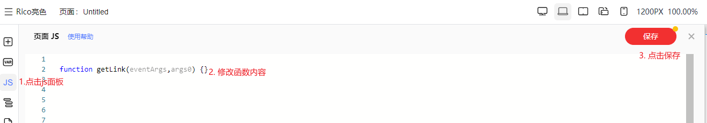
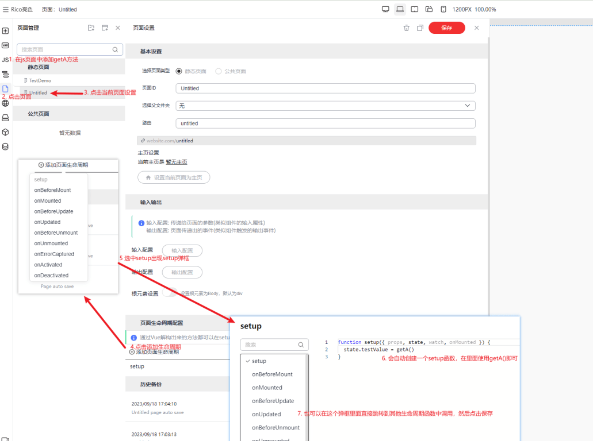
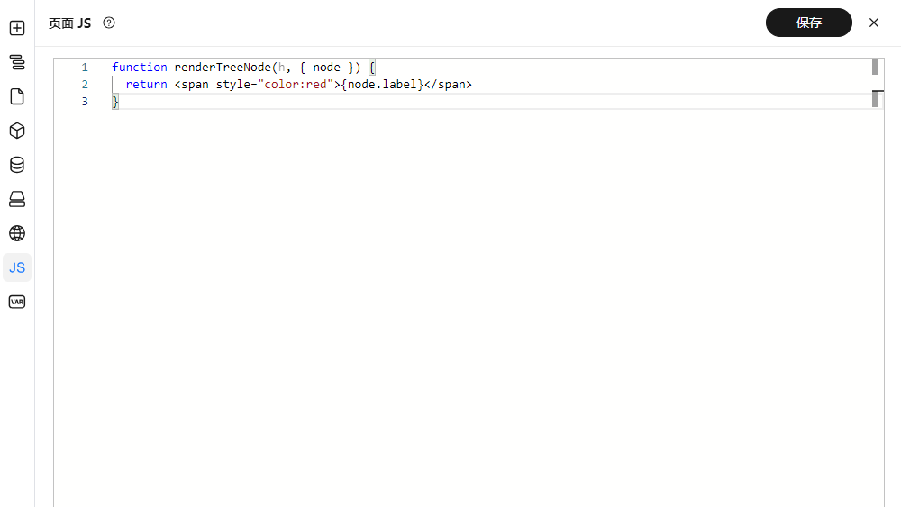
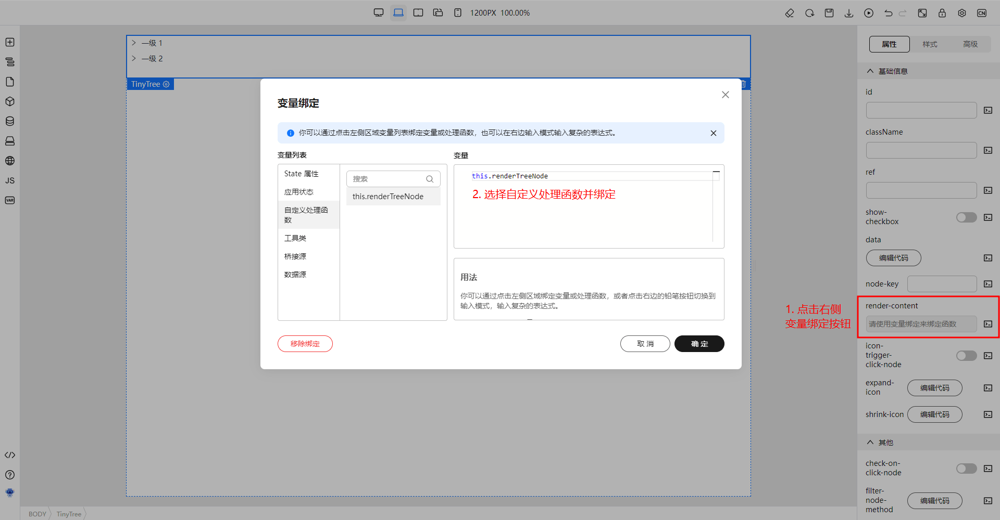
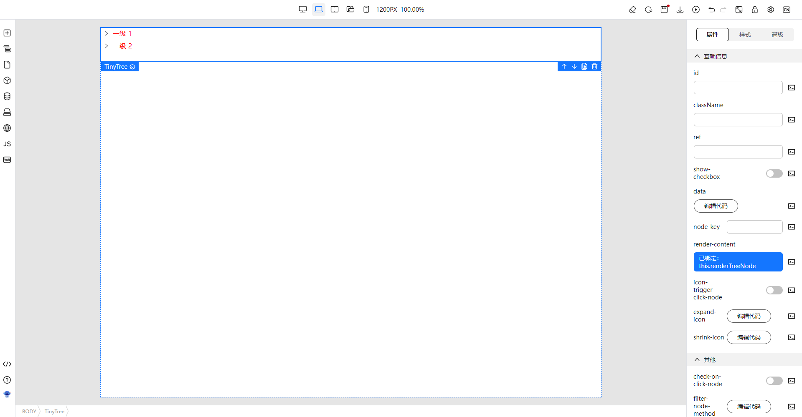

# 页面JS
> 1 在常规代码开发中，我们需要为某个区块或者某个元素添加一些事件，比如点击事件，同一个页面或者区块的事件会统一保存到对应的页面JS中  
> 2 很多时候我们需要自定义一些方法去复用一些逻辑，也需要用到页面js
> 3 需要注意的是当前的页面js只能使用声明函数，不能使用函数表达式声明函数，也不能在页面js中定义其他的变量
> 4 页面js中可以通过 **this** 访问当前页面的 **state**，全局的 **stores**， 以及**t**函数(获取国际化词条)

## 页面JS基本使用与管理
下面将通过两个示例分别展示如何使用
### 为图片添加点击事件
  
- 选中区块或者画布中元素
- 右侧面板高级选项中点击添加 onClick事件出现弹框
- 修改方法名，如果需要参数则打开开关
- 点击保存

  
- 代码保存之后点击左侧js面板，可以发现刚刚创建的getLink就在这里
- 现在只需要在这里写对应的逻辑即可


### 创建普通方法在生命周期中使用
  
1. 在js页面中添加getA方法
2. 点击页面
3. 点击当前页面设置
4. 点击添加生命周期
5. 选中setup出现setup弹框
6. 会自动创建一个setup函数，在里面使用getA()即可
7. 也可以在这个弹框里面直接跳转到其他生命周期函数中调用，然后点击保存

### 出码结果
通过上述的一些简单操作，我们可以通过TinyEngine提供的 “将代码生成本地Vue”的功能，将上述操作过后的代码生成到本地查看
```vue
<template>
  <div>
    <span>{{ state.testValue }}</span>
     getA(eventArgs, 12)"
    />
  </div>
</template>

<script setup>
import * as vue from 'vue'
import { defineProps, defineEmits } from 'vue'
import { I18nInjectionKey } from 'vue-i18n'

const props = defineProps({})
const emit = defineEmits([])

const { t, lowcodeWrap, stores } = vue.inject(I18nInjectionKey).lowcode()
const wrap = lowcodeWrap(props, { emit }, t)

const state = vue.reactive({
  testValue: {}
})

const getA = wrap(function (eventArgs, args0) {
  const testData = {
    name: 'rico',
    age: 18
  }
  return testData
})

wrap({
  stores,
  state,
  getA
})

const setup = wrap(function setup({ props, state, watch, onMounted }) {
  state.testValue = getA()
})
setup({ props, context: { emit }, state, ...vue })
</script>
```
如上代码所示：在TinyEngine中编辑的方法，为图片添加的点击事件等都有生成，并且会默认暴露出 **t**函数(国际化，具体可参考国际化教程如何使用) 和全局stores(pinia)状态

## 页面JS高级功能

### 使用JSX

部分组件需要使用到JSX代码来自定义渲染逻辑，可以在JS面板中定义好JSX渲染函数，然后绑定到组件的属性上。比如 TinyVue 中的 Tree 树形组件，此组件的 `render-content` 属性可以传递一个渲染函数，示例如下

> 函数类型或签名需参考组件的文档

1. 首先在页面JS中定义渲染函数，这里的函数参数的定义来自于 TinyVue 的文档



2. 然后选中 Tree 树形组件，在属性面板中找到 `render-content` 属性，点击右侧变量绑定按钮，变量绑定弹窗打开后，绑定自定义处理函数



3. 绑定成功后效果如下



## 总结
页面js能够很方便的为元素或区块添加事件，通过可视化的优势快速定位到某个元素。同时也很方便的提供一些状态获取方法，国际化词条获取方法等。