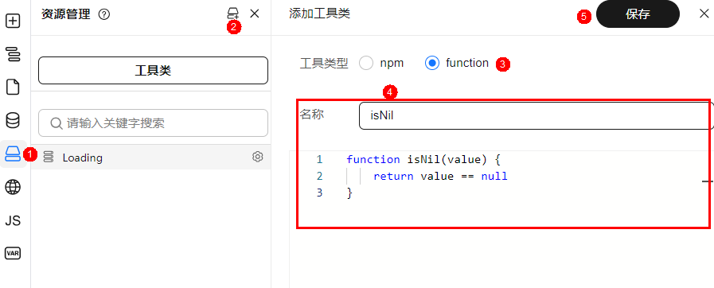

# 工具类方法 utils

## 基本概念

在常规代码开发中，我们通常会将一些高频率用到的一些代码片段抽离出来业务代码，使其成为一个公共函数，减少重复的代码，从而达到代码复用的目的。
同样，在低代码开发中，我们不可避免的需要编写一些高代码进行组合开发，这里同样存在存储一些公共函数以供各处调用需求。工具类方法 utils 就是诞生在这样的背景之下，我们可以将一些可复用的公共函数编写到工具类方法中，也可以将一些 npm 包引用到utils中，供后续调用。

**注意：utils 是应用级别的，即引入之后，即可在该应用下任意页面中进行调用**

## 分类

### function 工具类

提供输入框，直接编写函数代码


如上图：
- 第一步，点击添加工具类，选择 function 
- 第二步，输入工具类的名称
- 第三步，编写函数代码

最后点击保存，函数工具类就添加成功了。

实际出码效果：

```javascript
// utils.js
const testUtils = function utils() {
      console.log(321)
}

export { testUtils }
```

### npm 工具类

对于一些简单的公共函数来说，直接添加 function  工具类会很方便，但是对于一些比较复杂的公共函数或者第三方的一些公共函数来说，直接编写函数并不是一个理想的方式，所以，我们还提供了 npm 工具类，以供引入 npm 包。


如上图：
- 第一步，点击添加工具类，选择 npm
- 第二步，按需填写各项参数
- 第三部，点击保存按钮

各项参数解释：

| 参数名       | 解释           |
| ----------  | ---------------|
| 名称         |  utils 名称                   |
| 包名         | npm 包名 |
| 导出名称      | import 时的命名，如果是非解构，则可以自由命名，如果是解构，则 npm 包的导出必须要有该名称           |
| 是否解构      | 解构则使用如 `import { export1 } from 'module'` 的方式导入              |
| 入口路径      | 有些 npm 包的方法并不在默认导出中，如 `import { foo , bar } from "module-name/path/to/specific/un-exported/file";` 这时候，我们就需要填写入口路径             |
| 版本号        | npm 包的版本号，需要符合 npm 包版本规范，详见 [semver](https://www.npmjs.com/package/semver)，如不填则默认为 latest            |
| cdn 链接     |  如果我们的页面使用了 npm utils，则需要在手动录入 npm cdn 链接，否则可能会造成页面预览失败            |

#### 什么是 cdn 链接？

cdn 链接就是 npm 包在浏览器直接可用的链接，如：[https://unpkg.inhuawei.com/](https://unpkg.inhuawei.com/)，提供了大部分的 cdn 链接，我们可以从上面获取。
在页面预览中，我们并不会对所有代码和依赖进行转译，npm 依赖需要以 cdn 方式进行引入，所以，如果添加了 npm 工具类，在预览失败时，请确保已添加 cdn 链接

**预置的 cdn 链接**

目前在Vue技术栈中，为了使用的方便，我们已经预置了一部分 npm 包的 cdn 链接，所以使用以下 npm 包时，无需添加 cdn 链接

- @vueuse/core
- @vueuse/shared
- axios
- pinia
- vue
- vue-i18n
- vue-router
- vue/server/renderer
- @opentiny/vue

#### 实际出码结果示例

假设我们添加了 lodash 工具类


则实际出码结果为：

```javascript
// utils.js
import lodash from 'lodash'

export { lodash }
```
#### 应用发布

应用发布时，会对整体应用出码，这时候添加的 npm 工具类，也会将 npm 包写入到 package.json 依赖中

```json
// package.json
{
    "dependencies": {
      "lodash": "latest"
  }
}
```

## 示例

### 添加 npm utils

以按钮组件点击时显示Loading效果为例

1. 在资源管理面板新建工具类，引入 Loading

填写以下参数：


| 名称     | Loading           |
| ---------- | ------------------- |
| 包名     | @opentiny/vue |
| 导出名称 | Loading           |
| 是否解构 | 是                |
| 入口路径 | 不填              |
| 版本号   | 0.1.20            |

2. 对元素绑定事件，以按钮组件的 onClick 为例
3. 在事件回调函数中编写代码，使用 Loading 组件

代码示例：

```javascript
function handleOnClick(event) {
    this.loadingInstance = this.utils.Loading.service({
      text: "加载中",
    target: document.getElementById("tiny-loading1"),
  });
  setTimeout(() => {
      this.loadingInstance.close();
  }, 3000);
}
```

4. 预览组件效果


### 添加 function utils

1. 点击添加工具类，选择 function ，填入名称和函数



填入函数为
```javascript
function isNil(value) {
    return value == null
}
```

2. 在JS面板的函数中使用

我们可以在JS面板或者页面生命周期函数中通过 `this.utils.isNil` 方式使用我们自定义的函数

```javascript
function xxxHandler(value) {
    if(this.utils.isNil(value)) {
      return
  }
  // ... other logic 
}
```