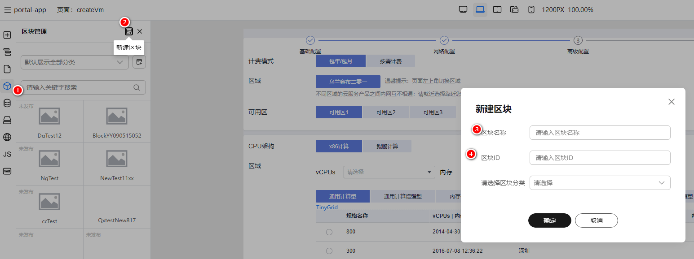
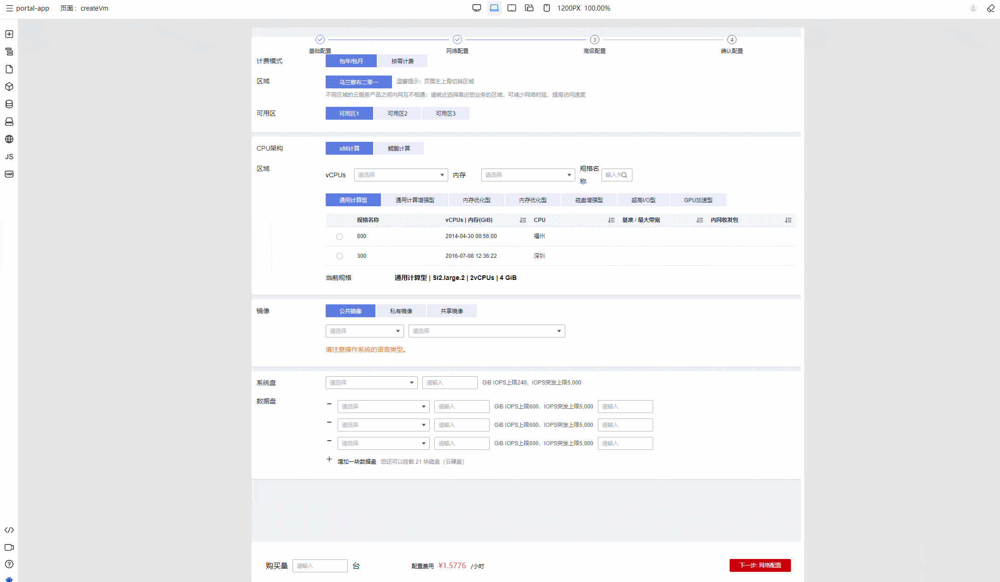
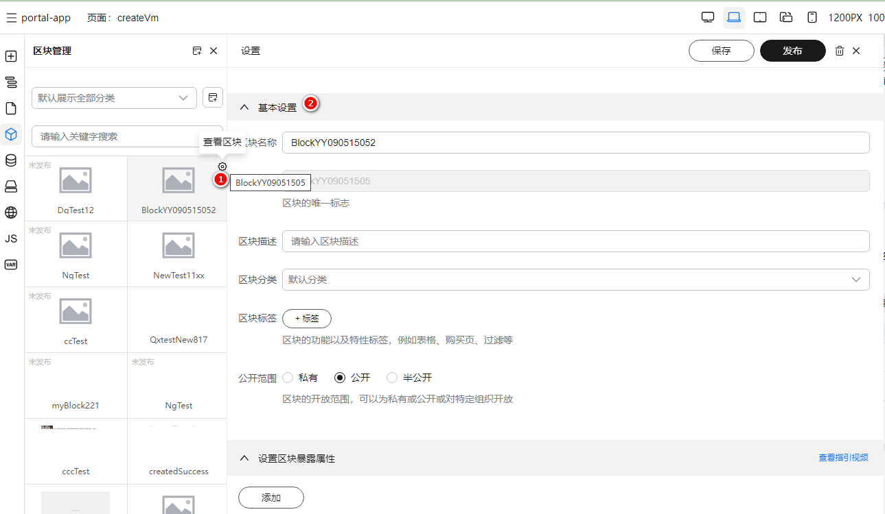
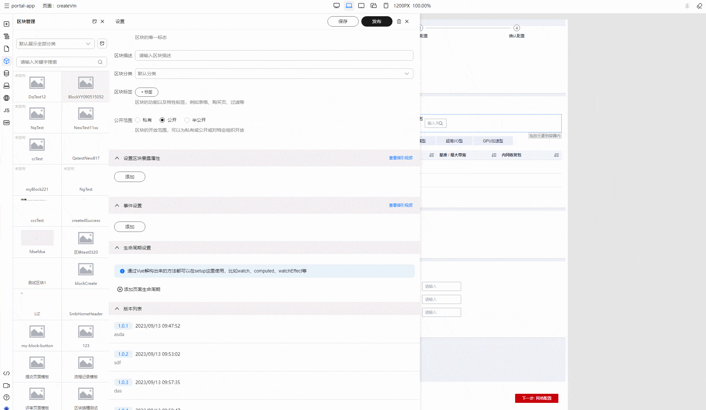
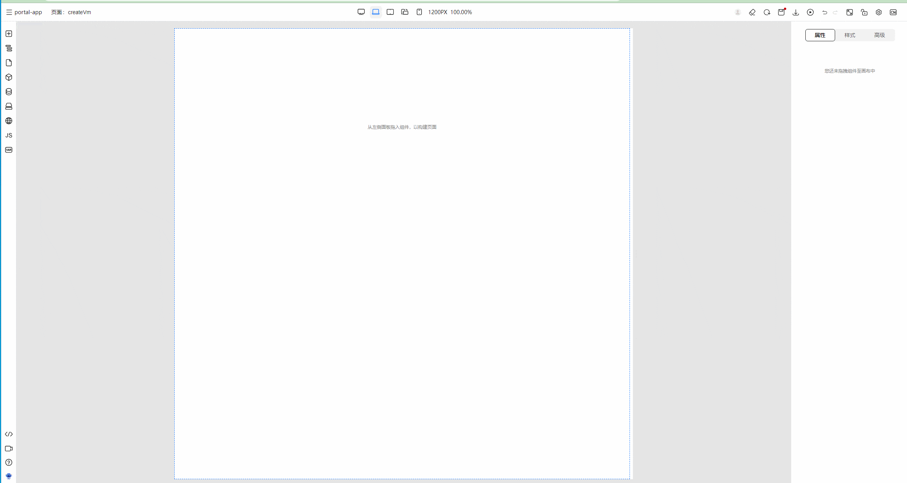

# 区块管理

> 区块的概念类似于前端开发中的 Component，我们可以将很多页面中都一样的结构（比如 Header），构建到区块中，发布之后直接在页面中拖入使用，提高开发效率

## 区块相关概念

假设我们有如下前端工程：

```bash
- project
  - components
    |_ Header.vue
     - Footer.vue
     - Container.vue
  - views
    |_ Index.vue
     - Page2.vue
    - TodoFolder
      |_ Todo.vue
```

其中，views 文件夹下 views每个页面都有路由一一对应，用户可以根据路由访问。components文件夹下的 Header、Footer、Container则没有对应路由可以访问，但是他们可以被页面1、2、3引用，提高代码复用率，我们的区块则对应 components 下的Header、Footer、Container等组件概念（即可重用的业务组件）。

### 区块发布相关概念

我们对区块编辑好之后，最终还是提供给另一个区块或者页面使用（即被另一个区块或者页面引用），所以我们设计了发布的概念，区块发布之后，会生成一个版本，可以在物料面板添加已经发布的区块，选择版本，然后拖入画布中消费使用

## 区块的基本使用与管理

创建区块可以有创建空白区块和从现有页面中创建区块两种

### 创建空白区块



如上图，按照步骤可创建空白区块

- 点击左侧区块插件打开区块插件面板
- 点击右上角新增按钮
- 在弹窗中输入区块ID与区块名称

相关概念

- 区块ID：区块的唯一ID，对应出码后的区块文件名
- 区块名称：在区块管理面板和物料消费面板显示的名称

### 从现有页面中选中组件创建区块



如上图，我们可以从现有页面中，按照步骤创建新区块

- 点击画布选中组件
- 右键，在弹出的右键菜单中点击新建区块
- 在弹出的弹窗中输入新区块的ID和名称，点击确认
- 最终我们得到了有选中组件作为初始内容的区块

## 区块管理与设置

在上述创建空白区块的区块管理插件中，我们还能看到现有的区块，对现有的区块进行修改和删除等管理操作，下面，我们来学习区块的几个管理属性

### 区块基本设置



如上图，点击区块列表中区块的右上角的设置按钮，即可打开设置面板。区块的基本设置中，我们可以对区块的名称、描述、标签、公开范围进行设置，下面对相关设置项进行讲解

- 区块描述：区块的描述，可以让别人更好的明白该区块的用途以及含义
- 区块标签：区块的标签，方便消费侧用户搜索
- 公开范围：区块的公开范围，设置 区块发布之后别的用户是否可以搜索，私有即只有自己可以看到、公开即所有用户都可以看到、半公开可以选择可以搜索到该区块的组织

### 区块暴露属性设置

#### 区块暴露属性的相关概念

假设我们的前端工程中有一个 Header 组件，该组件定义了 title 和 description 两个 props 属性

```vue
<template>
  <header>
    <h1>{{props.title}}</h1>
    <span>{{props.description}}</span>
  </header>
</template>

<script setup>

const props = defineProps({
  title: { type: String, default: '' },
  description: { type: String, default: '' }
})
</script>
```

区块暴露属性的概念即对应 组件中的 props 属性。暴露属性声明了外部组件引用当前组件时，可以定义的相关属性

#### 区块暴露属性的相关设置

区块暴露属性的设置与我们代码 props 的设置相似，只是区块暴露属性多了一个指定属性面板组件和属性的相关配置



#### 区块暴露属性的消费

在区块发布之后，我们在物料面板拖出区块到画布中，选中我们拖出的区块，右侧属性面板的属性即是我们定义的暴露属性



### 区块事件设置

#### 区块事件的概念

既然区块暴露属性等同于 组件 中的 props 属性，类似的，区块的事件即等同于 vue 中的 emit 事件声明

```vue
<script setup>
  const emit = defineEmits(['update:modelValue', 'success'])
</script>
```

注意的是，这里仅仅是声明我们的区块会抛出什么事件，真正的事件需要引用方（即消费该区块的一方在高级面板进行定义）

### 生命周期设置

同页面生命周期，即可以设置对应技术栈的生命周期函数

### 版本列表

可以预览对应版本的区块
