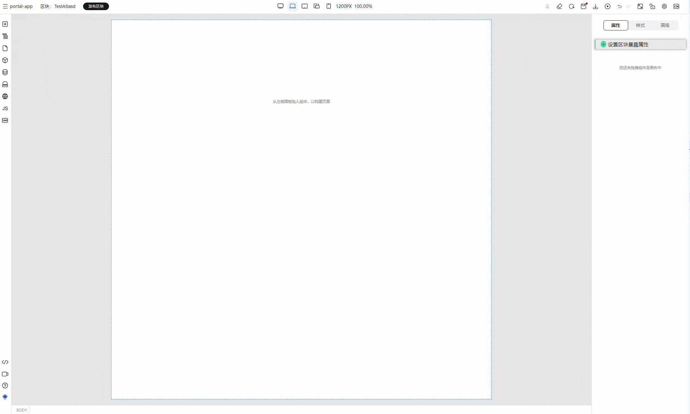
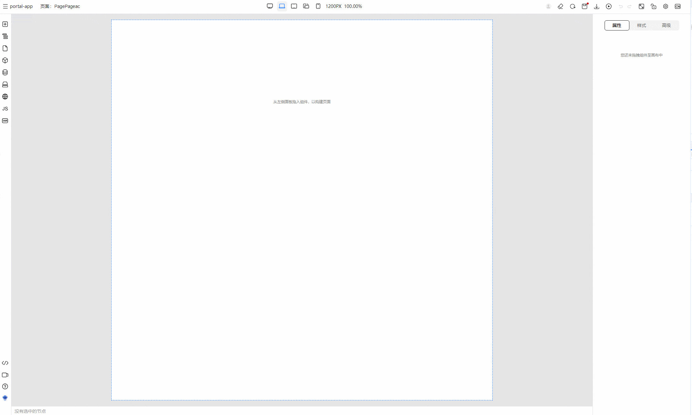

# 插槽的声明与使用

## 插槽的相关概念

> 插槽的概念与 vue.js 的插槽 [slot](https://cn.vuejs.org/guide/components/slots.html) 概念一致

我们以上述 Header组件为例，讲解插槽需要了解的核心概念：

- 插槽名字：插槽名字默认为 default
- 作用域插槽：用于向插槽传入子组件状态

```vue
// Header.vue
<template>
  <header>
    <h1>TinyEngine</h1>
    <slot name="menu" :menu="state.menu" :type="'mobile'">
      <menu>
        <li v-for="item in state.menu" :key="item.id">{{ item.name }}</li>
      </menu>
    </slot>
  </header>
</template>
```

```vue
<template>
 <Header>
  <template #menu="{ menu, type }">
    <ul>
      <li v-for="item in menu" :key="item.id">{{ item.name }}</li>
    </ul>
  </template>
 </Header>
</template>
```

如以上代码为例子，当我们使用 `Header` 组件的时候，我们可以声明 menu 插槽，并且在 menu 插槽里面获取到子组件 menu 的状态。此时即为作用域插槽。

## 插槽的声明

在区块中，我们可以通过拖入插槽的方式声明插槽。然后，我们可以在右侧设置面板设置插槽的名字，向插槽传入 props。
如果需要传入 props，我们可以通过编辑代码写入我们需要的表达式，将 props 传入 插槽中。



我们得到的带有插槽的 schema 大致为以下样式：

```json5
{
  "componentName": "Slot",
  "props": {
    "name": "menu",
    "params": [
      {
        "name": "title",
        "value": {
          "type": "JSExpression",
          "value": "this.state.ggggg"
        }
      }
    ]
  },
  "id": "25632b32",
  "children": [
    {
      "componentName": "Text",
      "props": {
        "text": "TinyEngine 前端可视化设计器，为设计器开发者提供定制服务，在线构建出自己专属的设计器。"
      },
      "id": "63246b33"
    }
  ]
}
```

区块出码大致为：

```vue
<template>
<div>
  <slot name="menu" :title="state.ggggg">
    <span>TinyEngine 前端可视化设计器，为设计器开发者提供定制服务，在线构建出自己专属的设计器。</span>
  </slot>
</div>
</template>
```

最后，我们可以经过保存 -> 发布 -> 组件面板导入区块的流程，将区块变成可消费的组件。

## 插槽的使用

上一步，我们通过低代码的区块，或者导入的已有的组件声明插槽，那么我们将可以将组件或者区块拖入画布中，在右侧面板相关的配置项开启插槽。

然后画布会开启对应的插槽，我们可以往插槽中拖入编排插槽组件。

在拖入的组件中，我们可以通过绑定变量的方式获取传入的作用域插槽：



最终得到的 schema 大致为：

```json5
{
  // 组件或者区块名
  "componentName": "BlockFileName",
  "props": {},
  "componentType": "Block",
  "id": "363d84ba",
  "children": [
    {
      // 子组件是 template
      "componentName": "Template",
      "props": {
        // slot 作为 props，说明是插槽
        "slot": {
          // 插槽名称
          "name": "menu",
          // 插槽参数
          "params": [
            "title"
          ]
        }
      },
      // 插槽内容
      "children": [
        {
          "componentName": "Text",
          "props": {
            // 这里 text 使用作用域插槽传入的变量，我们绑定变量 title 即可生效
            "text": {
              "type": "JSExpression",
              "value": "title"
            }
          },
          "id": "24212a32"
        }
      ],
      "id": "42753254"
    }
  ]
}
```

组件的插槽，也类似于区块插槽，我们在组件物料定义插槽即可：

```json5
{
  // 物料 schema 定义
  "schema": {
    // 定义插槽
    "slots": {
      // 命名插槽，为 menu
      "menu": {
        // 在右侧属性面板显示的名称
        "label": {
          "zh_CN": "menu"
        },
        // 插槽参数名
        "params": ["title"]
      }
    }
  }
}
```
