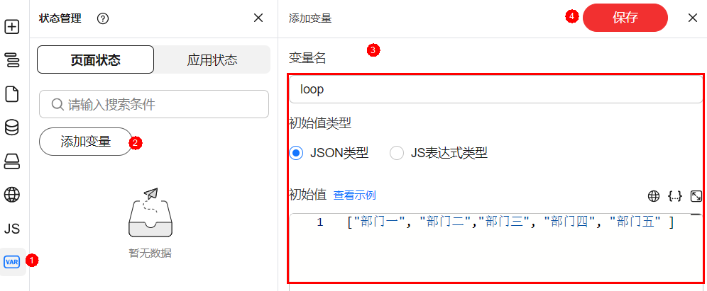
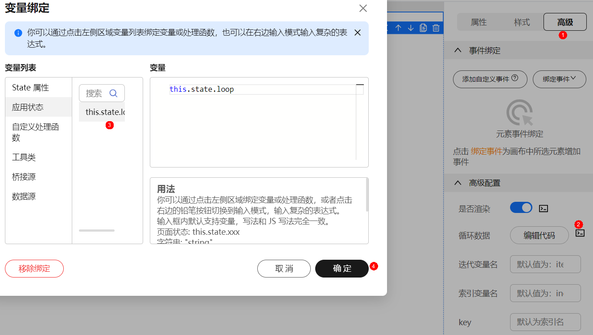
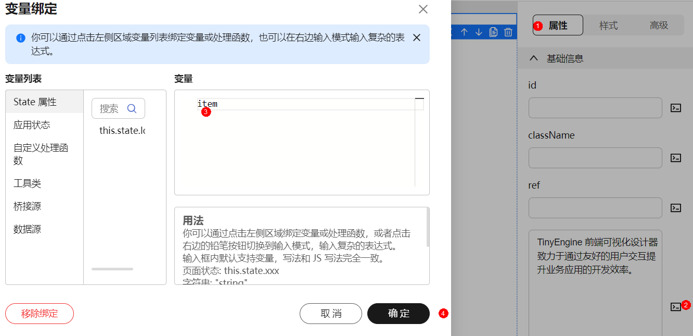
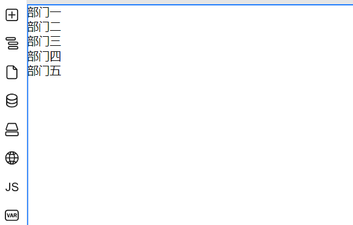

# 循环渲染

页面可能有若干份重复的、动态生成的内容，例如商品列表页、表格数据。这时候需要用到循环渲染。您可以在高级面板中指定循环数据绑定的变量、迭代的变量名、索引变量名、以及唯一的key。

1. 拖拽组件至画布，例如拖拽一个“段落“组件。
2. 添加变量，例如loop.isLogin。

   **图 1**  添加变量

   

3. 选中组件，在组件属性设置面板选择“高级”。
4. 单击“循环数据“后的，进行变量绑定。
5. 选择绑定的变量，单击“确定”。

   **图 2**  绑定变量

   

6. 为展示内容添加变量，默认为item。

   绑定成功后，查看渲染效果。

   **图 3**  添加变量
   

   **图 4**  查看渲染效果

   

相关概念关联：

- 循环数据，即需要循环渲染的数组，在这里是state.imageList。
- 迭代变量名，在循环渲染子项对应的变量名，默认为item。
- 索引变量名，循环渲染的索引变量名，默认为index。
- key，标识唯一的key，默认为index。

最终出码：

```html
<template>   
<div v-for="(item, index) in state.imageList" :key="index">     
<span>{{ item.title }}</span>   
<!---列表细节--->   
</div> </template>
```

