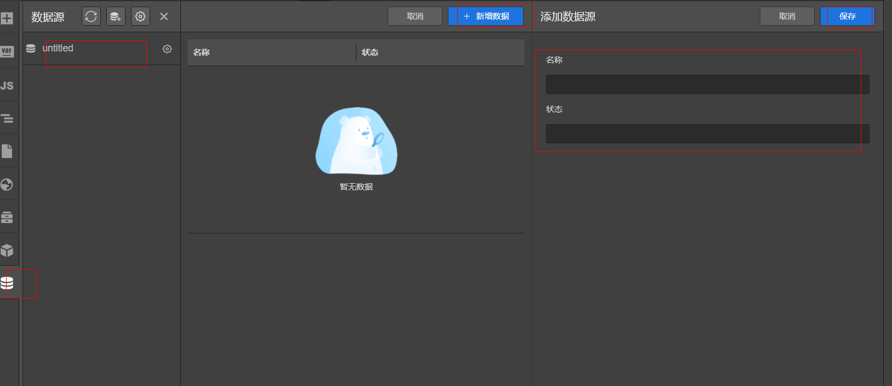
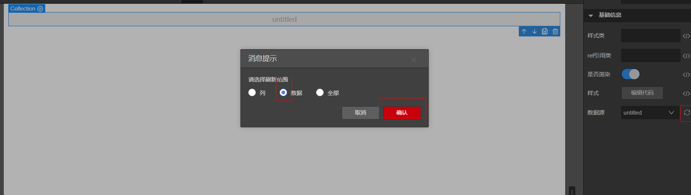

# 数据源Mock数据

目前数据源在编辑态时只能使用Mock数据，所以我们可能需要给数据源添加Mock数据

## 操作步骤

- 打开数据源面板，选中数据源
- 点击新增数据，添加数据并保存

## 使用数据源Mock数据

- 拖动一个Collection组件到画布中，在Collection组件属性面板上选择数据源
- 拖动格组件到Collection中，表格组件将自动生成数据源中的字段

## 更新数据源到画布

添加完Mock数据后，画布上绑定的数据源不会同步改变，需要手动更新，操作如下：
选中画布中的数据源，打开属性面板，点击更新数据源

