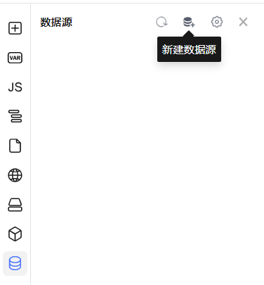
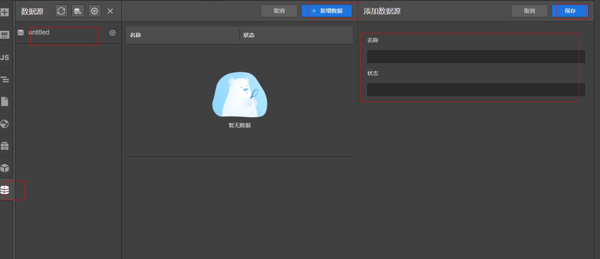
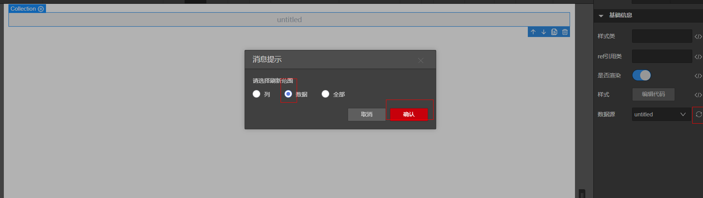

## 数据源

### 前言
设计器提供数据源来配合画布上的组件/区块渲染，数据源的配置既可以采取在设计器中静态配置的方式，也可以采取远程 API 请求 JSON 数据动态获取的方式。

> 目前**数据源**可便捷地应用于表格组件的表格列，也可灵活地应用于手动调用指定的远程 API。

### 创建数据源

创建数据源步骤：

1. 选择左边操作栏 - 数据源
2. 点击左上操作区 - 新建数据源

    
3. 配置数据源类型（可选对象数组、树结构），配置数据源名称以及数据源字段
4. 保存数据源

    


### 表格组件中的应用

数据源主要载体为**Collection组件**，因此在使用数据源之前需要先在画布中拖放入**Collection组件**，然后在属性面板中选择需要绑定的数据源


然后需要在Collection组件中放入Grid表格组件，根据提示引入配置数据，就会自动解析出表格列数据


### 手动调用指定的远程 API

低代码引擎，将所有数据源都挂载到了 `dataSourceMap` 中，并为每个数据源都提供了 `load` 方法，用于手动调用场景，比如：点击保存按钮时，需要调用后端的保存接口，提交用户填写的数据，此时可以通过数据源来提交。

#### 使用说明

`this.dataSourceMap.xxx.load()`

- xxx 为在数据源面板设置的数据源名称
- 支持传入请求参数，可用于覆盖在数据源面板中配置的请求参数（默认请求参数）
- load 方法返回一个 Promise

#### 示例

以会议预订页面为例，为 `创建` 按钮绑定点击事件（`onClick`）


绑定点击事件处理器为 `createMeeting`，补充其实现，主要为 `this.dataSourceMap.createMeeting.load(this.state.meeting)`。
表示将用户填写的会议信息（`this.state.meeting`），调用数据源 `addMeeting`（POST 请求），提交给后端。


其中，数据源 `addMeeting` 配置示例如下：


完整代码示例如下：
```js
async function createMeeting() {
  try {
    const res = await this.dataSourceMap.addMeeting.load(this.state.meeting)
    console.log('成功创建以下会议：', res)
  } catch {
    this.utils.toast({
      type: 'error',
      title: '创建会议请求失败，请稍候重试或联系客服' 
    })
  }
}
```

# 数据源获取远程字段

在使用数据源之前，我们需要向数据源中添加属性字段，可以通过“新建字段”按钮逐个添加。

但某些场景下，有更高效的添加方式，比如：基于已有的 HTTP 接口响应数据，快速地创建数据源的字段。

## 操作步骤

- 打开数据源面板，新建数据源。点击获取远程数据
- 设置请求地址、请求方式、请求参数、请求结果回调

- 请求成功后获取到接口字段信息，填写字段名后，保存后即可生成数据源字段信息


> 如果接口请求存在跨域、鉴权等情况，无法通过“发送请求”自动填充响应数据时，可以手动将响应数据（比如：JSON 格式数据），粘贴至下方的“请求结果”编辑器中。

## 请求完成回调函数示例

- 解析对象数组

```javascript
function dataHandler(data) {
  return data.map(v => ({
      name: v.nickName,
      status: v.status
    })
  )
}
```


# 数据源Mock数据

目前数据源在编辑态时只能使用Mock数据，所以我们可能需要给数据源添加Mock数据

## 操作步骤

- 打开数据源面板，选中数据源
- 点击新增数据，添加数据并保存


## 使用数据源Mock数据

- 拖动一个Collection组件到画布中，在Collection组件属性面板上选择数据源
- 拖动格组件到Collection中，表格组件将自动生成数据源中的字段


## 更新数据源到画布

添加完Mock数据后，画布上绑定的数据源不会同步改变，需要手动更新，操作如下：
选中画布中的数据源，打开属性面板，点击更新数据源

