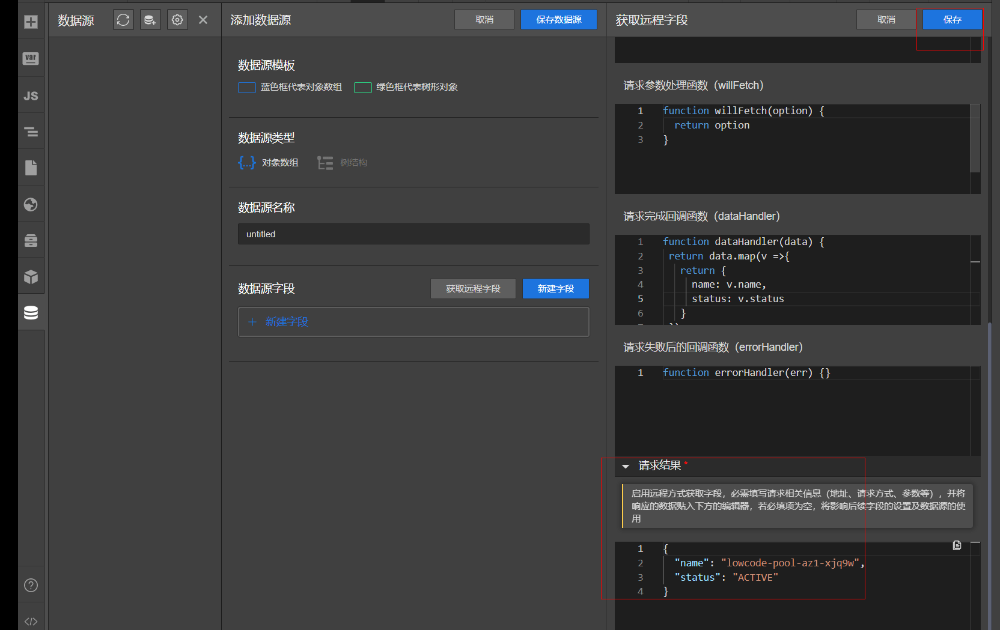
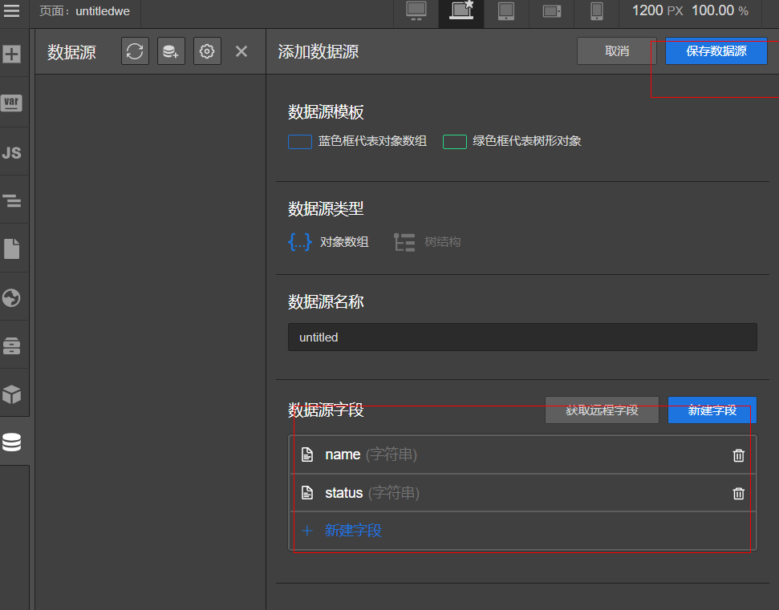

# 数据源获取远程字段

我们可以通过已有的远程Http接口，快速地生成数据源的字段

## 操作步骤

- 打开数据源面板，新建数据源。点击获取远程数据
- 设置请求地址、请求方式、请求参数、请求结果回调

- 请求成功后获取到接口字段信息，填写字段名后，保存后即可生成数据源字段信息





## 请求完成回调函数示例
- 解析对象数组
```javascript
function dataHandler(data) { 
     return data.map(v => {
      return {
        name: v.aa.ss,
    status: v.status
  }
 })
}
```