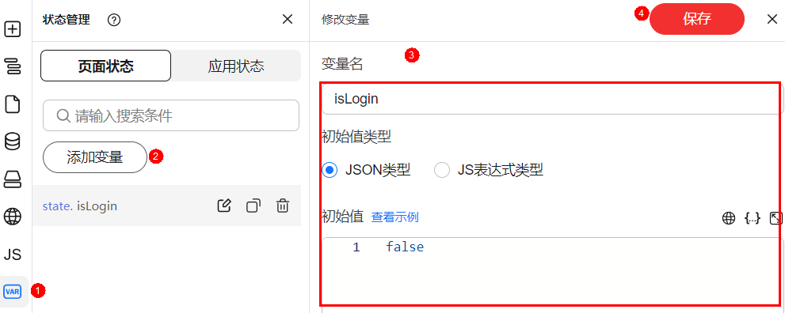
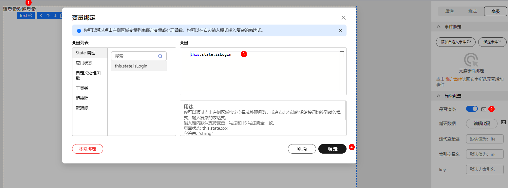
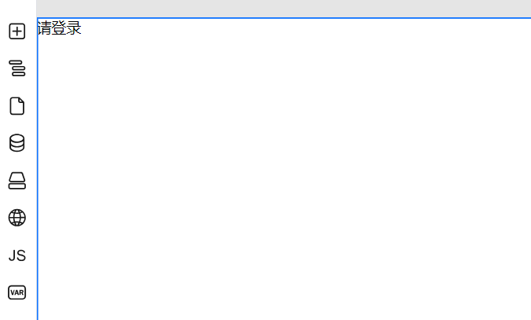
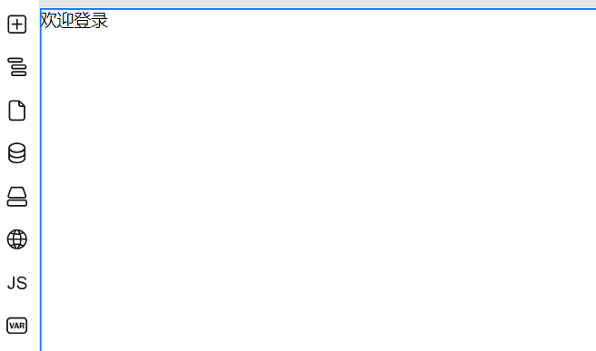

# 条件渲染

在页面开发中，可能需要根据某些条件来动态显示或隐藏页面中的内容，例如：如果您希望当用户已经登录的时候，显示“欢迎登录“的文字，未登录的时候，显示“请登录“的文字。

1. 拖拽组件至画布，分别输入希望展示的文字。
2. 添加变量，例如state.isLogin

   **图 1**  添加变量

   

3. 选中组件，在组件属性设置面板选择“高级”。
4. 单击“是否渲染“后的 ，进行变量绑定。

   **图 2**  绑定变量

   

5. 选项绑定的变量，单击“确定”。

   绑定成功后可根据变量state.isLogin的值，查看渲染效果。

   **图 3**  state.isLogin为false时

   

   **图 4**  state.isLogin为ture时

   

