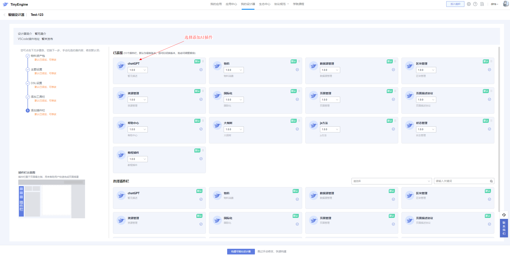
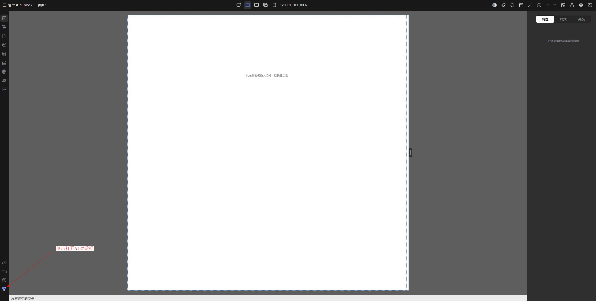
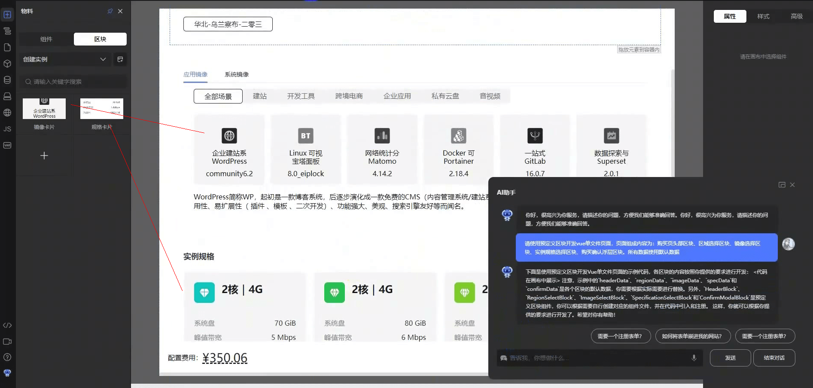
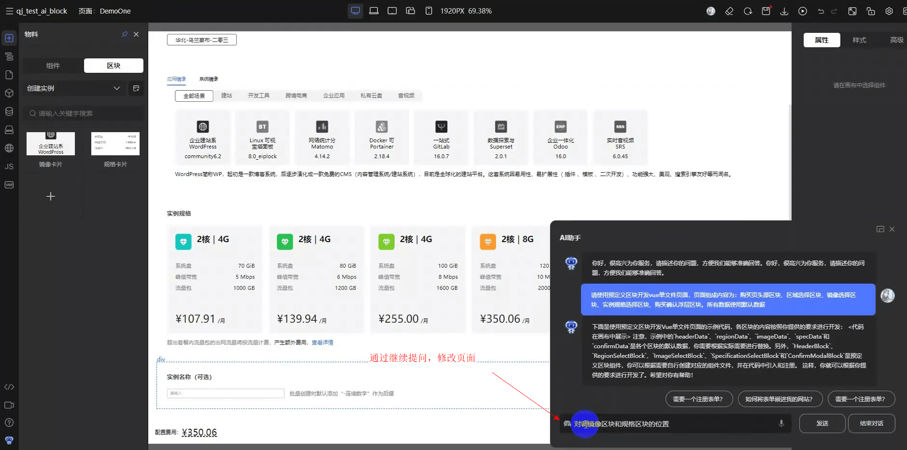

### 一、创建引入AI插件的设计器

AI生成页面的能力，以可拔插插件的形式，依附在设计器上。同时，AI生成的页面，也将在设计器的画布中渲染出来。
所以要使用AI生成页面的能力，需要先创建引入了AI插件的设计器，如下图所示。创建设计器参考[此文档](../关于设计器/创建设计器.md)

### 二、打开AI聊天窗口

如果设计器已经引入AI插件，进入设计器后，左下角会有个机器人图标，如下图所示，单击即可打开聊天窗，开始与AI交互。

### 三、通过提问，让AI生成页面

我们知道如ChatGPT之类的大模型，可以依照指令生成代码。在这里AI生成的代码会直接渲染在画布中。

**特别提示**：我们可以让AI直接使用预置的区块

### 四、通过继续提问，让AI修改生成的页面

