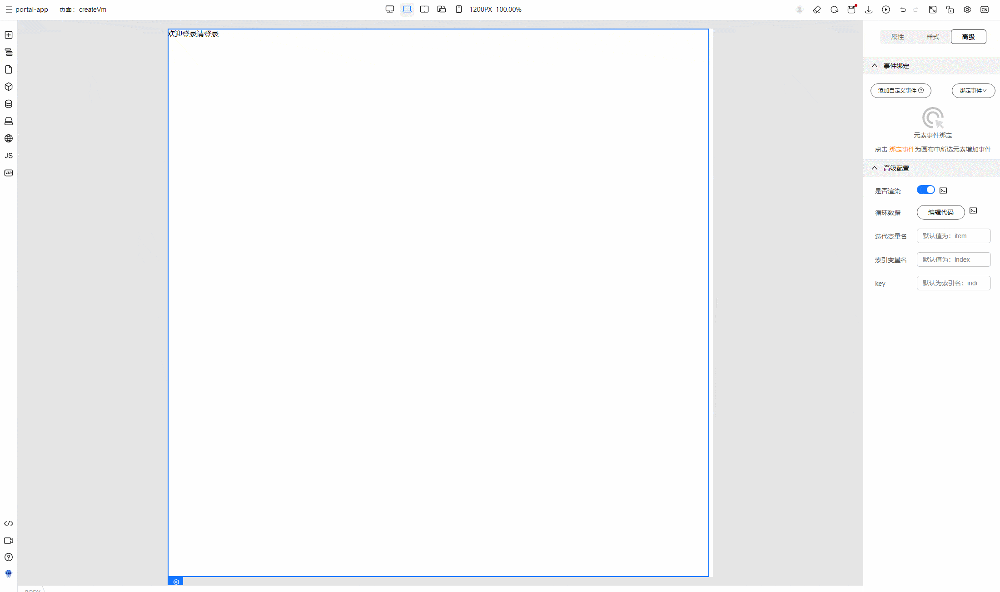
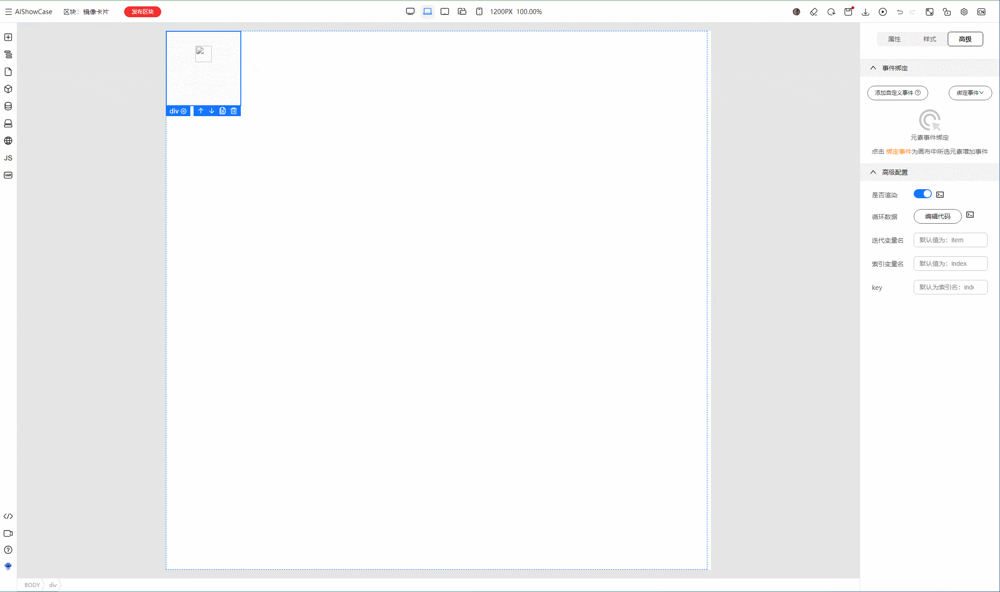
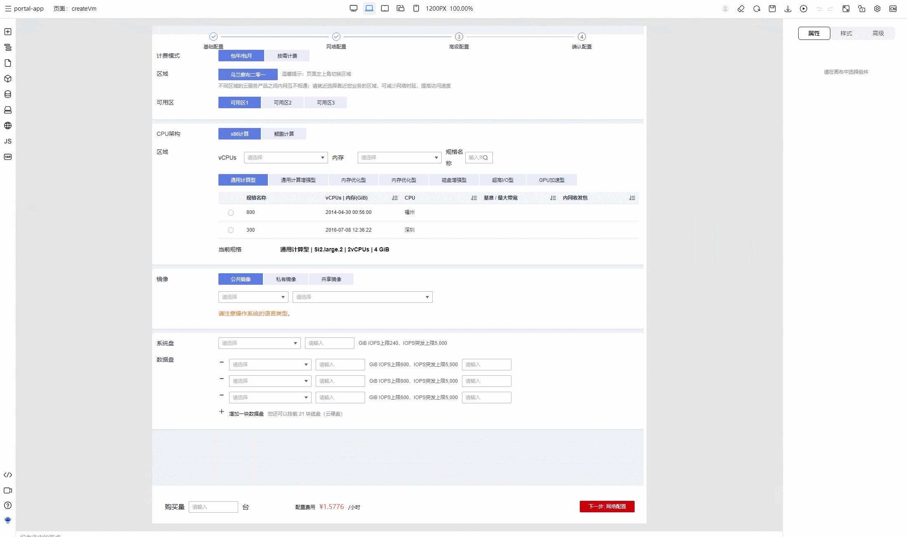

# 高级面板设置

> 选中组件之后，我们可以在高级面板对组件进行事件的绑定、以及循环渲染、条件渲染等高级设置

## 条件渲染

在页面开发中，我们可能需要根据某些条件来动态显示或隐藏页面中的内容，举个例子：我们希望当用户已经登录的时候，显示欢迎登录的文字，未登录的时候，显示请登录的文字。
那么，我们可以在组件上面绑定条件渲染，点击绑定变量，选择变量 state.isLogin，那么，我们的组件就会根据变量 state.isLogin 的真假值来进行渲染。



## 循环渲染

我们的页面可能有若干份重复的、动态生成的内容，比如商品列表页，比如表格数据。这时候，我们就需要用到循环渲染

我们可以在高级面板中指定循环数据绑定的变量、迭代的变量名、索引变量名、以及唯一的 key。
举例：假如我们的状态变量中有一个镜像列表，我们希望渲染出来镜像的 icon、镜像名称以及镜像版本，那么我们可以使用循环渲染来实现：



相关概念关联：

- 循环数据，即需要循环渲染的数组，在这里是 state.imageList
- 迭代变量名，在循环渲染子项对应的变量名，默认为 item
- 索引变量名，循环渲染的索引变量名，默认为 index
- key，标识唯一的 key，默认为 index

最终出码：

```vue
<template>
  <div v-for="(item, index) in state.imageList" :key="index">
    <span>{{ item.title }}</span>
  <!---列表细节--->
  </div>
</template>
```

## 事件绑定

我们可以给选中的组件进行事件的绑定：

- 在绑定事件下拉按钮中选中需要绑定的事件
- 随后在事件绑定弹窗中指定方法名称
- 指定拓展参数
- 点击确定，在随后弹出的JS面板中进行绑定方法的具体逻辑实现



### 拓展参数相关说明

在某些点击事件中，我们不仅仅希望得知事件是否被点击，我们还希望在点击事件中获得一些额外的参数，这时候，我们就可以用拓展参数，下面举例说明：
我们希望为镜像列表中的列表项绑定点击事件，然后将镜像的 id 和版本传入到事件处理函数中。那么，我们就可以使用拓展参数进行传入。

```bash
# 循环渲染项迭代变量名 item
# 拓展参数设置：
["item.imageId", "item.imageVersion"]
```

最终出码：

```vue
<template>
  <div v-for="(item, index) in state.imageList" @click="(e) => handleClick(e, item.imageId, item.imageVersion)">
  <!---列表细节--->
  </div>
</template>
```
